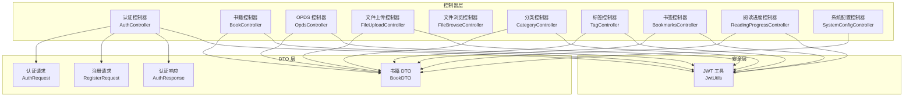
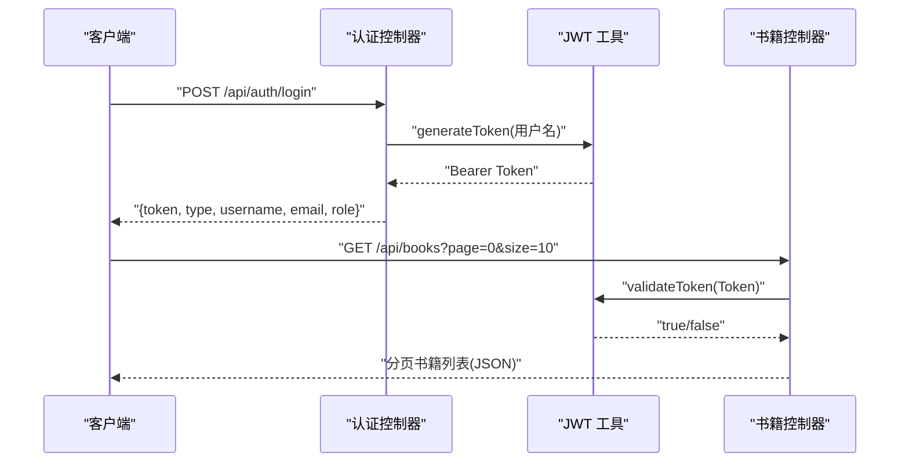
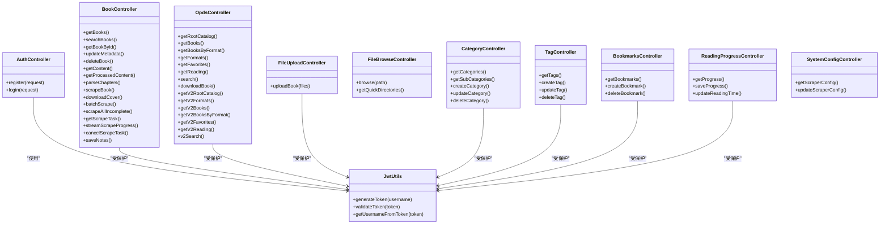

# API 接口文档

<cite>
**本文引用的文件**   
- [AuthController.java](file://backend/src/main/java/com/aibook/controller/AuthController.java)
- [BookController.java](file://backend/src/main/java/com/aibook/controller/BookController.java)
- [OpdsController.java](file://backend/src/main/java/com/aibook/controller/OpdsController.java)
- [FileUploadController.java](file://backend/src/main/java/com/aibook/controller/FileUploadController.java)
- [FileBrowseController.java](file://backend/src/main/java/com/aibook/controller/FileBrowseController.java)
- [CategoryController.java](file://backend/src/main/java/com/aibook/controller/CategoryController.java)
- [TagController.java](file://backend/src/main/java/com/aibook/controller/TagController.java)
- [BookmarksController.java](file://backend/src/main/java/com/aibook/controller/BookmarksController.java)
- [ReadingProgressController.java](file://backend/src/main/java/com/aibook/controller/ReadingProgressController.java)
- [SystemConfigController.java](file://backend/src/main/java/com/aibook/controller/SystemConfigController.java)
- [AuthRequest.java](file://backend/src/main/java/com/aibook/dto/AuthRequest.java)
- [AuthResponse.java](file://backend/src/main/java/com/aibook/dto/AuthResponse.java)
- [RegisterRequest.java](file://backend/src/main/java/com/aibook/dto/RegisterRequest.java)
- [BookDTO.java](file://backend/src/main/java/com/aibook/dto/BookDTO.java)
- [JwtUtils.java](file://backend/src/main/java/com/aibook/security/JwtUtils.java)
</cite>

## 目录
1. [简介](#简介)
2. [项目结构](#项目结构)
3. [核心组件](#核心组件)
4. [架构总览](#架构总览)
5. [详细组件分析](#详细组件分析)
6. [依赖关系分析](#依赖关系分析)
7. [性能考虑](#性能考虑)
8. [故障排查指南](#故障排查指南)
9. [结论](#结论)
10. [附录](#附录)

## 简介
本文件为 AI Book 系统的后端 RESTful API 接口文档，覆盖认证、书籍管理、OPDS（1.2 与 2.0）、文件操作、分类与标签、书签、阅读进度、系统配置等能力。文档提供每个端点的 HTTP 方法、URL 模式、请求参数、响应格式与状态码说明，并给出认证机制、权限控制与速率限制策略的说明，以及版本管理与兼容性建议。

## 项目结构
后端采用 Spring Boot 分层架构：
- 控制器层：处理 HTTP 请求与响应
- DTO 层：定义请求/响应数据结构
- 安全层：JWT 工具与安全过滤器
- 服务层与仓储层：业务逻辑与数据访问（未在本文直接引用）

图表来源
- [AuthController.java:1-41](file://backend/src/main/java/com/aibook/controller/AuthController.java#L1-L41)
- [BookController.java:1-488](file://backend/src/main/java/com/aibook/controller/BookController.java#L1-L488)
- [OpdsController.java:1-265](file://backend/src/main/java/com/aibook/controller/OpdsController.java#L1-L265)
- [FileUploadController.java:1-156](file://backend/src/main/java/com/aibook/controller/FileUploadController.java#L1-L156)
- [FileBrowseController.java:1-230](file://backend/src/main/java/com/aibook/controller/FileBrowseController.java#L1-L230)
- [CategoryController.java:1-90](file://backend/src/main/java/com/aibook/controller/CategoryController.java#L1-L90)
- [TagController.java:1-74](file://backend/src/main/java/com/aibook/controller/TagController.java#L1-L74)
- [BookmarksController.java:1-73](file://backend/src/main/java/com/aibook/controller/BookmarksController.java#L1-L73)
- [ReadingProgressController.java:1-75](file://backend/src/main/java/com/aibook/controller/ReadingProgressController.java#L1-L75)
- [SystemConfigController.java:1-43](file://backend/src/main/java/com/aibook/controller/SystemConfigController.java#L1-L43)
- [AuthRequest.java:1-22](file://backend/src/main/java/com/aibook/dto/AuthRequest.java#L1-L22)
- [RegisterRequest.java:1-32](file://backend/src/main/java/com/aibook/dto/RegisterRequest.java#L1-L32)
- [AuthResponse.java:1-32](file://backend/src/main/java/com/aibook/dto/AuthResponse.java#L1-L32)
- [BookDTO.java:1-43](file://backend/src/main/java/com/aibook/dto/BookDTO.java#L1-L43)
- [JwtUtils.java:1-80](file://backend/src/main/java/com/aibook/security/JwtUtils.java#L1-L80)

章节来源
- [AuthController.java:1-41](file://backend/src/main/java/com/aibook/controller/AuthController.java#L1-L41)
- [BookController.java:1-488](file://backend/src/main/java/com/aibook/controller/BookController.java#L1-L488)
- [OpdsController.java:1-265](file://backend/src/main/java/com/aibook/controller/OpdsController.java#L1-L265)
- [FileUploadController.java:1-156](file://backend/src/main/java/com/aibook/controller/FileUploadController.java#L1-L156)
- [FileBrowseController.java:1-230](file://backend/src/main/java/com/aibook/controller/FileBrowseController.java#L1-L230)
- [CategoryController.java:1-90](file://backend/src/main/java/com/aibook/controller/CategoryController.java#L1-L90)
- [TagController.java:1-74](file://backend/src/main/java/com/aibook/controller/TagController.java#L1-L74)
- [BookmarksController.java:1-73](file://backend/src/main/java/com/aibook/controller/BookmarksController.java#L1-L73)
- [ReadingProgressController.java:1-75](file://backend/src/main/java/com/aibook/controller/ReadingProgressController.java#L1-L75)
- [SystemConfigController.java:1-43](file://backend/src/main/java/com/aibook/controller/SystemConfigController.java#L1-L43)
- [AuthRequest.java:1-22](file://backend/src/main/java/com/aibook/dto/AuthRequest.java#L1-L22)
- [RegisterRequest.java:1-32](file://backend/src/main/java/com/aibook/dto/RegisterRequest.java#L1-L32)
- [AuthResponse.java:1-32](file://backend/src/main/java/com/aibook/dto/AuthResponse.java#L1-L32)
- [BookDTO.java:1-43](file://backend/src/main/java/com/aibook/dto/BookDTO.java#L1-L43)
- [JwtUtils.java:1-80](file://backend/src/main/java/com/aibook/security/JwtUtils.java#L1-L80)

## 核心组件
- 认证组件
  - 用户注册：POST /api/auth/register
  - 用户登录：POST /api/auth/login
  - 令牌刷新：未提供独立端点；客户端应使用服务端返回的 Bearer Token 进行后续请求鉴权
- 书籍管理组件
  - 列表/分页/筛选/排序：GET /api/books
  - 收藏/想读：GET /api/books/favorites, GET /api/books/wanted
  - 搜索：GET /api/books/search
  - 详情/更新元数据/删除：GET/PUT/DELETE /api/books/{id}
  - 内容读取与 TXT 处理：GET /api/books/{id}/content, GET /api/books/{id}/content-processed
  - 批量刮削任务：POST /api/books/batch-scrape, POST /api/books/scrape-all-incomplete
  - 任务查询/取消/SSE 推送：GET /api/books/scrape-task/{taskId}, POST /api/books/scrape-task/{taskId}/cancel, GET /api/books/scrape-task/{taskId}/stream
  - 笔记保存：PUT /api/books/{id}/notes
- OPDS 组件
  - OPDS 1.2：根目录、按格式/收藏/正在阅读/搜索、下载
  - OPDS 2.0：对应 JSON 结构的目录与条目
- 文件操作组件
  - 多文件上传：POST /api/books/upload
  - 目录浏览：GET /api/files/browse, GET /api/files/quick-dirs
- 分类与标签组件
  - 分类 CRUD 与子分类：/api/categories
  - 标签 CRUD：/api/tags
- 书签组件
  - 获取/创建/删除：/api/books/{bookId}/bookmarks
- 阅读进度组件
  - 获取/保存/累计时长：/api/reading-progress/book/{bookId}
- 系统配置组件
  - 获取/更新 scraper 配置：/api/config/scraper

章节来源
- [AuthController.java:1-41](file://backend/src/main/java/com/aibook/controller/AuthController.java#L1-L41)
- [BookController.java:1-488](file://backend/src/main/java/com/aibook/controller/BookController.java#L1-L488)
- [OpdsController.java:1-265](file://backend/src/main/java/com/aibook/controller/OpdsController.java#L1-L265)
- [FileUploadController.java:1-156](file://backend/src/main/java/com/aibook/controller/FileUploadController.java#L1-L156)
- [FileBrowseController.java:1-230](file://backend/src/main/java/com/aibook/controller/FileBrowseController.java#L1-L230)
- [CategoryController.java:1-90](file://backend/src/main/java/com/aibook/controller/CategoryController.java#L1-L90)
- [TagController.java:1-74](file://backend/src/main/java/com/aibook/controller/TagController.java#L1-L74)
- [BookmarksController.java:1-73](file://backend/src/main/java/com/aibook/controller/BookmarksController.java#L1-L73)
- [ReadingProgressController.java:1-75](file://backend/src/main/java/com/aibook/controller/ReadingProgressController.java#L1-L75)
- [SystemConfigController.java:1-43](file://backend/src/main/java/com/aibook/controller/SystemConfigController.java#L1-L43)

## 架构总览
下图展示了典型认证与受保护资源访问流程，包括 JWT 生成与校验。

图表来源
- [AuthController.java:23-39](file://backend/src/main/java/com/aibook/controller/AuthController.java#L23-L39)
- [JwtUtils.java:32-78](file://backend/src/main/java/com/aibook/security/JwtUtils.java#L32-L78)
- [BookController.java:59-92](file://backend/src/main/java/com/aibook/controller/BookController.java#L59-L92)

## 详细组件分析

### 认证接口
- 用户注册
  - 方法：POST
  - URL：/api/auth/register
  - 请求体：RegisterRequest
    - 字段：username, email, password, nickname
    - 约束：用户名非空且长度 3-20；邮箱非空且符合邮箱格式；密码非空且长度 6-40
  - 响应：AuthResponse
    - 字段：token, type, username, email, role
  - 状态码：200 OK
- 用户登录
  - 方法：POST
  - URL：/api/auth/login
  - 请求体：AuthRequest
    - 字段：username, password（均非空）
  - 响应：AuthResponse
  - 状态码：200 OK
- 令牌刷新
  - 当前未提供专用刷新端点。客户端应在 Token 过期前重新登录或根据服务端策略刷新。

请求示例（JSON）
- 注册请求体
  - {
    "username": "alice",
    "email": "alice@example.com",
    "password": "123456",
    "nickname": "Alice"
  }
- 登录请求体
  - {
    "username": "alice",
    "password": "123456"
  }
- 成功响应体
  - {
    "token": "eyJhbGciOiJIUzI1NiJ9...",
    "type": "Bearer",
    "username": "alice",
    "email": "alice@example.com",
    "role": "USER"
  }

错误码说明
- 400 Bad Request：请求体验证失败（如字段缺失、格式不符）
- 401 Unauthorized：认证失败（用户名或密码错误）
- 409 Conflict：用户名或邮箱已存在（由服务端实现决定）

章节来源
- [AuthController.java:23-39](file://backend/src/main/java/com/aibook/controller/AuthController.java#L23-L39)
- [AuthRequest.java:1-22](file://backend/src/main/java/com/aibook/dto/AuthRequest.java#L1-L22)
- [RegisterRequest.java:1-32](file://backend/src/main/java/com/aibook/dto/RegisterRequest.java#L1-L32)
- [AuthResponse.java:1-32](file://backend/src/main/java/com/aibook/dto/AuthResponse.java#L1-L32)

### 书籍管理接口
- 获取书籍列表（分页/筛选/排序）
  - 方法：GET
  - URL：/api/books
  - 查询参数：page, size, sortBy, sortDir, format, status, categoryId, tagId
  - 响应：分页对象（Page<BookDTO>）
- 收藏/想读书籍
  - 方法：GET
  - URL：/api/books/favorites, /api/books/wanted
  - 查询参数：page, size
  - 响应：分页对象（Page<BookDTO>）
- 搜索书籍
  - 方法：GET
  - URL：/api/books/search
  - 查询参数：keyword, page, size
  - 响应：分页对象（Page<BookDTO>）
- 书籍详情
  - 方法：GET
  - URL：/api/books/{id}
  - 响应：BookDTO
- 切换收藏/想读
  - 方法：PUT
  - URL：/api/books/{id}/favorite, /api/books/{id}/wanted
  - 响应：BookDTO
- 删除书籍
  - 方法：DELETE
  - URL：/api/books/{id}
  - 响应：204 No Content
- 更新元数据
  - 方法：PUT
  - URL：/api/books/{id}/metadata
  - 请求体：BookDTO（部分字段）
  - 响应：BookDTO
- 更新阅读状态
  - 方法：PUT
  - URL：/api/books/{id}/status
  - 请求体：{ "status": "READING|DONE|WANT_TO_READ|..." }
  - 响应：BookDTO
- 获取书籍内容（在线阅读）
  - 方法：GET
  - URL：/api/books/{id}/content
  - 响应：二进制流（Content-Type 由格式推断），PDF 以 inline 显示
- 获取 TXT 处理后内容（段落+章节信息）
  - 方法：GET
  - URL：/api/books/{id}/content-processed
  - 响应：{ "text": "...", "chapterInfo": "[]" }
- 解析章节（TXT/MD）
  - 方法：POST
  - URL：/api/books/{id}/parse-chapters
  - 响应：{ "success": true/false, "chapterInfo": "...", "message": "..." }
- 刮削元数据/封面
  - 方法：POST
  - URL：/api/books/{id}/scrape, /api/books/{id}/cover
  - 响应：{ "success": true, "book": BookDTO }
- 批量刮削
  - 方法：POST
  - URL：/api/books/batch-scrape
  - 请求体：BatchScrapeRequest（包含 bookIds, forceUpdate）
  - 响应：{ "taskId": "..." }
- 全量补全元数据
  - 方法：POST
  - URL：/api/books/scrape-all-incomplete?forceUpdate=false
  - 响应：{ "taskId": "..." }
- 任务查询/取消/SSE 推送
  - 方法：GET/POST
  - URL：/api/books/scrape-task/{taskId}, /api/books/scrape-task/{taskId}/cancel, /api/books/scrape-task/{taskId}/stream
  - 响应：任务状态对象或事件流（TEXT_EVENT_STREAM）
- 保存笔记
  - 方法：PUT
  - URL：/api/books/{id}/notes
  - 请求体：{ "notes": "..." }
  - 响应：{ "success": true/false, "message": "..." }

请求示例（JSON）
- 更新阅读状态
  - { "status": "READING" }
- 保存笔记
  - { "notes": "第3章对AI的理解很有启发" }
- 批量刮削
  - { "bookIds": [1,2,3], "forceUpdate": false }

状态码说明
- 200 OK：成功
- 204 No Content：删除成功
- 400 Bad Request：参数错误或不支持的操作（如非 TXT/MD 解析章节）
- 404 Not Found：资源不存在
- 500 Internal Server Error：服务器内部错误

章节来源
- [BookController.java:59-92](file://backend/src/main/java/com/aibook/controller/BookController.java#L59-L92)
- [BookController.java:97-124](file://backend/src/main/java/com/aibook/controller/BookController.java#L97-L124)
- [BookController.java:129-141](file://backend/src/main/java/com/aibook/controller/BookController.java#L129-L141)
- [BookController.java:146-164](file://backend/src/main/java/com/aibook/controller/BookController.java#L146-L164)
- [BookController.java:169-190](file://backend/src/main/java/com/aibook/controller/BookController.java#L169-L190)
- [BookController.java:195-203](file://backend/src/main/java/com/aibook/controller/BookController.java#L195-L203)
- [BookController.java:208-217](file://backend/src/main/java/com/aibook/controller/BookController.java#L208-L217)
- [BookController.java:222-232](file://backend/src/main/java/com/aibook/controller/BookController.java#L222-L232)
- [BookController.java:237-263](file://backend/src/main/java/com/aibook/controller/BookController.java#L237-L263)
- [BookController.java:268-292](file://backend/src/main/java/com/aibook/controller/BookController.java#L268-L292)
- [BookController.java:297-328](file://backend/src/main/java/com/aibook/controller/BookController.java#L297-L328)
- [BookController.java:333-366](file://backend/src/main/java/com/aibook/controller/BookController.java#L333-L366)
- [BookController.java:371-394](file://backend/src/main/java/com/aibook/controller/BookController.java#L371-L394)
- [BookController.java:399-456](file://backend/src/main/java/com/aibook/controller/BookController.java#L399-L456)
- [BookController.java:461-486](file://backend/src/main/java/com/aibook/controller/BookController.java#L461-L486)
- [BookDTO.java:1-43](file://backend/src/main/java/com/aibook/dto/BookDTO.java#L1-L43)

### OPDS 接口
- OPDS 1.2
  - 根目录：GET /opds 或 /opds/
  - 所有书籍（分页）：GET /opds/books?page=0
  - 按格式（分页）：GET /opds/formats/{format}?page=0
  - 格式列表：GET /opds/formats
  - 收藏（分页）：GET /opds/favorites?page=0
  - 正在阅读（分页）：GET /opds/reading?page=0
  - 搜索（分页）：GET /opds/search?query=...&page=0
  - 下载书籍：GET /opds/books/{id}/download
  - 响应类型：application/atom+xml; profile=opds-catalog
- OPDS 2.0
  - 根目录：GET /opds/v2
  - 格式列表：GET /opds/v2/formats
  - 所有书籍（分页）：GET /opds/v2/books?page=0
  - 按格式（分页）：GET /opds/v2/formats/{format}?page=0
  - 收藏（分页）：GET /opds/v2/favorites?page=0
  - 正在阅读（分页）：GET /opds/v2/reading?page=0
  - 搜索（分页）：GET /opds/v2/search?query=...&page=0
  - 响应类型：application/json

请求示例（JSON，OPDS 2.0）
- 根目录
  - 响应体示例：{ "links": [...], "metadata": { "title": "AI Book OPDS 2.0" } }

状态码说明
- 200 OK：成功
- 404 Not Found：资源不存在

章节来源
- [OpdsController.java:49-176](file://backend/src/main/java/com/aibook/controller/OpdsController.java#L49-L176)
- [OpdsController.java:183-253](file://backend/src/main/java/com/aibook/controller/OpdsController.java#L183-L253)

### 文件操作接口
- 多文件上传（书籍）
  - 方法：POST
  - URL：/api/books/upload
  - 表单字段：files（List<MultipartFile>）
  - 响应：{ success, message, results[], totalCount, successCount, failCount }
  - 行为：去重（基于 SHA-256 哈希），自动创建书籍记录
- 目录浏览
  - 方法：GET
  - URL：/api/files/browse?path=/uploads
  - 响应：DirectoryItem[]（名称、路径、是否目录、大小、类型、可访问性）
- 常用目录
  - 方法：GET
  - URL：/api/files/quick-dirs
  - 响应：DirectoryItem[]

请求示例（Multipart）
- 上传
  - files: [file1.epub, file2.pdf]
- 目录浏览
  - path=/books

状态码说明
- 200 OK：成功
- 400 Bad Request：路径不允许或不存在

章节来源
- [FileUploadController.java:43-135](file://backend/src/main/java/com/aibook/controller/FileUploadController.java#L43-L135)
- [FileBrowseController.java:58-131](file://backend/src/main/java/com/aibook/controller/FileBrowseController.java#L58-L131)
- [FileBrowseController.java:136-174](file://backend/src/main/java/com/aibook/controller/FileBrowseController.java#L136-L174)

### 分类与标签接口
- 分类
  - 获取所有：GET /api/categories
  - 获取子分类：GET /api/categories/{parentId}/subcategories
  - 创建：POST /api/categories（body: { name, description, parentId? }）
  - 更新：PUT /api/categories/{id}（body: { name, description }）
  - 删除：DELETE /api/categories/{id}
- 标签
  - 获取所有：GET /api/tags
  - 创建：POST /api/tags（body: { name, color }）
  - 更新：PUT /api/tags/{id}（body: { name, color }）
  - 删除：DELETE /api/tags/{id}

状态码说明
- 200 OK：成功
- 204 No Content：删除成功

章节来源
- [CategoryController.java:30-88](file://backend/src/main/java/com/aibook/controller/CategoryController.java#L30-L88)
- [TagController.java:30-72](file://backend/src/main/java/com/aibook/controller/TagController.java#L30-L72)

### 书签接口
- 获取书籍的所有书签：GET /api/books/{bookId}/bookmarks
- 创建书签：POST /api/books/{bookId}/bookmarks（body: CreateBookmarkRequest）
- 删除书签：DELETE /api/books/{bookId}/bookmarks/{id}

状态码说明
- 200 OK：成功
- 201 Created：创建成功
- 204 No Content：删除成功

章节来源
- [BookmarksController.java:31-64](file://backend/src/main/java/com/aibook/controller/BookmarksController.java#L31-L64)

### 阅读进度接口
- 获取进度：GET /api/reading-progress/book/{bookId}
- 保存进度：POST /api/reading-progress/book/{bookId}（body: { currentChapter, chapterProgress?, totalProgress? }）
- 累计时长：PUT /api/reading-progress/book/{bookId}/time（body: { seconds }）

状态码说明
- 200 OK：成功

章节来源
- [ReadingProgressController.java:29-73](file://backend/src/main/java/com/aibook/controller/ReadingProgressController.java#L29-L73)

### 系统配置接口
- 获取 scraper 配置：GET /api/config/scraper
- 更新 scraper 配置：PUT /api/config/scraper（仅允许 key 以 "scraper." 开头）

状态码说明
- 200 OK：成功

章节来源
- [SystemConfigController.java:24-41](file://backend/src/main/java/com/aibook/controller/SystemConfigController.java#L24-L41)

## 依赖关系分析
- 控制器依赖
  - 认证控制器依赖 AuthService、DTO（AuthRequest、RegisterRequest、AuthResponse）
  - 书籍控制器依赖 BookService、UserService、TxtParserService、Scraper 相关服务、Repository
  - OPDS 控制器依赖 OpdsService、Opds2Service、BookRepository、UserService
  - 文件上传控制器依赖 BookRepository、UserService
  - 文件浏览控制器无外部服务依赖，直接访问文件系统
  - 分类/标签/书签/阅读进度/系统配置控制器分别依赖各自 Service 与 UserService
- 安全依赖
  - 各受保护端点通过 Spring Security 的 Authentication 注入当前用户
  - JWT 工具用于生成与验证令牌

图表来源
- [AuthController.java:1-41](file://backend/src/main/java/com/aibook/controller/AuthController.java#L1-L41)
- [BookController.java:1-488](file://backend/src/main/java/com/aibook/controller/BookController.java#L1-L488)
- [OpdsController.java:1-265](file://backend/src/main/java/com/aibook/controller/OpdsController.java#L1-L265)
- [FileUploadController.java:1-156](file://backend/src/main/java/com/aibook/controller/FileUploadController.java#L1-L156)
- [FileBrowseController.java:1-230](file://backend/src/main/java/com/aibook/controller/FileBrowseController.java#L1-L230)
- [CategoryController.java:1-90](file://backend/src/main/java/com/aibook/controller/CategoryController.java#L1-L90)
- [TagController.java:1-74](file://backend/src/main/java/com/aibook/controller/TagController.java#L1-L74)
- [BookmarksController.java:1-73](file://backend/src/main/java/com/aibook/controller/BookmarksController.java#L1-L73)
- [ReadingProgressController.java:1-75](file://backend/src/main/java/com/aibook/controller/ReadingProgressController.java#L1-L75)
- [SystemConfigController.java:1-43](file://backend/src/main/java/com/aibook/controller/SystemConfigController.java#L1-L43)
- [JwtUtils.java:1-80](file://backend/src/main/java/com/aibook/security/JwtUtils.java#L1-L80)

## 性能考虑
- 分页与排序
  - 书籍列表支持 page/size/sortBy/sortDir，避免一次性加载大量数据
- 大文件处理
  - 上传接口支持多文件，但需关注磁盘空间与 I/O 开销；建议在网关层限制单次上传大小
- 文本处理
  - TXT 内容处理与章节解析可能耗时，建议异步化或限流
- 批量任务
  - 批量刮削任务通过 taskId 轮询与 SSE 推送，适合长耗时任务；注意并发连接数与超时设置
- 缓存
  - 书籍内容返回设置了 Cache-Control，有助于减少重复请求

[本节为通用指导，不直接分析具体文件]

## 故障排查指南
- 常见错误
  - 400 Bad Request：请求体验证失败（如必填字段缺失、格式不正确）
  - 401 Unauthorized：未携带有效 Bearer Token 或 Token 无效
  - 403 Forbidden：权限不足（若启用角色控制）
  - 404 Not Found：资源不存在（如书籍 ID 不存在）
  - 500 Internal Server Error：服务器内部异常（查看日志定位）
- 调试建议
  - 检查请求头 Authorization: Bearer <token>
  - 确认跨域配置（控制器已开启 @CrossOrigin）
  - 对于文件浏览，确保 path 在白名单内且路径存在
  - 对于 SSE 推送，检查网络连通性与超时

章节来源
- [FileBrowseController.java:179-211](file://backend/src/main/java/com/aibook/controller/FileBrowseController.java#L179-L211)
- [BookController.java:297-328](file://backend/src/main/java/com/aibook/controller/BookController.java#L297-L328)
- [BookController.java:414-444](file://backend/src/main/java/com/aibook/controller/BookController.java#L414-L444)

## 结论
AI Book 后端提供了完整的书籍管理与 OPDS 能力，涵盖认证、CRUD、批量任务、文件操作、分类标签、书签与阅读进度等。API 设计遵循 REST 风格，统一使用 Bearer Token 鉴权，并提供 OPDS 1.2 与 2.0 兼容接口，便于多种阅读器接入。建议在生产环境结合网关层实施速率限制与访问控制，并对大文件与长任务进行优化。

[本节为总结性内容，不直接分析具体文件]

## 附录

### 认证机制与权限控制
- 认证方式：基于 JWT 的 Bearer Token
- 令牌生成与校验：由 JwtUtils 负责
- 权限控制：受保护端点通过 Spring Security 的 Authentication 注入当前用户；如需细粒度权限，可在服务层扩展

章节来源
- [JwtUtils.java:32-78](file://backend/src/main/java/com/aibook/security/JwtUtils.java#L32-L78)
- [AuthController.java:23-39](file://backend/src/main/java/com/aibook/controller/AuthController.java#L23-L39)

### 速率限制策略
- 当前未在控制器层实现显式限流
- 建议方案：在反向代理（Nginx/API Gateway）或服务端 AOP 中实现基于 IP/用户的限流策略

[本节为通用指导，不直接分析具体文件]

### API 版本管理与兼容性
- 当前未引入显式版本前缀（除 OPDS 2.0 使用 /opds/v2）
- 建议：
  - 对主要变更引入 /api/v1、/api/v2 前缀
  - 保持向后兼容：新增字段默认值、废弃字段保留一段时间
  - 发布迁移指南与弃用通知

[本节为通用指导，不直接分析具体文件]

### Postman 集合与客户端集成示例
- 环境变量
  - base_url: http://localhost:8080
  - token: 登录后获取的 Bearer Token
- 示例请求
  - 登录
    - POST {{base_url}}/api/auth/login
    - Body(JSON): { "username": "alice", "password": "123456" }
  - 获取书籍列表
    - GET {{base_url}}/api/books?page=0&size=10
    - Headers: Authorization: Bearer {{token}}
  - 上传书籍
    - POST {{base_url}}/api/books/upload
    - Form-data: files (multipart)
  - OPDS 2.0 根目录
    - GET {{base_url}}/opds/v2
    - Headers: Authorization: Bearer {{token}}

[本节为通用指导，不直接分析具体文件]