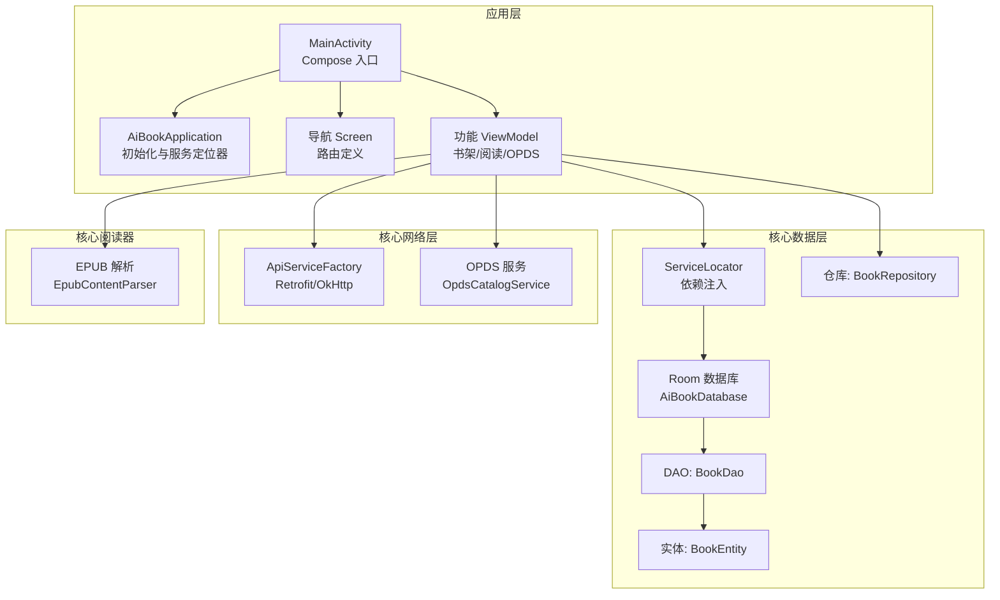
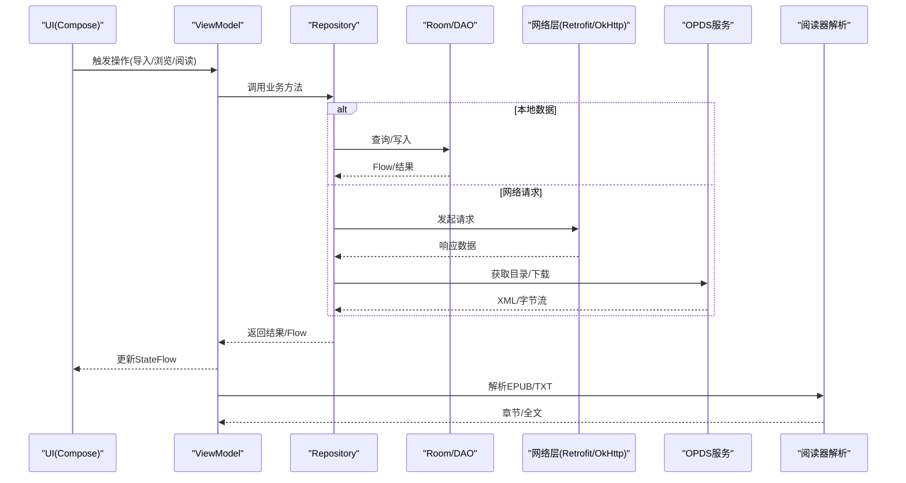
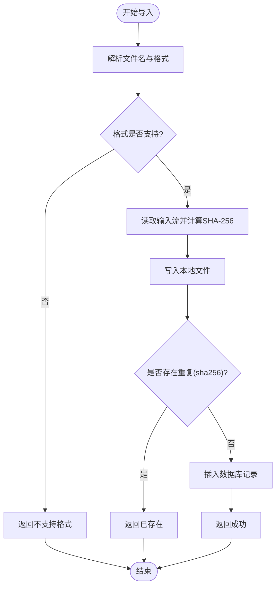
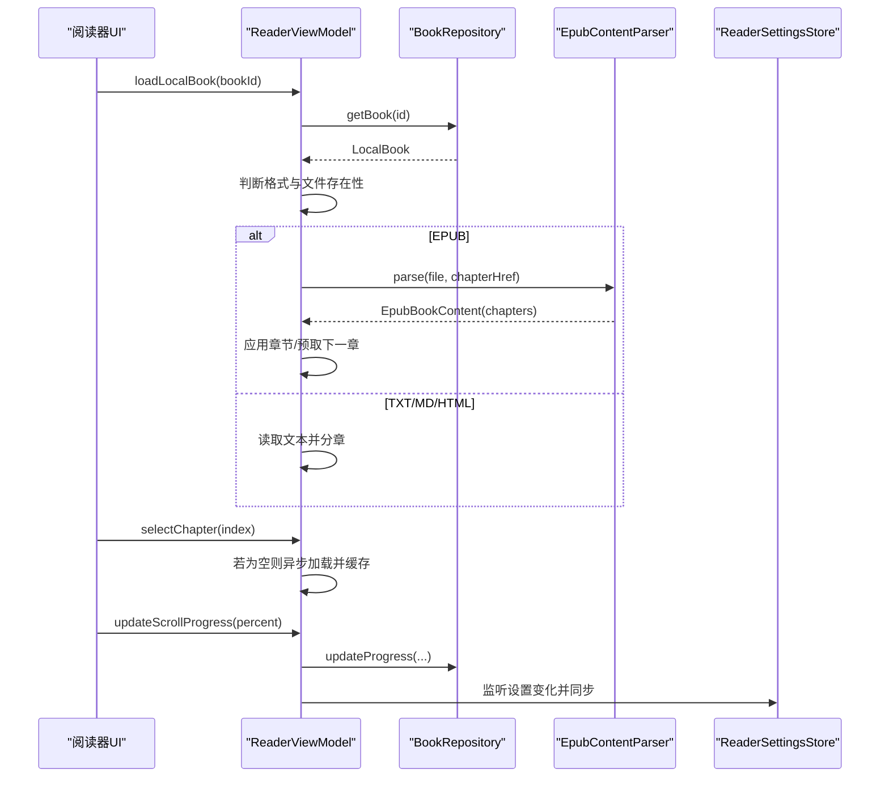
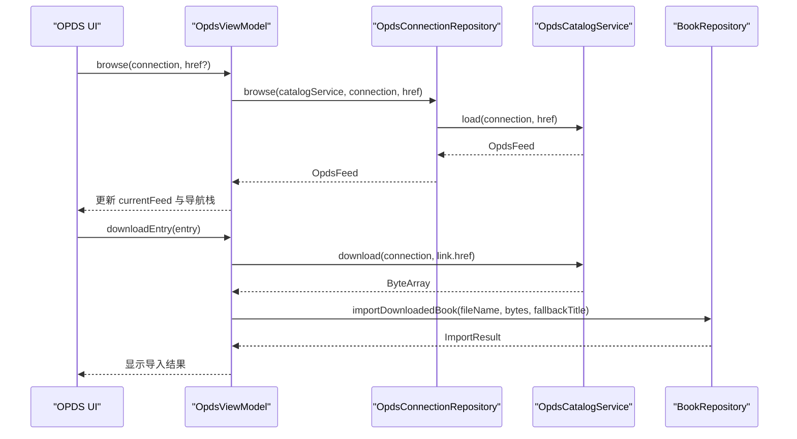
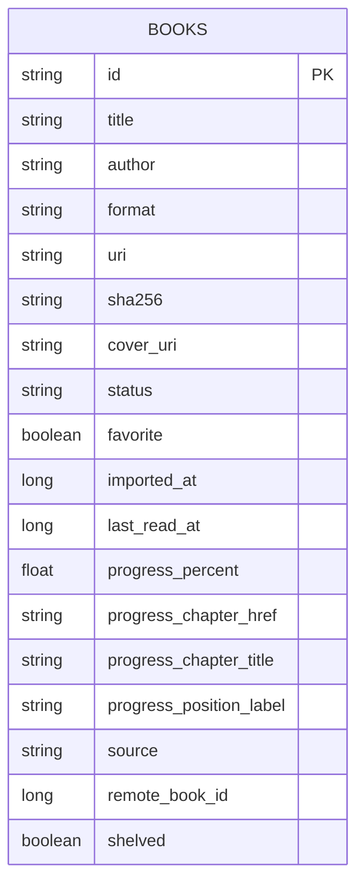
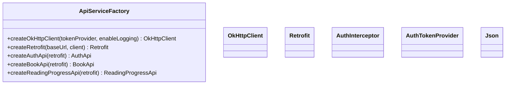
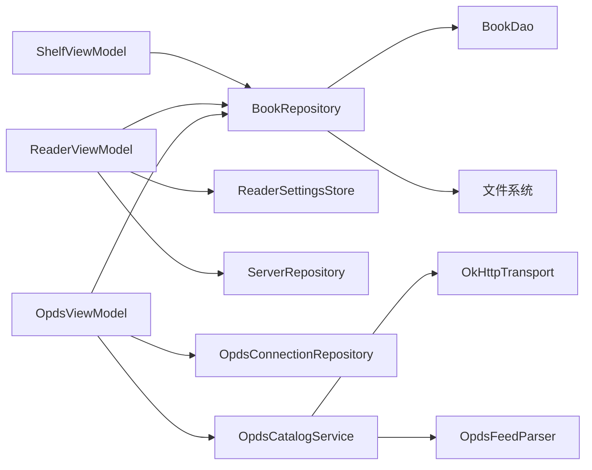

# Android 应用

<cite>
**本文引用的文件**   
- [AiBookApplication.kt](file://android/app/src/main/kotlin/com/aibook/android/AiBookApplication.kt)
- [MainActivity.kt](file://android/app/src/main/kotlin/com/aibook/android/MainActivity.kt)
- [Screen.kt](file://android/app/src/main/kotlin/com/aibook/android/navigation/Screen.kt)
- [ServiceLocator.kt](file://android/app/src/main/kotlin/com/aibook/android/di/ServiceLocator.kt)
- [AiBookDatabase.kt](file://android/core/data/src/main/kotlin/com/aibook/android/core/data/db/AiBookDatabase.kt)
- [BookDao.kt](file://android/core/data/src/main/kotlin/com/aibook/android/core/data/db/BookDao.kt)
- [BookEntity.kt](file://android/core/data/src/main/kotlin/com/aibook/android/core/data/db/BookEntity.kt)
- [BookRepository.kt](file://android/core/data/src/main/kotlin/com/aibook/android/core/data/repository/BookRepository.kt)
- [ApiServiceFactory.kt](file://android/core/network/src/main/kotlin/com/aibook/android/core/network/api/ApiServiceFactory.kt)
- [OpdsCatalogService.kt](file://android/core/network/src/main/kotlin/com/aibook/android/core/network/opds/OpdsCatalogService.kt)
- [EpubContentParser.kt](file://android/core/reader/src/main/kotlin/com/aibook/android/core/reader/EpubContentParser.kt)
- [ShelfViewModel.kt](file://android/app/src/main/kotlin/com/aibook/android/feature/shelf/ShelfViewModel.kt)
- [ReaderViewModel.kt](file://android/app/src/main/kotlin/com/aibook/android/feature/reader/ReaderViewModel.kt)
- [OpdsViewModel.kt](file://android/app/src/main/kotlin/com/aibook/android/feature/opds/OpdsViewModel.kt)
- [design-system.md](file://android/ui_design/design-system.md)
</cite>

## 目录
1. [简介](#简介)
2. [项目结构](#项目结构)
3. [核心组件](#核心组件)
4. [架构总览](#架构总览)
5. [详细组件分析](#详细组件分析)
6. [依赖关系分析](#依赖关系分析)
7. [性能考量](#性能考量)
8. [故障排查指南](#故障排查指南)
9. [结论](#结论)
10. [附录](#附录)

## 简介
本技术文档面向 AI Book Android 应用，聚焦基于 Kotlin 与 Jetpack Compose 的现代化架构实现。文档围绕 MVVM 模式、状态管理、数据抽象、UI 同步机制展开，深入解析书架管理、EPUB/TXT/PDF 阅读器、OPDS 客户端、设置管理等核心模块；同时覆盖 Room 数据库持久化设计、网络通信层（Retrofit + OkHttp）、UI 设计规范、主题定制与性能优化策略，并给出测试与调试建议。

## 项目结构
Android 端采用多模块分层组织：
- app 模块：入口、导航、功能界面与 ViewModel
- core/data：Room 数据库、DAO、实体、仓库与偏好存储
- core/network：API 工厂、拦截器、OPDS 服务与传输
- core/reader：阅读内容解析（EPUB/TXT）
- ui_design：设计系统与规范

图表来源
- [MainActivity.kt:1-25](file://android/app/src/main/kotlin/com/aibook/android/MainActivity.kt#L1-L25)
- [AiBookApplication.kt:1-22](file://android/app/src/main/kotlin/com/aibook/android/AiBookApplication.kt#L1-L22)
- [Screen.kt:1-28](file://android/app/src/main/kotlin/com/aibook/android/navigation/Screen.kt#L1-L28)
- [ServiceLocator.kt:1-58](file://android/app/src/main/kotlin/com/aibook/android/di/ServiceLocator.kt#L1-L58)
- [AiBookDatabase.kt:1-36](file://android/core/data/src/main/kotlin/com/aibook/android/core/data/db/AiBookDatabase.kt#L1-L36)
- [BookDao.kt:1-60](file://android/core/data/src/main/kotlin/com/aibook/android/core/data/db/BookDao.kt#L1-L60)
- [BookEntity.kt:1-28](file://android/core/data/src/main/kotlin/com/aibook/android/core/data/db/BookEntity.kt#L1-L28)
- [BookRepository.kt:1-186](file://android/core/data/src/main/kotlin/com/aibook/android/core/data/repository/BookRepository.kt#L1-L186)
- [ApiServiceFactory.kt:1-59](file://android/core/network/src/main/kotlin/com/aibook/android/core/network/api/ApiServiceFactory.kt#L1-L59)
- [OpdsCatalogService.kt:1-31](file://android/core/network/src/main/kotlin/com/aibook/android/core/network/opds/OpdsCatalogService.kt#L1-L31)
- [EpubContentParser.kt:1-203](file://android/core/reader/src/main/kotlin/com/aibook/android/core/reader/EpubContentParser.kt#L1-L203)

章节来源
- [MainActivity.kt:1-25](file://android/app/src/main/kotlin/com/aibook/android/MainActivity.kt#L1-L25)
- [AiBookApplication.kt:1-22](file://android/app/src/main/kotlin/com/aibook/android/AiBookApplication.kt#L1-L22)
- [Screen.kt:1-28](file://android/app/src/main/kotlin/com/aibook/android/navigation/Screen.kt#L1-L28)

## 核心组件
- 应用启动与初始化
  - Application 中通过 ServiceLocator 初始化服务器配置等全局资源
  - MainActivity 启用边缘到边缘显示并挂载 Compose 主题与应用根节点
- 依赖注入
  - ServiceLocator 集中提供数据库、仓库、OPDS 服务等实例，避免硬耦合
- 数据层
  - Room 数据库声明实体与 DAO，暴露 Flow 以驱动 UI 响应式更新
  - Repository 封装导入、去重、进度保存、收藏/书架标记等业务逻辑
- 网络层
  - ApiServiceFactory 统一创建 OkHttpClient 与 Retrofit，集成认证拦截器与日志
  - OPDS 服务通过可插拔传输与解析器加载目录与下载书籍
- 阅读器
  - EPUB 解析器从 ZIP 中提取元数据与章节文本，支持降级策略
  - ReaderViewModel 负责本地/远程书籍加载、章节选择、预取与进度保存

章节来源
- [AiBookApplication.kt:1-22](file://android/app/src/main/kotlin/com/aibook/android/AiBookApplication.kt#L1-L22)
- [MainActivity.kt:1-25](file://android/app/src/main/kotlin/com/aibook/android/MainActivity.kt#L1-L25)
- [ServiceLocator.kt:1-58](file://android/app/src/main/kotlin/com/aibook/android/di/ServiceLocator.kt#L1-L58)
- [AiBookDatabase.kt:1-36](file://android/core/data/src/main/kotlin/com/aibook/android/core/data/db/AiBookDatabase.kt#L1-L36)
- [BookDao.kt:1-60](file://android/core/data/src/main/kotlin/com/aibook/android/core/data/db/BookDao.kt#L1-L60)
- [BookRepository.kt:1-186](file://android/core/data/src/main/kotlin/com/aibook/android/core/data/repository/BookRepository.kt#L1-L186)
- [ApiServiceFactory.kt:1-59](file://android/core/network/src/main/kotlin/com/aibook/android/core/network/api/ApiServiceFactory.kt#L1-L59)
- [OpdsCatalogService.kt:1-31](file://android/core/network/src/main/kotlin/com/aibook/android/core/network/opds/OpdsCatalogService.kt#L1-L31)
- [EpubContentParser.kt:1-203](file://android/core/reader/src/main/kotlin/com/aibook/android/core/reader/EpubContentParser.kt#L1-L203)

## 架构总览
整体遵循 MVVM + Repository 的分层架构：
- UI 层（Composable）订阅 ViewModel 的 StateFlow
- ViewModel 组合多个 Flow 与协程任务，调用 Repository
- Repository 协调 Room、文件系统与网络服务
- 网络层通过 Retrofit/OkHttp 访问后端 API 与 OPDS 源
- 阅读器在本地解析 EPUB/TXT，必要时回退到简化解析

图表来源
- [ShelfViewModel.kt:1-98](file://android/app/src/main/kotlin/com/aibook/android/feature/shelf/ShelfViewModel.kt#L1-L98)
- [ReaderViewModel.kt:1-400](file://android/app/src/main/kotlin/com/aibook/android/feature/reader/ReaderViewModel.kt#L1-L400)
- [OpdsViewModel.kt:1-312](file://android/app/src/main/kotlin/com/aibook/android/feature/opds/OpdsViewModel.kt#L1-L312)
- [BookRepository.kt:1-186](file://android/core/data/src/main/kotlin/com/aibook/android/core/data/repository/BookRepository.kt#L1-L186)
- [ApiServiceFactory.kt:1-59](file://android/core/network/src/main/kotlin/com/aibook/android/core/network/api/ApiServiceFactory.kt#L1-L59)
- [OpdsCatalogService.kt:1-31](file://android/core/network/src/main/kotlin/com/aibook/android/core/network/opds/OpdsCatalogService.kt#L1-L31)
- [EpubContentParser.kt:1-203](file://android/core/reader/src/main/kotlin/com/aibook/android/core/reader/EpubContentParser.kt#L1-L203)

## 详细组件分析

### 书架管理（Shelf）
- 职责
  - 展示已上架书籍列表，支持搜索过滤
  - 处理导入流程（URI 或下载后导入），去重与格式校验
  - 维护收藏与书架标记，删除书籍时清理本地文件
- 状态管理
  - 使用 combine 将书籍 Flow、查询词、导入消息与加载状态合并为 ShelfUiState
  - 通过 stateIn 控制订阅生命周期，减少内存占用
- 关键流程
  - 导入：解析文件名→计算 SHA-256→查重→落盘→插入数据库→返回结果
  - 更新进度：根据百分比计算状态与位置标签，持久化至数据库

图表来源
- [BookRepository.kt:53-95](file://android/core/data/src/main/kotlin/com/aibook/android/core/data/repository/BookRepository.kt#L53-L95)
- [ShelfViewModel.kt:63-75](file://android/app/src/main/kotlin/com/aibook/android/feature/shelf/ShelfViewModel.kt#L63-L75)

章节来源
- [ShelfViewModel.kt:1-98](file://android/app/src/main/kotlin/com/aibook/android/feature/shelf/ShelfViewModel.kt#L1-L98)
- [BookRepository.kt:1-186](file://android/core/data/src/main/kotlin/com/aibook/android/core/data/repository/BookRepository.kt#L1-L186)

### 阅读器（Reader）
- 职责
  - 加载本地 EPUB/TXT/HTML/Markdown，PDF 暂不支持
  - 支持远程书籍内容加载与进度同步
  - 章节选择、懒加载与下一章预取
  - 阅读设置（字体大小、行距、主题、对齐、翻页模式、亮度、常亮）
- 状态管理
  - ReaderUiState 聚合书籍信息、内容、章节、滚动进度、错误信息与设置
  - 监听 ReaderSettingsStore 的多项设置 Flow，实时同步到 UI
- 关键流程
  - 本地加载：优先尝试 Readium 解析，失败则降级到 EpubContentParser；若无章节则回退 TXT 全文
  - 章节切换：若目标章节内容为空，异步加载并缓存；同时预取下一章节
  - 进度保存：更新本地数据库与远程进度（如适用）

图表来源
- [ReaderViewModel.kt:74-130](file://android/app/src/main/kotlin/com/aibook/android/feature/reader/ReaderViewModel.kt#L74-L130)
- [ReaderViewModel.kt:161-201](file://android/app/src/main/kotlin/com/aibook/android/feature/reader/ReaderViewModel.kt#L161-L201)
- [ReaderViewModel.kt:211-228](file://android/app/src/main/kotlin/com/aibook/android/feature/reader/ReaderViewModel.kt#L211-L228)
- [EpubContentParser.kt:24-47](file://android/core/reader/src/main/kotlin/com/aibook/android/core/reader/EpubContentParser.kt#L24-L47)

章节来源
- [ReaderViewModel.kt:1-400](file://android/app/src/main/kotlin/com/aibook/android/feature/reader/ReaderViewModel.kt#L1-L400)
- [EpubContentParser.kt:1-203](file://android/core/reader/src/main/kotlin/com/aibook/android/core/reader/EpubContentParser.kt#L1-L203)

### OPDS 客户端
- 职责
  - 管理 OPDS 连接（增删改查、启用/停用、同步状态）
  - 浏览目录树（支持导航栈）、下载书籍并导入书架
- 状态管理
  - OpdsUiState 包含连接列表、当前目录、导航栈、下载状态与表单字段
  - 通过 combine 将连接 Flow 与内部状态合并，保持 UI 一致性
- 关键流程
  - 浏览：根据 href 解析 URL，发送 BasicAuth 头，解析 XML 为目录条目
  - 下载：获取字节流，命名文件，调用仓库导入并反馈结果

图表来源
- [OpdsViewModel.kt:184-210](file://android/app/src/main/kotlin/com/aibook/android/feature/opds/OpdsViewModel.kt#L184-L210)
- [OpdsViewModel.kt:217-251](file://android/app/src/main/kotlin/com/aibook/android/feature/opds/OpdsViewModel.kt#L217-L251)
- [OpdsCatalogService.kt:7-21](file://android/core/network/src/main/kotlin/com/aibook/android/core/network/opds/OpdsCatalogService.kt#L7-L21)
- [BookRepository.kt:97-130](file://android/core/data/src/main/kotlin/com/aibook/android/core/data/repository/BookRepository.kt#L97-L130)

章节来源
- [OpdsViewModel.kt:1-312](file://android/app/src/main/kotlin/com/aibook/android/feature/opds/OpdsViewModel.kt#L1-L312)
- [OpdsCatalogService.kt:1-31](file://android/core/network/src/main/kotlin/com/aibook/android/core/network/opds/OpdsCatalogService.kt#L1-L31)

### 数据持久化（Room）
- 实体设计
  - BookEntity 包含书籍标识、标题、作者、格式、URI、哈希、封面、状态、收藏、时间戳、进度、来源与远程 ID 等字段
- DAO 操作
  - 提供观察全部/已上架/按来源的 Flow，单条查询与更新，计数与删除
  - 进度更新接口支持章节链接、标题与位置标签
- 迁移策略
  - 当前版本 4，使用 destructive migration（重建表），适用于开发期快速迭代

图表来源
- [BookEntity.kt:6-27](file://android/core/data/src/main/kotlin/com/aibook/android/core/data/db/BookEntity.kt#L6-L27)
- [BookDao.kt:13-58](file://android/core/data/src/main/kotlin/com/aibook/android/core/data/db/BookDao.kt#L13-L58)
- [AiBookDatabase.kt:8-17](file://android/core/data/src/main/kotlin/com/aibook/android/core/data/db/AiBookDatabase.kt#L8-L17)

章节来源
- [AiBookDatabase.kt:1-36](file://android/core/data/src/main/kotlin/com/aibook/android/core/data/db/AiBookDatabase.kt#L1-L36)
- [BookDao.kt:1-60](file://android/core/data/src/main/kotlin/com/aibook/android/core/data/db/BookDao.kt#L1-L60)
- [BookEntity.kt:1-28](file://android/core/data/src/main/kotlin/com/aibook/android/core/data/db/BookEntity.kt#L1-L28)

### 网络通信层（Retrofit + OkHttp）
- 配置要点
  - OkHttpClient 设置连接/读写超时，集成认证拦截器与可选日志
  - Retrofit 使用 kotlinx.serialization 作为 JSON 转换器，自动忽略未知键并强制填充默认值
- 认证与拦截
  - AuthInterceptor 负责附加鉴权头，AuthTokenProvider 提供令牌
- 错误处理与离线支持
  - 上层 ViewModel 捕获异常并转换为可读错误消息
  - 本地缓存与 Flow 驱动使 UI 在网络不可用时仍可展示最近数据

图表来源
- [ApiServiceFactory.kt:20-54](file://android/core/network/src/main/kotlin/com/aibook/android/core/network/api/ApiServiceFactory.kt#L20-L54)

章节来源
- [ApiServiceFactory.kt:1-59](file://android/core/network/src/main/kotlin/com/aibook/android/core/network/api/ApiServiceFactory.kt#L1-L59)

### UI 组件设计与主题
- 视觉方向
  - 现代、安静、温暖、阅读优先；浅米白背景，暖橙强调色，柔和卡片与线性图标
- 色彩与排版 Token
  - 定义主背景、表面色、强调色、文本色、描边、成功/警告/错误等
  - 页面标题、区块标题、正文、辅助信息字号与行高规范
- 尺寸与交互
  - 边距、圆角、按钮高度、触控区域、加载/空态/错误/危险操作提示
- 可访问性
  - contentDescription、颜色非唯一状态表达、正文字号/行距/主题可调、暗色对比度保障

章节来源
- [design-system.md:1-63](file://android/ui_design/design-system.md#L1-L63)

## 依赖关系分析
- 组件耦合
  - ViewModel 仅依赖 Repository 与设置存储，降低对底层实现的感知
  - Repository 组合 DAO、文件系统与网络服务，职责清晰
- 外部依赖
  - Room 用于本地持久化
  - Retrofit/OkHttp 用于 HTTP 通信
  - kotlinx.serialization 用于 JSON 编解码
- 潜在循环依赖
  - 通过 ServiceLocator 解耦，避免直接构造链导致的循环引用

图表来源
- [ShelfViewModel.kt:37-98](file://android/app/src/main/kotlin/com/aibook/android/feature/shelf/ShelfViewModel.kt#L37-L98)
- [ReaderViewModel.kt:48-72](file://android/app/src/main/kotlin/com/aibook/android/feature/reader/ReaderViewModel.kt#L48-L72)
- [OpdsViewModel.kt:43-55](file://android/app/src/main/kotlin/com/aibook/android/feature/opds/OpdsViewModel.kt#L43-L55)
- [BookRepository.kt:29-39](file://android/core/data/src/main/kotlin/com/aibook/android/core/data/repository/BookRepository.kt#L29-L39)
- [OpdsCatalogService.kt:3-21](file://android/core/network/src/main/kotlin/com/aibook/android/core/network/opds/OpdsCatalogService.kt#L3-L21)

章节来源
- [ServiceLocator.kt:16-45](file://android/app/src/main/kotlin/com/aibook/android/di/ServiceLocator.kt#L16-L45)

## 性能考量
- 数据流与订阅
  - 使用 stateIn 的 WhileSubscribed 策略，减少不必要的数据订阅与内存占用
- 懒加载与预取
  - EPUB 章节按需加载，下一页预取提升翻页体验
- 大文件处理
  - 导入过程使用流式写入与分块哈希，避免一次性加载大文件导致 OOM
- 网络超时与重试
  - 合理设置连接/读写超时；可在拦截器层增加重试与退避策略
- 线程调度
  - 使用 viewModelScope 与 IO 调度器执行耗时任务，避免阻塞主线程

[本节为通用指导，不直接分析具体文件]

## 故障排查指南
- 常见问题
  - 导入失败：检查 URI 可读性与文件格式支持；查看导入消息与错误码
  - 重复导入：基于 SHA-256 去重，确认哈希计算与文件完整性
  - 章节空白：EPUB 解析失败时回退 TXT 全文；检查章节内容与索引
  - OPDS 连接失败：验证地址、用户名/密码与 BasicAuth 头；查看同步状态与错误信息
- 调试建议
  - 开启 OkHttp 日志输出，定位网络问题
  - 在 ViewModel 中打印关键状态变更与异常堆栈
  - 使用 Room Schema 导出与迁移脚本进行版本演进验证

章节来源
- [ShelfViewModel.kt:63-75](file://android/app/src/main/kotlin/com/aibook/android/feature/shelf/ShelfViewModel.kt#L63-L75)
- [ReaderViewModel.kt:123-129](file://android/app/src/main/kotlin/com/aibook/android/feature/reader/ReaderViewModel.kt#L123-L129)
- [OpdsViewModel.kt:198-209](file://android/app/src/main/kotlin/com/aibook/android/feature/opds/OpdsViewModel.kt#L198-L209)
- [ApiServiceFactory.kt:30-34](file://android/core/network/src/main/kotlin/com/aibook/android/core/network/api/ApiServiceFactory.kt#L30-L34)

## 结论
AI Book Android 应用采用清晰的 MVVM + Repository 分层，结合 Room 与 Retrofit/OkHttp 构建稳定可靠的数据与网络层。阅读器模块在 EPUB/TXT 解析上具备良好容错与性能优化，OPDS 客户端提供完整的目录浏览与下载能力。设计系统确保一致的视觉与交互体验。建议在后续迭代中完善 PDF 支持、引入正式迁移策略与更完善的错误分类与重试机制。

[本节为总结性内容，不直接分析具体文件]

## 附录
- 导航路由
  - 书架、商店、OPDS、设置、主题、扫描目录、存储缓存、隐私权限、关于、书籍详情、阅读器及其远程变体
- 设置管理
  - 阅读器设置包括字体缩放、行距、主题、段落间距、对齐方式、翻页模式、自动亮度与屏幕常亮

章节来源
- [Screen.kt:3-27](file://android/app/src/main/kotlin/com/aibook/android/navigation/Screen.kt#L3-L27)
- [ReaderViewModel.kt:230-306](file://android/app/src/main/kotlin/com/aibook/android/feature/reader/ReaderViewModel.kt#L230-L306)