# Web 前端

<cite>
**本文引用的文件**
- [frontend/package.json](file://frontend/package.json)
- [frontend/vite.config.ts](file://frontend/vite.config.ts)
- [frontend/tsconfig.json](file://frontend/tsconfig.json)
- [frontend/src/main.ts](file://frontend/src/main.ts)
- [frontend/src/App.vue](file://frontend/src/App.vue)
- [frontend/src/router/index.ts](file://frontend/src/router/index.ts)
- [frontend/src/utils/api.ts](file://frontend/src/utils/api.ts)
- [frontend/src/stores/theme.ts](file://frontend/src/stores/theme.ts)
- [frontend/src/stores/book.ts](file://frontend/src/stores/book.ts)
- [frontend/src/stores/user.ts](file://frontend/src/stores/user.ts)
- [frontend/src/layouts/ThemeLayoutWrapper.vue](file://frontend/src/layouts/ThemeLayoutWrapper.vue)
- [frontend/src/views/HomeView.vue](file://frontend/src/views/HomeView.vue)
- [frontend/src/views/BooksView.vue](file://frontend/src/views/BooksView.vue)
- [frontend/src/views/ReaderView.vue](file://frontend/src/views/ReaderView.vue)
- [frontend/src/views/SettingsView.vue](file://frontend/src/views/SettingsView.vue)
</cite>

## 目录
1. [简介](#简介)
2. [项目结构](#项目结构)
3. [核心组件](#核心组件)
4. [架构总览](#架构总览)
5. [详细组件分析](#详细组件分析)
6. [依赖分析](#依赖分析)
7. [性能考虑](#性能考虑)
8. [故障排查指南](#故障排查指南)
9. [结论](#结论)
10. [附录](#附录)

## 简介
本技术文档面向 AI Book Web 的前端实现，基于 Vue.js 3 + TypeScript 构建，采用 Vite 作为开发与构建工具，使用 Pinia 进行状态管理，Vue Router 进行路由与权限控制，Element Plus 提供基础 UI 能力。文档覆盖：
- 组件化设计与布局系统（主题驱动的动态布局）
- 状态管理模式（Pinia Store：书籍、用户、主题）
- 路由配置与守卫
- 核心页面功能：首页、书库、阅读器、设置、连接管理等
- 自定义组件库与样式系统（主题变量、玻璃态风格）
- 后端 API 集成方案（Axios 封装、拦截器、错误处理、类型定义）
- 构建配置、性能优化策略与浏览器兼容性
- 开发工作流、代码规范与调试技巧

## 项目结构
前端工程位于 frontend 目录，主要组织方式如下：
- src/main.ts：应用入口，注册插件、初始化主题
- src/App.vue：根组件，全局样式与字体
- src/router/index.ts：路由表与导航守卫
- src/stores/*：Pinia 状态模块（book、user、theme）
- src/layouts/*：布局容器（Dock、Topbar、Sidebar），由主题驱动动态渲染
- src/views/*：页面级视图（Home、Books、Reader、Settings、Connections 等）
- src/components/*：可复用业务组件（上传、目录浏览、批处理刮削等）
- src/utils/*：通用工具（API 封装、消息提示、封面 URL 生成、爬虫辅助）
- src/styles/*：全局样式与主题变量
- vite.config.ts：Vite 开发服务器、代理、别名配置
- tsconfig.json：TypeScript 编译选项与路径映射
- package.json：依赖与脚本

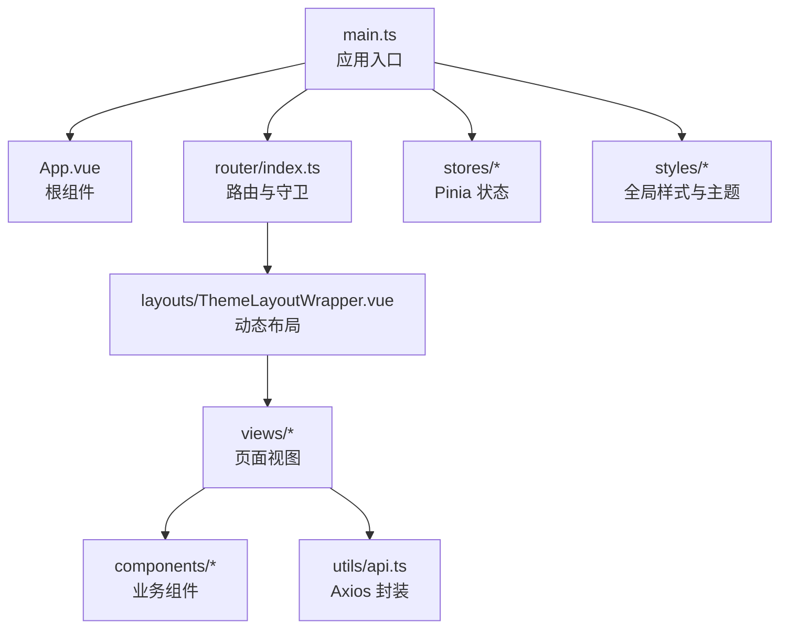

图表来源
- [frontend/src/main.ts:1-23](file://frontend/src/main.ts#L1-L23)
- [frontend/src/App.vue:1-21](file://frontend/src/App.vue#L1-L21)
- [frontend/src/router/index.ts:1-86](file://frontend/src/router/index.ts#L1-L86)
- [frontend/src/layouts/ThemeLayoutWrapper.vue:1-25](file://frontend/src/layouts/ThemeLayoutWrapper.vue#L1-L25)

章节来源
- [frontend/package.json:1-27](file://frontend/package.json#L1-L27)
- [frontend/vite.config.ts:1-22](file://frontend/vite.config.ts#L1-L22)
- [frontend/tsconfig.json:1-26](file://frontend/tsconfig.json#L1-L26)
- [frontend/src/main.ts:1-23](file://frontend/src/main.ts#L1-L23)
- [frontend/src/App.vue:1-21](file://frontend/src/App.vue#L1-L21)

## 核心组件
- 应用启动与插件装配
  - 创建 Vue 应用实例，安装 Pinia、Router、ElementPlus
  - 初始化主题并写入 DOM 数据属性，确保主题变量生效
- 根组件
  - 仅包含 router-view，承载所有页面内容
  - 统一全局样式与字体栈
- 路由与守卫
  - 定义登录、注册与受保护的路由树
  - 通过 meta.requiresAuth 控制访问权限，未登录时重定向到登录页
- 主题与布局
  - 主题 Store 维护当前主题 ID、主题定义与布局类型
  - 布局包装组件根据主题选择 Dock/Topbar/Sidebar 布局，支持异步加载
- 状态管理（Pinia）
  - book store：书籍列表、分页、搜索、收藏/想读切换、删除、元数据更新
  - user store：登录、注册、登出、本地 token 同步
  - theme store：主题切换、持久化、布局计算
- API 封装（Axios）
  - 统一 baseURL、超时、Content-Type
  - 请求拦截器自动注入 Authorization 头
  - 响应拦截器统一错误处理，401 自动跳转登录并提示

章节来源
- [frontend/src/main.ts:1-23](file://frontend/src/main.ts#L1-L23)
- [frontend/src/App.vue:1-21](file://frontend/src/App.vue#L1-L21)
- [frontend/src/router/index.ts:1-86](file://frontend/src/router/index.ts#L1-L86)
- [frontend/src/stores/theme.ts:1-39](file://frontend/src/stores/theme.ts#L1-L39)
- [frontend/src/stores/book.ts:1-154](file://frontend/src/stores/book.ts#L1-L154)
- [frontend/src/stores/user.ts:1-74](file://frontend/src/stores/user.ts#L1-L74)
- [frontend/src/utils/api.ts:1-50](file://frontend/src/utils/api.ts#L1-L50)
- [frontend/src/layouts/ThemeLayoutWrapper.vue:1-25](file://frontend/src/layouts/ThemeLayoutWrapper.vue#L1-L25)

## 架构总览
整体采用“视图层 + 状态层 + 网络层”的清晰分层：
- 视图层：各页面组件负责展示与交互，调用 Store 方法
- 状态层：Pinia Store 集中管理业务状态与副作用（如网络请求）
- 网络层：Axios 封装统一处理鉴权、错误提示与路由跳转

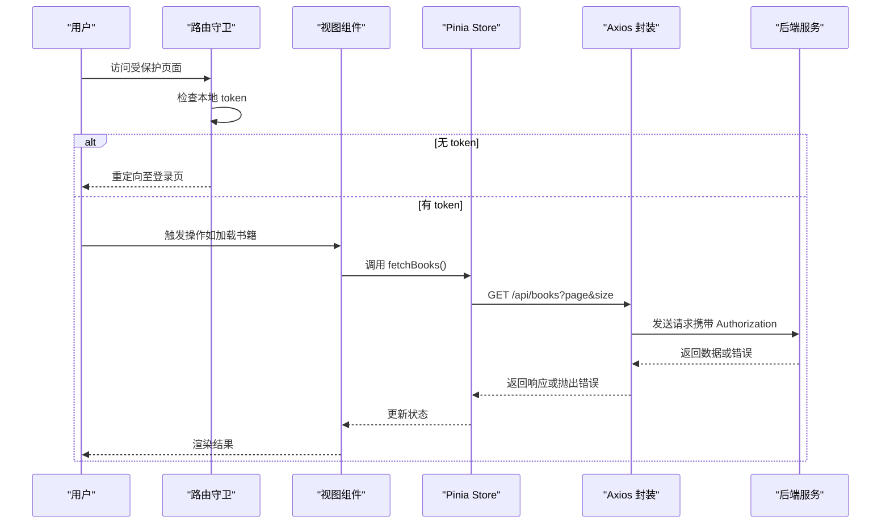

图表来源
- [frontend/src/router/index.ts:72-83](file://frontend/src/router/index.ts#L72-L83)
- [frontend/src/stores/book.ts:47-62](file://frontend/src/stores/book.ts#L47-L62)
- [frontend/src/utils/api.ts:14-47](file://frontend/src/utils/api.ts#L14-L47)

## 详细组件分析

### 主题与布局系统
- 主题 Store
  - 维护 currentTheme、currentThemeDef、currentLayout
  - setTheme 写入 data-theme 属性并持久化到 localStorage
  - initTheme 在应用启动时恢复上次主题
- 动态布局
  - ThemeLayoutWrapper 根据 currentLayout 动态渲染 Dock/Topbar/Sidebar
  - 使用 defineAsyncComponent 按需加载布局组件，减少首屏体积

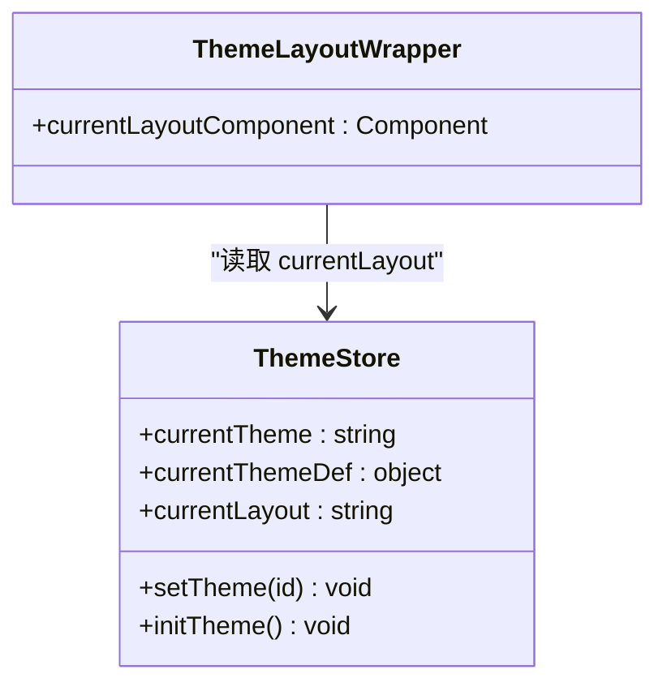

图表来源
- [frontend/src/stores/theme.ts:1-39](file://frontend/src/stores/theme.ts#L1-L39)
- [frontend/src/layouts/ThemeLayoutWrapper.vue:1-25](file://frontend/src/layouts/ThemeLayoutWrapper.vue#L1-L25)

章节来源
- [frontend/src/stores/theme.ts:1-39](file://frontend/src/stores/theme.ts#L1-L39)
- [frontend/src/layouts/ThemeLayoutWrapper.vue:1-25](file://frontend/src/layouts/ThemeLayoutWrapper.vue#L1-L25)

### 路由与权限控制
- 路由表
  - 登录/注册为非受保护路由
  - 根路由下嵌套多个受保护子路由（首页、书库、详情、阅读器、书架、书单、连接、设置）
- 导航守卫
  - 进入 requiresAuth 路由且无 token 时重定向到登录
  - 已登录访问登录/注册时重定向到首页

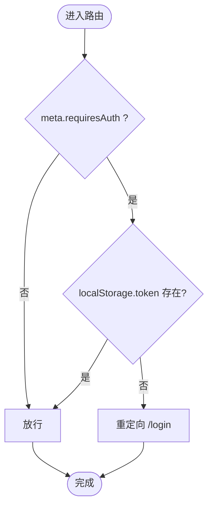

图表来源
- [frontend/src/router/index.ts:1-86](file://frontend/src/router/index.ts#L1-L86)

章节来源
- [frontend/src/router/index.ts:1-86](file://frontend/src/router/index.ts#L1-L86)

### 状态管理（Pinia）
- 书籍 Store
  - 数据结构：Book、BookPage
  - 方法：fetchBooks、searchBooks、fetchBookById、toggleFavorite、toggleWanted、deleteBook、updateBookMetadata
  - 分页参数：page、size、sortBy、sortDir
- 用户 Store
  - 方法：login、register、logout、isLoggedIn
  - 与 Axios 配合，登录后将 token 写入 localStorage
- 主题 Store
  - 方法：setTheme、initTheme
  - 计算属性：currentThemeDef、currentLayout

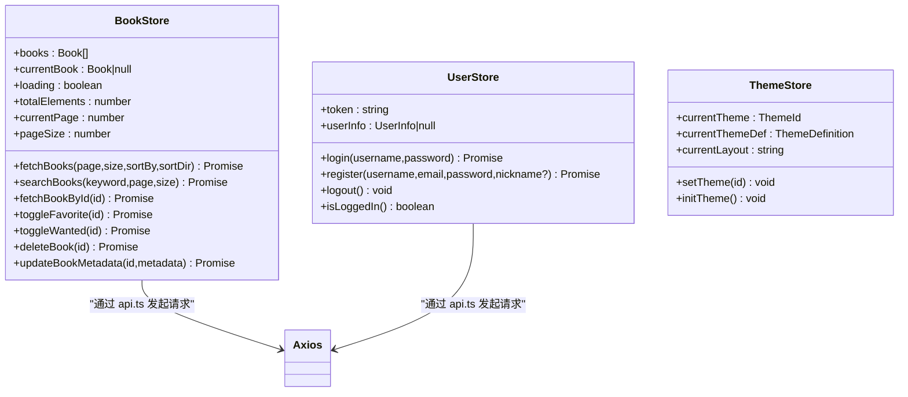

图表来源
- [frontend/src/stores/book.ts:1-154](file://frontend/src/stores/book.ts#L1-L154)
- [frontend/src/stores/user.ts:1-74](file://frontend/src/stores/user.ts#L1-L74)
- [frontend/src/stores/theme.ts:1-39](file://frontend/src/stores/theme.ts#L1-L39)
- [frontend/src/utils/api.ts:1-50](file://frontend/src/utils/api.ts#L1-L50)

章节来源
- [frontend/src/stores/book.ts:1-154](file://frontend/src/stores/book.ts#L1-L154)
- [frontend/src/stores/user.ts:1-74](file://frontend/src/stores/user.ts#L1-L74)
- [frontend/src/stores/theme.ts:1-39](file://frontend/src/stores/theme.ts#L1-L39)

### API 集成方案
- Axios 实例
  - baseURL 为空字符串，结合 Vite 开发代理转发到后端
  - 默认超时 30s，Content-Type 为 application/json
- 请求拦截器
  - 从 localStorage 读取 token，附加到 Authorization 头
- 响应拦截器
  - 401：清除 token、跳转登录、提示过期
  - 403：提示无权限
  - 其他错误：显示后端返回 message 或默认失败提示

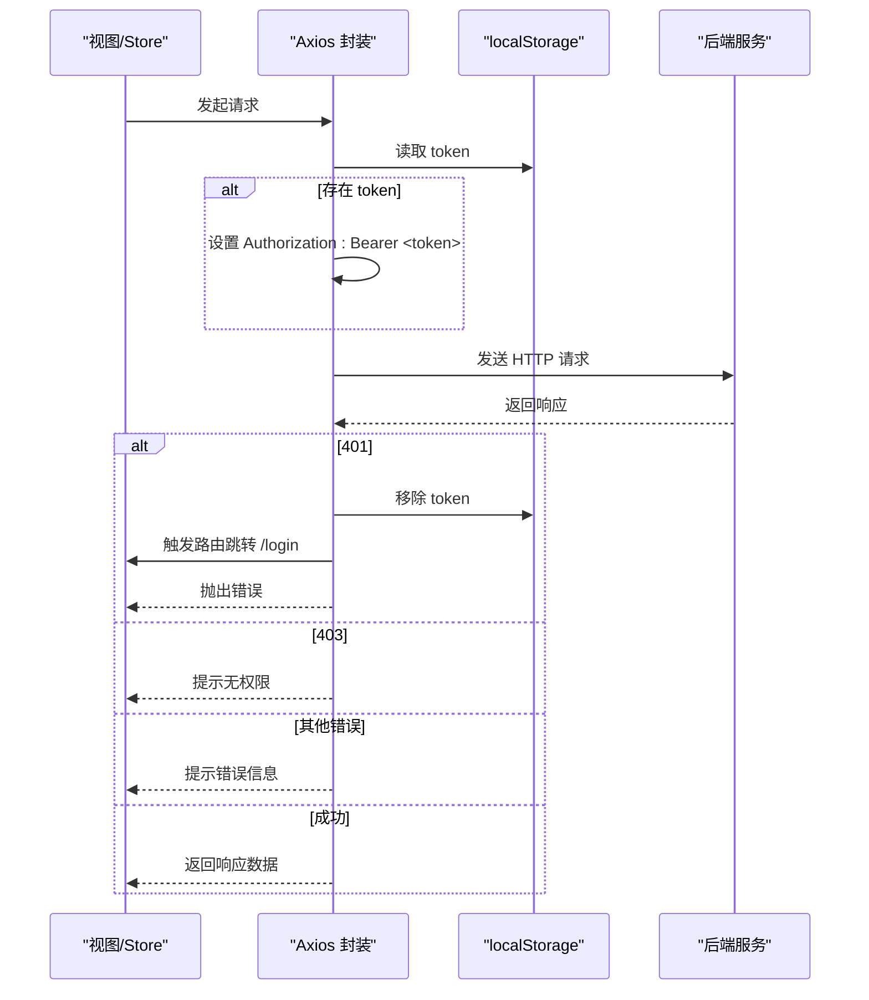

图表来源
- [frontend/src/utils/api.ts:1-50](file://frontend/src/utils/api.ts#L1-L50)
- [frontend/vite.config.ts:12-21](file://frontend/vite.config.ts#L12-L21)

章节来源
- [frontend/src/utils/api.ts:1-50](file://frontend/src/utils/api.ts#L1-L50)
- [frontend/vite.config.ts:1-22](file://frontend/vite.config.ts#L1-L22)

### 核心页面功能

#### 首页（HomeView）
- 统计卡片：书籍总数、正在阅读、收藏书籍、已读完
- 最近阅读：按更新时间倒序取前 N 条
- 想读书单：过滤 isWanted 标记的书籍
- 数据来源：bookStore.fetchBooks

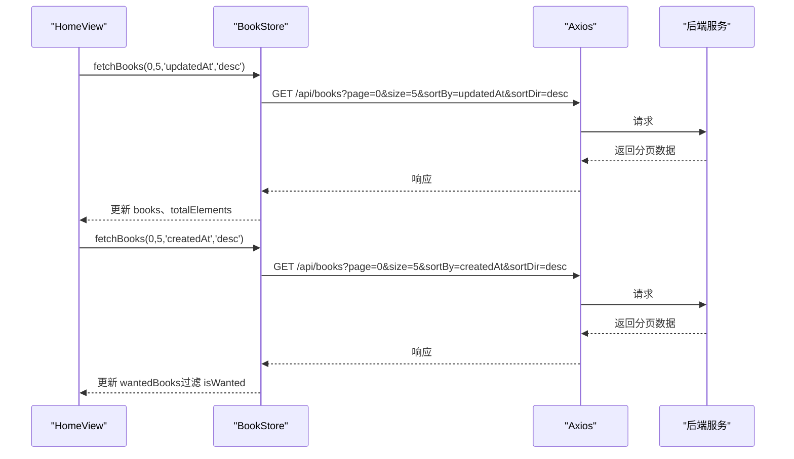

图表来源
- [frontend/src/views/HomeView.vue:115-126](file://frontend/src/views/HomeView.vue#L115-L126)
- [frontend/src/stores/book.ts:47-62](file://frontend/src/stores/book.ts#L47-L62)

章节来源
- [frontend/src/views/HomeView.vue:1-395](file://frontend/src/views/HomeView.vue#L1-L395)
- [frontend/src/stores/book.ts:1-154](file://frontend/src/stores/book.ts#L1-L154)

#### 书库（BooksView）
- 筛选与排序：关键词、格式、阅读状态、排序字段
- 视图模式：卡片/列表，支持多选批量操作
- 批量刮削：打开 BatchScraperDialog，支持“全选当前页”、“取消全选”
- 上传书籍：FileUpload 组件，成功后刷新列表
- 分页：上一页/下一页，页码信息展示

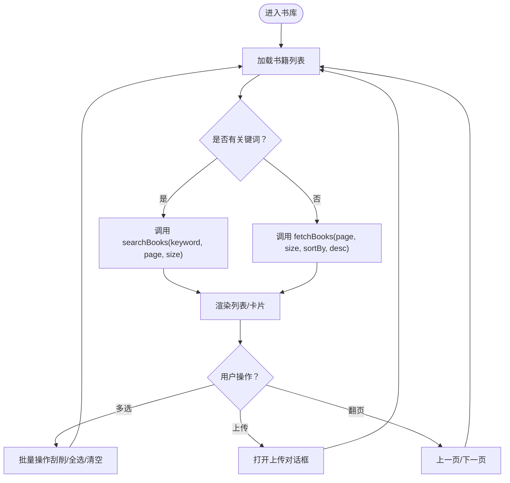

图表来源
- [frontend/src/views/BooksView.vue:298-318](file://frontend/src/views/BooksView.vue#L298-L318)
- [frontend/src/stores/book.ts:47-80](file://frontend/src/stores/book.ts#L47-L80)

章节来源
- [frontend/src/views/BooksView.vue:1-800](file://frontend/src/views/BooksView.vue#L1-L800)
- [frontend/src/stores/book.ts:1-154](file://frontend/src/stores/book.ts#L1-L154)

#### 阅读器（ReaderView）
- 多格式支持：EPUB（epubjs）、TXT/MD（文本分页/滚动）、HTML（v-html）、PDF（iframe）
- 侧边面板：目录、书签、高亮与笔记
- 阅读设置：字体、字号、行距、段落间距、背景主题、内容宽度、屏幕模式（一屏/两屏）、翻页模式
- 进度保存：定时保存当前位置与章节名
- 键盘导航：左右箭头、上下箭头、PageUp/PageDown、空格、Home/End

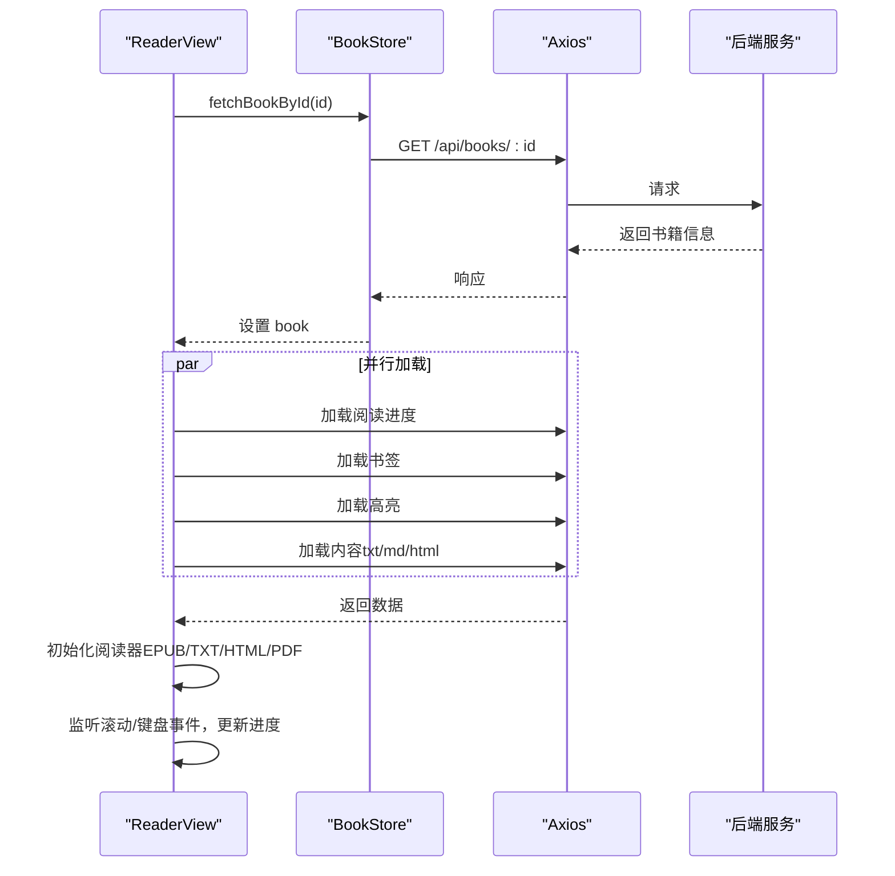

图表来源
- [frontend/src/views/ReaderView.vue:772-800](file://frontend/src/views/ReaderView.vue#L772-L800)
- [frontend/src/stores/book.ts:83-87](file://frontend/src/stores/book.ts#L83-L87)

章节来源
- [frontend/src/views/ReaderView.vue:1-800](file://frontend/src/views/ReaderView.vue#L1-L800)

#### 设置（SettingsView）
- 主题风格：预览卡片、布局名称、一键切换
- 扫描目录：添加、启用/禁用、立即扫描、删除
- 定时任务：开关与时间配置
- 系统信息：版本、运行状态、数据库状态

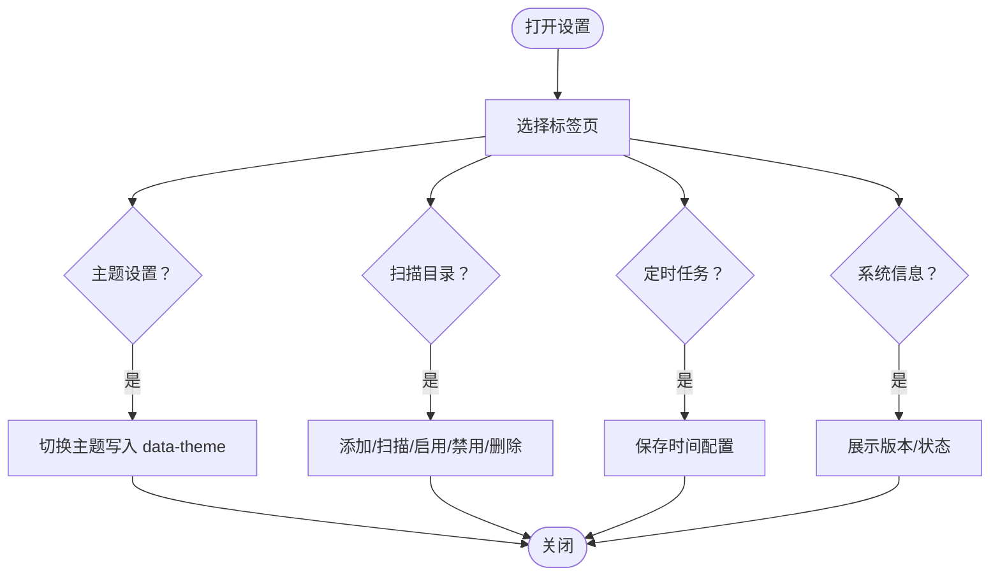

图表来源
- [frontend/src/views/SettingsView.vue:257-344](file://frontend/src/views/SettingsView.vue#L257-L344)
- [frontend/src/stores/theme.ts:16-29](file://frontend/src/stores/theme.ts#L16-L29)

章节来源
- [frontend/src/views/SettingsView.vue:1-732](file://frontend/src/views/SettingsView.vue#L1-L732)
- [frontend/src/stores/theme.ts:1-39](file://frontend/src/stores/theme.ts#L1-L39)

#### 连接管理（ConnectionsView）
- 该页面已在路由中声明，具体实现可在后续扩展，用于管理 OPDS 源或其他外部连接。

章节来源
- [frontend/src/router/index.ts:54-57](file://frontend/src/router/index.ts#L54-L57)

## 依赖分析
- 运行时依赖
  - vue、vue-router、pinia、axios、element-plus、epubjs
- 开发依赖
  - @vitejs/plugin-vue、typescript、vite、vue-tsc
- 构建与开发
  - Vite 提供热重载、生产构建、预览
  - TypeScript 严格模式、ES2020 目标、bundler 解析
  - 路径别名 @ 指向 src

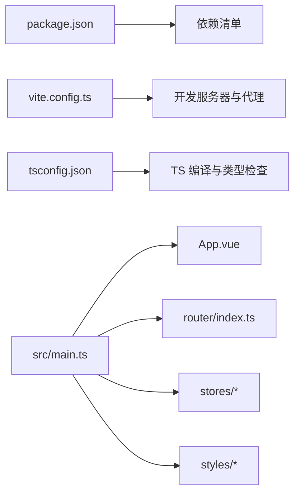

图表来源
- [frontend/package.json:1-27](file://frontend/package.json#L1-L27)
- [frontend/vite.config.ts:1-22](file://frontend/vite.config.ts#L1-L22)
- [frontend/tsconfig.json:1-26](file://frontend/tsconfig.json#L1-L26)
- [frontend/src/main.ts:1-23](file://frontend/src/main.ts#L1-L23)

章节来源
- [frontend/package.json:1-27](file://frontend/package.json#L1-L27)
- [frontend/vite.config.ts:1-22](file://frontend/vite.config.ts#L1-L22)
- [frontend/tsconfig.json:1-26](file://frontend/tsconfig.json#L1-L26)

## 性能考虑
- 路由懒加载：所有页面组件使用动态 import，降低首屏体积
- 布局异步加载：ThemeLayoutWrapper 对三种布局使用 defineAsyncComponent
- 列表分页：书库与首页均使用分页接口，避免一次性加载大量数据
- 并发请求：阅读器初始化阶段并行加载进度、书签、高亮与内容
- 资源缓存：静态资源与 API 响应可通过浏览器缓存与 CDN 提升加载速度
- 样式优化：CSS 变量与主题切换避免重复渲染；合理使用 backdrop-filter 与阴影

[本节为通用指导，不直接分析具体文件]

## 故障排查指南
- 登录过期
  - 现象：401 错误后自动跳转登录页并提示
  - 排查：确认 axios 响应拦截器是否正确处理 401，检查 localStorage 中的 token 是否存在
- 权限不足
  - 现象：403 错误提示无权限
  - 排查：确认用户角色与后端权限配置一致
- 网络请求失败
  - 现象：统一错误提示
  - 排查：检查 Vite 代理配置与后端地址，确认 CORS 与跨域问题
- 主题未生效
  - 现象：切换主题后样式不变
  - 排查：确认 document.documentElement.dataset.theme 是否被正确设置，检查 CSS 变量绑定

章节来源
- [frontend/src/utils/api.ts:28-47](file://frontend/src/utils/api.ts#L28-L47)
- [frontend/src/stores/theme.ts:16-29](file://frontend/src/stores/theme.ts#L16-L29)
- [frontend/vite.config.ts:12-21](file://frontend/vite.config.ts#L12-L21)

## 结论
本项目以清晰的层次结构与模块化设计实现了完整的书籍管理与阅读体验。通过 Pinia 集中管理状态、Axios 统一封装网络层、Vue Router 控制导航与权限，以及主题驱动的动态布局，形成了可扩展、易维护的前端架构。后续可在连接管理、OPDS 集成与阅读器增强方面继续完善。

[本节为总结性内容，不直接分析具体文件]

## 附录

### 构建与开发工作流
- 开发
  - 启动开发服务器：npm run dev（端口 3000，代理 /api 到 http://localhost:8080）
  - 热重载与类型检查：Vite + TypeScript
- 构建
  - 生产构建：npm run build
  - 预览构建产物：npm run preview
- 代码规范
  - ESLint 规则与修复：npm run lint

章节来源
- [frontend/package.json:6-11](file://frontend/package.json#L6-L11)
- [frontend/vite.config.ts:12-21](file://frontend/vite.config.ts#L12-L21)

### 浏览器兼容性
- 目标环境：现代浏览器（ES2020、DOM API）
- 特性使用：backdrop-filter、CSS 变量、IntersectionObserver（如需）
- 兼容建议：针对旧版浏览器提供降级样式与 polyfill

[本节为通用指导，不直接分析具体文件]

### 调试技巧
- 路由调试：在浏览器开发者工具查看路由历史与导航守卫行为
- 状态调试：在 Vue DevTools 中观察 Pinia Store 的状态变化
- 网络调试：Network 面板查看请求与响应，确认拦截器是否正确注入 Authorization
- 主题调试：检查 HTML 根节点的 data-theme 属性与 CSS 变量生效情况

[本节为通用指导，不直接分析具体文件]