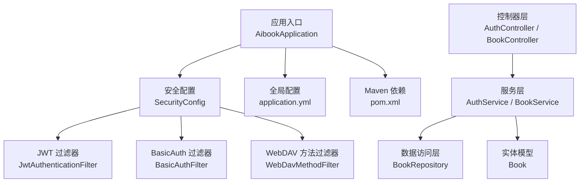
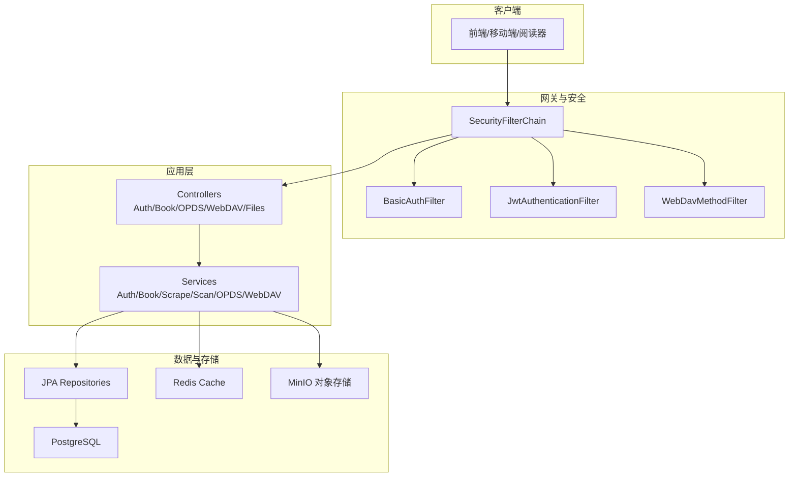
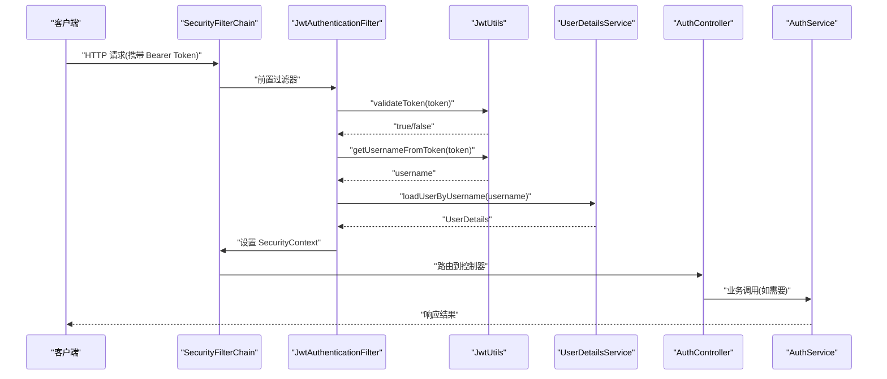
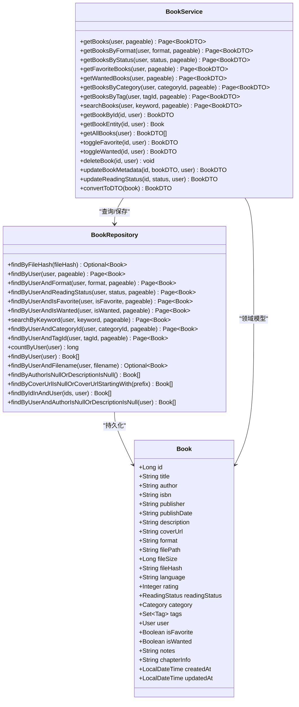
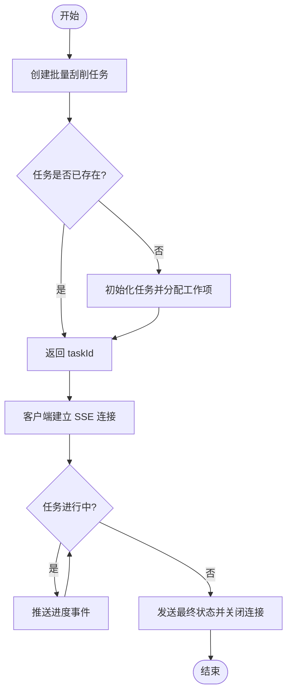
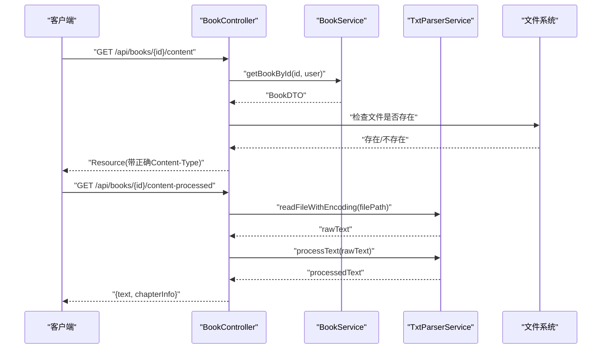
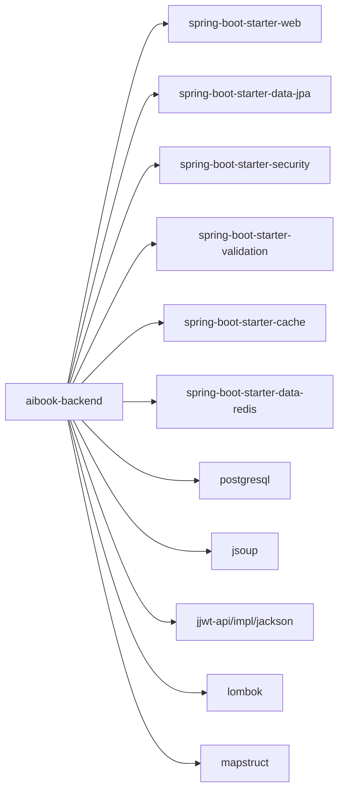

# 后端服务

<cite>
**本文引用的文件**
- [AibookApplication.java](file://backend/src/main/java/com/aibook/AibookApplication.java)
- [pom.xml](file://backend/pom.xml)
- [application.yml](file://backend/src/main/resources/application.yml)
- [SecurityConfig.java](file://backend/src/main/java/com/aibook/security/SecurityConfig.java)
- [JwtAuthenticationFilter.java](file://backend/src/main/java/com/aibook/security/JwtAuthenticationFilter.java)
- [JwtUtils.java](file://backend/src/main/java/com/aibook/security/JwtUtils.java)
- [AuthController.java](file://backend/src/main/java/com/aibook/controller/AuthController.java)
- [AuthService.java](file://backend/src/main/java/com/aibook/service/AuthService.java)
- [BookController.java](file://backend/src/main/java/com/aibook/controller/BookController.java)
- [BookService.java](file://backend/src/main/java/com/aibook/service/BookService.java)
- [BookRepository.java](file://backend/src/main/java/com/aibook/repository/BookRepository.java)
- [Book.java](file://backend/src/main/java/com/aibook/model/entity/Book.java)
</cite>

## 目录
1. [简介](#简介)
2. [项目结构](#项目结构)
3. [核心组件](#核心组件)
4. [架构总览](#架构总览)
5. [详细组件分析](#详细组件分析)
6. [依赖分析](#依赖分析)
7. [性能考虑](#性能考虑)
8. [故障排查指南](#故障排查指南)
9. [结论](#结论)
10. [附录](#附录)

## 简介
本技术文档面向 AI Book 后端服务，基于 Spring Boot 3.x 构建，涵盖以下关键主题：
- 系统架构与分层设计（配置、依赖注入、异常处理）
- 用户认证体系（JWT 令牌认证、Basic Auth 支持）
- 书籍管理模块（CRUD、批量元数据刮削、阅读状态与收藏/想读）
- 文件管理与扫描（上传下载、目录扫描、内容直出）
- OPDS 服务（电子书源发现）
- WebDAV 服务（KOReader 兼容）
- 业务逻辑层实现细节（事务管理、异步任务、缓存策略）
- API 接口规范、错误码定义与响应格式标准
- 性能优化建议、安全最佳实践与扩展开发指南

## 项目结构
后端采用典型的分层架构：
- 启动与全局配置：应用入口、Spring Security、缓存与调度开关、外部依赖（数据库、Redis、MinIO、JWT）
- 安全层：过滤器链（BasicAuth、WebDavMethodFilter、JWT）、工具类（JWT 生成与校验）
- 控制器层：REST 接口（认证、书籍、OPDS、WebDAV、文件等）
- 服务层：业务编排（书籍、认证、OPDS、WebDAV、扫描、元数据抓取等）
- 数据访问层：JPA Repository
- 模型层：实体与 DTO

图表来源
- [AibookApplication.java:1-17](file://backend/src/main/java/com/aibook/AibookApplication.java#L1-L17)
- [SecurityConfig.java:1-71](file://backend/src/main/java/com/aibook/security/SecurityConfig.java#L1-L71)
- [application.yml:1-68](file://backend/src/main/resources/application.yml#L1-L68)
- [pom.xml:1-157](file://backend/pom.xml#L1-L157)

章节来源
- [AibookApplication.java:1-17](file://backend/src/main/java/com/aibook/AibookApplication.java#L1-L17)
- [pom.xml:1-157](file://backend/pom.xml#L1-L157)
- [application.yml:1-68](file://backend/src/main/resources/application.yml#L1-L68)

## 核心组件
- 应用启动与特性开关
  - 启用缓存与定时任务，便于后续异步任务与缓存策略落地。
- 安全框架
  - 无状态会话策略；放行公开路径（认证、OPDS、WebDAV、封面与文件等）；注册 BasicAuth 与 JWT 过滤器。
- 认证流程
  - 登录/注册返回 JWT；请求通过 Authorization: Bearer 或查询参数 token 进行鉴权。
- 书籍管理
  - 提供分页、筛选、搜索、收藏/想读切换、删除、元数据更新、阅读状态变更、内容直出、TXT 解析、批量元数据刮削与 SSE 进度推送。
- 数据访问
  - 基于 JPA 的 Repository，提供按用户、格式、状态、分类、标签、关键词等多维查询能力。
- 配置中心
  - 数据库连接池、JPA/Hibernate、Redis 缓存、MinIO 存储、上传大小限制、扫描计划任务、日志级别等。

章节来源
- [AibookApplication.java:1-17](file://backend/src/main/java/com/aibook/AibookApplication.java#L1-L17)
- [SecurityConfig.java:1-71](file://backend/src/main/java/com/aibook/security/SecurityConfig.java#L1-L71)
- [JwtAuthenticationFilter.java:1-76](file://backend/src/main/java/com/aibook/security/JwtAuthenticationFilter.java#L1-L76)
- [JwtUtils.java:1-80](file://backend/src/main/java/com/aibook/security/JwtUtils.java#L1-L80)
- [AuthController.java:1-41](file://backend/src/main/java/com/aibook/controller/AuthController.java#L1-L41)
- [AuthService.java:1-84](file://backend/src/main/java/com/aibook/service/AuthService.java#L1-L84)
- [BookController.java:1-488](file://backend/src/main/java/com/aibook/controller/BookController.java#L1-L488)
- [BookService.java:1-236](file://backend/src/main/java/com/aibook/service/BookService.java#L1-L236)
- [BookRepository.java:1-112](file://backend/src/main/java/com/aibook/repository/BookRepository.java#L1-L112)
- [Book.java:1-171](file://backend/src/main/java/com/aibook/model/entity/Book.java#L1-L171)
- [application.yml:1-68](file://backend/src/main/resources/application.yml#L1-L68)

## 架构总览
整体采用“控制器-服务-仓储”三层结构，结合 Spring Security 过滤器链完成统一鉴权，使用 JPA 持久化，Redis 作为缓存后端，MinIO 用于对象存储，支持 OPDS 与 WebDAV 协议以兼容阅读器生态。

图表来源
- [SecurityConfig.java:1-71](file://backend/src/main/java/com/aibook/security/SecurityConfig.java#L1-L71)
- [JwtAuthenticationFilter.java:1-76](file://backend/src/main/java/com/aibook/security/JwtAuthenticationFilter.java#L1-L76)
- [application.yml:1-68](file://backend/src/main/resources/application.yml#L1-L68)
- [pom.xml:1-157](file://backend/pom.xml#L1-L157)

## 详细组件分析

### 认证与安全组件
- 安全配置
  - 关闭 CSRF，设置无状态会话策略，放行认证、OPDS、WebDAV、封面与文件等公开路径，其余需认证。
  - 注册 BasicAuth 与 JWT 过滤器，顺序在默认表单认证之前。
- JWT 过滤器
  - 从 Authorization: Bearer 或查询参数 token 提取令牌，校验后写入 SecurityContext。
- JWT 工具
  - 提供签名密钥获取、令牌生成、用户名提取与校验。
- 认证控制器与服务
  - 注册/登录接口，密码加密存储，认证成功后签发 JWT。

图表来源
- [SecurityConfig.java:1-71](file://backend/src/main/java/com/aibook/security/SecurityConfig.java#L1-L71)
- [JwtAuthenticationFilter.java:1-76](file://backend/src/main/java/com/aibook/security/JwtAuthenticationFilter.java#L1-L76)
- [JwtUtils.java:1-80](file://backend/src/main/java/com/aibook/security/JwtUtils.java#L1-L80)
- [AuthController.java:1-41](file://backend/src/main/java/com/aibook/controller/AuthController.java#L1-L41)
- [AuthService.java:1-84](file://backend/src/main/java/com/aibook/service/AuthService.java#L1-L84)

章节来源
- [SecurityConfig.java:1-71](file://backend/src/main/java/com/aibook/security/SecurityConfig.java#L1-L71)
- [JwtAuthenticationFilter.java:1-76](file://backend/src/main/java/com/aibook/security/JwtAuthenticationFilter.java#L1-L76)
- [JwtUtils.java:1-80](file://backend/src/main/java/com/aibook/security/JwtUtils.java#L1-L80)
- [AuthController.java:1-41](file://backend/src/main/java/com/aibook/controller/AuthController.java#L1-L41)
- [AuthService.java:1-84](file://backend/src/main/java/com/aibook/service/AuthService.java#L1-L84)

### 书籍管理模块
- 控制器
  - 提供列表、详情、收藏/想读切换、删除、元数据更新、阅读状态变更、内容直出、TXT 解析、批量元数据刮削、任务状态查询与取消、SSE 实时进度推送等接口。
- 服务层
  - 封装业务规则：权限校验（归属用户）、分页与排序、状态与收藏/想读切换、级联删除（阅读进度、书签、高亮）、DTO 转换。
- 数据访问
  - 多条件查询、全文模糊搜索、按分类/标签聚合、按文件名去重、缺失元数据检索、按 ID 列表批量查询等。
- 实体模型
  - 包含书名、作者、ISBN、出版社、出版日期、简介、封面、格式、路径、大小、哈希、语言、评分、阅读状态、分类、标签、用户、收藏/想读、笔记、章节信息、时间戳等字段。

图表来源
- [Book.java:1-171](file://backend/src/main/java/com/aibook/model/entity/Book.java#L1-L171)
- [BookRepository.java:1-112](file://backend/src/main/java/com/aibook/repository/BookRepository.java#L1-L112)
- [BookService.java:1-236](file://backend/src/main/java/com/aibook/service/BookService.java#L1-L236)

章节来源
- [BookController.java:1-488](file://backend/src/main/java/com/aibook/controller/BookController.java#L1-L488)
- [BookService.java:1-236](file://backend/src/main/java/com/aibook/service/BookService.java#L1-L236)
- [BookRepository.java:1-112](file://backend/src/main/java/com/aibook/repository/BookRepository.java#L1-L112)
- [Book.java:1-171](file://backend/src/main/java/com/aibook/model/entity/Book.java#L1-L171)

### 批量元数据刮削与 SSE 进度
- 控制器暴露创建任务、查询任务状态、SSE 流式推送进度、取消任务等接口。
- 服务层维护任务状态与 SSE 发射器集合，支持轮询与实时推送。

图表来源
- [BookController.java:371-456](file://backend/src/main/java/com/aibook/controller/BookController.java#L371-L456)

章节来源
- [BookController.java:371-456](file://backend/src/main/java/com/aibook/controller/BookController.java#L371-L456)

### 文件内容与 TXT 解析
- 书籍内容直出：根据格式设置 Content-Type，PDF 内联显示，其他类型可下载。
- TXT 预处理：读取文本并按编码处理，输出结构化段落与章节信息。
- 章节解析：对 TXT/MD 文件执行章节识别并持久化章节信息。

图表来源
- [BookController.java:237-292](file://backend/src/main/java/com/aibook/controller/BookController.java#L237-L292)

章节来源
- [BookController.java:237-328](file://backend/src/main/java/com/aibook/controller/BookController.java#L237-L328)

### OPDS 与 WebDAV 服务
- OPDS：开放电子书目录发现，供阅读器订阅与浏览。
- WebDAV：遵循 WebDAV 协议，兼容 KOReader 等客户端的远程目录浏览与文件操作。
- 安全策略：相关路径在安全配置中放行，允许未认证访问以满足第三方阅读器需求。

章节来源
- [SecurityConfig.java:44-56](file://backend/src/main/java/com/aibook/security/SecurityConfig.java#L44-L56)

## 依赖分析
- 运行时依赖
  - Spring Boot Web、Data JPA、Security、Validation、Cache、Data Redis
  - PostgreSQL 驱动
  - Jsoup（HTML 解析）
  - Jackson Hibernate5 模块（懒加载序列化）
  - JJWT（API/Impl/Jackson）
  - Lombok、MapStruct
- 构建插件
  - Spring Boot Maven Plugin
  - Maven Compiler 插件（注解处理器：Lombok、MapStruct）

图表来源
- [pom.xml:25-118](file://backend/pom.xml#L25-L118)

章节来源
- [pom.xml:1-157](file://backend/pom.xml#L1-L157)

## 性能考虑
- 数据库连接池
  - HikariCP 最大连接数与最小空闲数已在配置中设定，可根据负载调优。
- 缓存
  - 全局启用 Redis 缓存，建议在热点数据（如书籍列表、元数据）上增加 @Cacheable/@CacheEvict 注解以提升吞吐。
- 大文件传输
  - 上传与请求体大小上限已配置为 500MB，注意磁盘空间与网络带宽。
- 扫描任务
  - 定时扫描任务默认每日凌晨执行，可按需调整 cron 表达式与目录列表。
- 序列化
  - 引入 Jackson Hibernate5 模块以避免懒加载导致的序列化问题。

章节来源
- [application.yml:15-41](file://backend/src/main/resources/application.yml#L15-L41)
- [application.yml:28-36](file://backend/src/main/resources/application.yml#L28-L36)
- [application.yml:59-63](file://backend/src/main/resources/application.yml#L59-L63)
- [pom.xml:68-72](file://backend/pom.xml#L68-L72)

## 故障排查指南
- 认证失败
  - 检查 Authorization 头是否为 Bearer Token，或查询参数 token 是否正确传递。
  - 确认 JWT 密钥与过期时间配置一致。
- 资源未找到
  - 书籍内容直出时若文件不存在将返回 404，请核对 filePath 与存储路径。
- 批量任务异常
  - 通过任务状态接口查看任务状态；SSE 连接超时后需重新建立连接。
- 日志定位
  - 应用日志级别已设置为 DEBUG，关注 com.aibook 与 org.springframework.security 包日志。

章节来源
- [JwtAuthenticationFilter.java:30-57](file://backend/src/main/java/com/aibook/security/JwtAuthenticationFilter.java#L30-L57)
- [JwtUtils.java:68-78](file://backend/src/main/java/com/aibook/security/JwtUtils.java#L68-L78)
- [BookController.java:245-263](file://backend/src/main/java/com/aibook/controller/BookController.java#L245-L263)
- [application.yml:64-68](file://backend/src/main/resources/application.yml#L64-L68)

## 结论
AI Book 后端以 Spring Boot 3.x 为核心，结合 Spring Security 与 JPA 构建了可扩展的书籍管理系统。通过 JWT 与 Basic Auth 双重认证机制，配合 OPDS 与 WebDAV 协议，满足多端与阅读器生态的接入需求。在服务层实现了事务控制与批量任务处理，并通过 Redis 缓存与 MinIO 对象存储提升整体性能与可用性。后续可在热点查询、索引优化与分布式部署方面进一步演进。

## 附录

### API 接口规范与响应格式
- 通用响应
  - 成功：HTTP 200，JSON 主体
  - 未认证：HTTP 401
  - 未授权：HTTP 403
  - 未找到：HTTP 404
  - 参数校验失败：HTTP 400
  - 服务器错误：HTTP 500
- 认证接口
  - POST /api/auth/register
    - 请求体：RegisterRequest
    - 响应：AuthResponse
  - POST /api/auth/login
    - 请求体：AuthRequest
    - 响应：AuthResponse
- 书籍接口（节选）
  - GET /api/books
    - 查询参数：page、size、sortBy、sortDir、format、status、categoryId、tagId
    - 响应：Page<BookDTO>
  - GET /api/books/{id}
    - 响应：BookDTO
  - PUT /api/books/{id}/favorite
  - PUT /api/books/{id}/wanted
  - DELETE /api/books/{id}
  - PUT /api/books/{id}/metadata
  - PUT /api/books/{id}/status
  - GET /api/books/{id}/content
  - GET /api/books/{id}/content-processed
  - POST /api/books/{id}/parse-chapters
  - POST /api/books/{id}/scrape
  - POST /api/books/{id}/cover
  - POST /api/books/batch-scrape
  - POST /api/books/scrape-all-incomplete
  - GET /api/books/scrape-task/{taskId}
  - GET /api/books/scrape-task/{taskId}/stream (text/event-stream)
  - POST /api/books/scrape-task/{taskId}/cancel

章节来源
- [AuthController.java:26-39](file://backend/src/main/java/com/aibook/controller/AuthController.java#L26-L39)
- [BookController.java:59-456](file://backend/src/main/java/com/aibook/controller/BookController.java#L59-L456)

### 错误码与异常处理
- 自定义异常
  - ResourceNotFoundException：资源不存在
- 全局异常处理
  - GlobalExceptionHandler：统一捕获并转换为标准 JSON 响应
- 常见业务异常
  - 用户名/邮箱重复、书籍不存在、任务不存在等

章节来源
- [GlobalExceptionHandler.java](file://backend/src/main/java/com/aibook/controller/GlobalExceptionHandler.java)
- [ResourceNotFoundException.java](file://backend/src/main/java/com/aibook/exception/ResourceNotFoundException.java)

### 安全最佳实践
- 生产环境务必更换 JWT 密钥与数据库/Redis/MinIO 默认密码
- 仅对必要路径启用跨域，避免 origins = "*"
- 对敏感接口启用更严格的访问控制与审计日志
- 定期轮换令牌与密钥，监控异常登录行为

章节来源
- [application.yml:43-56](file://backend/src/main/resources/application.yml#L43-L56)
- [SecurityConfig.java:44-56](file://backend/src/main/java/com/aibook/security/SecurityConfig.java#L44-L56)

### 扩展开发指南
- 新增业务模块
  - 在 controller 下新建控制器，service 下实现业务逻辑，repository 定义数据访问接口，model 下维护实体与 DTO。
- 集成新缓存
  - 在 application.yml 配置缓存后端，并在服务方法上使用 @Cacheable/@CachePut/@CacheEvict。
- 新增协议支持
  - 参考 OPDS 与 WebDAV 的实现，在 SecurityConfig 中放行相应路径，并在对应 Controller 中实现协议语义。

章节来源
- [AibookApplication.java:8-10](file://backend/src/main/java/com/aibook/AibookApplication.java#L8-L10)
- [application.yml:28-36](file://backend/src/main/resources/application.yml#L28-L36)