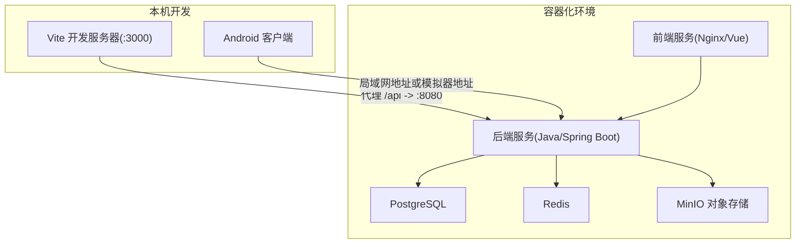
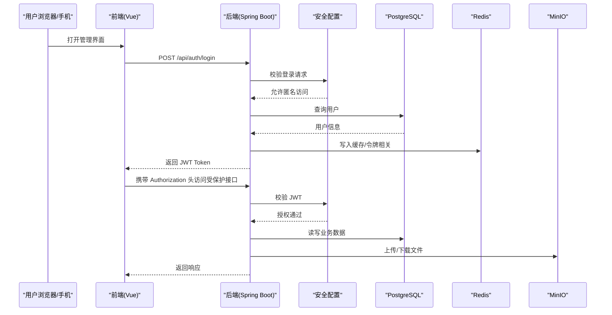
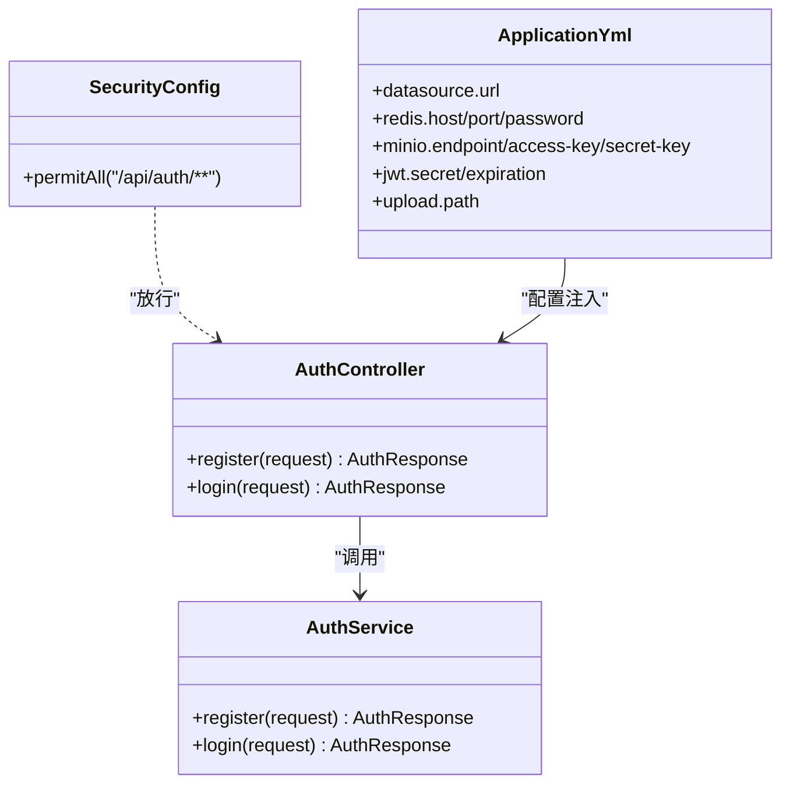
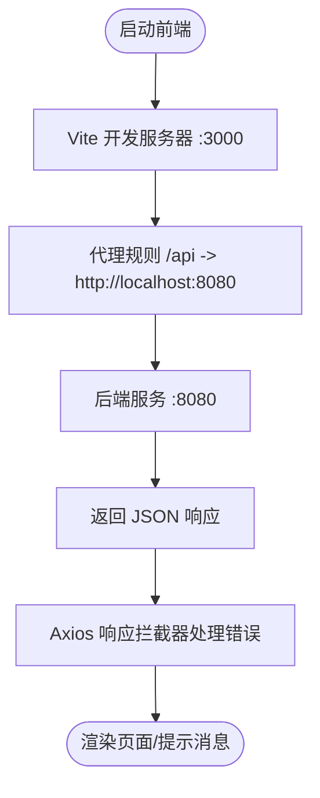
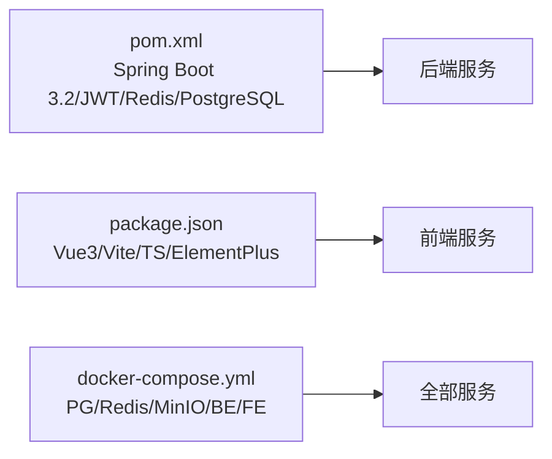

# 快速开始

<cite>
**本文引用的文件**   
- [backend/pom.xml](file://backend/pom.xml)
- [backend/src/main/resources/application.yml](file://backend/src/main/resources/application.yml)
- [backend/Dockerfile](file://backend/Dockerfile)
- [docker/docker-compose.yml](file://docker/docker-compose.yml)
- [frontend/package.json](file://frontend/package.json)
- [frontend/vite.config.ts](file://frontend/vite.config.ts)
- [frontend/Dockerfile](file://frontend/Dockerfile)
- [android/README.md](file://android/README.md)
- [backend/src/main/java/com/aibook/controller/AuthController.java](file://backend/src/main/java/com/aibook/controller/AuthController.java)
- [backend/src/main/java/com/aibook/service/AuthService.java](file://backend/src/main/java/com/aibook/service/AuthService.java)
- [backend/src/main/java/com/aibook/security/SecurityConfig.java](file://backend/src/main/java/com/aibook/security/SecurityConfig.java)
- [frontend/src/utils/api.ts](file://frontend/src/utils/api.ts)
- [frontend/src/utils/config.ts](file://frontend/src/utils/config.ts)
</cite>

## 目录
1. [简介](#简介)
2. [项目结构](#项目结构)
3. [核心组件](#核心组件)
4. [架构总览](#架构总览)
5. [详细组件分析](#详细组件分析)
6. [依赖关系分析](#依赖关系分析)
7. [性能与运行建议](#性能与运行建议)
8. [故障排查指南](#故障排查指南)
9. [结论](#结论)
10. [附录：验证与示例请求](#附录：验证与示例请求)

## 简介
本指南面向首次接触 AI Book（汗牛充栋）项目的开发者，帮助你在最短时间内完成环境准备、服务启动与基本功能验证。你将学到：
- 必需工具及版本要求（JDK、Node.js、Android Studio、Docker）
- 一键部署（Docker Compose）与手动开发环境搭建
- 环境变量配置要点
- 常见问题的定位与解决
- 安装成功验证与示例请求

## 项目结构
仓库采用前后端分离与多端客户端的模块化组织方式：
- backend：Spring Boot 后端服务，提供 REST API、认证鉴权、元数据抓取、OPDS 等能力
- frontend：Vue 3 + Vite 管理端前端，通过代理访问后端
- android：原生 Android 客户端（Kotlin + Jetpack Compose），支持本地导入与 OPDS 连接
- docker：Docker Compose 编排脚本，包含 PostgreSQL、Redis、MinIO、后端与前端容器
- resources：静态资源（可选）

图表来源
- [docker/docker-compose.yml:1-125](file://docker/docker-compose.yml#L1-L125)
- [backend/src/main/resources/application.yml:1-68](file://backend/src/main/resources/application.yml#L1-L68)
- [frontend/vite.config.ts:1-21](file://frontend/vite.config.ts#L1-L21)

章节来源
- [docker/docker-compose.yml:1-125](file://docker/docker-compose.yml#L1-L125)
- [backend/src/main/resources/application.yml:1-68](file://backend/src/main/resources/application.yml#L1-L68)
- [frontend/vite.config.ts:1-21](file://frontend/vite.config.ts#L1-L21)

## 核心组件
- 后端服务（Spring Boot）
  - 技术栈：Spring Boot 3.2、Spring Data JPA、Spring Security、JWT、Redis 缓存、PostgreSQL 数据库、MinIO 对象存储
  - 关键端口：8080
  - 构建与运行：Maven 构建，Docker 镜像基于 JDK 21
- 前端管理端（Vue 3 + Vite）
  - 技术栈：Vue 3、TypeScript、Element Plus、Axios、Pinia、EpubJS
  - 开发端口：3000（生产由 Nginx 暴露 80）
  - 开发模式通过 Vite 代理将 /api 转发至后端 8080
- Android 客户端
  - 技术栈：Kotlin、Jetpack Compose、Material 3、API 36 编译目标、最低 API 29
  - 使用 Android Studio 打开并同步 Gradle 即可运行
- 基础设施（Docker Compose）
  - PostgreSQL 16、Redis 7、MinIO、后端、前端统一编排

章节来源
- [backend/pom.xml:1-157](file://backend/pom.xml#L1-L157)
- [backend/Dockerfile:1-41](file://backend/Dockerfile#L1-L41)
- [frontend/package.json:1-27](file://frontend/package.json#L1-L27)
- [frontend/Dockerfile:1-31](file://frontend/Dockerfile#L1-L31)
- [android/README.md:1-49](file://android/README.md#L1-L49)

## 架构总览
系统由“前端/移动端 + 后端 + 数据存储”构成。后端负责业务逻辑、安全认证、文件与元数据处理；前端与移动端通过 HTTP 调用后端 API；数据持久化到 PostgreSQL，缓存与会话使用 Redis，文件与封面等资源使用 MinIO。

图表来源
- [backend/src/main/java/com/aibook/controller/AuthController.java:1-40](file://backend/src/main/java/com/aibook/controller/AuthController.java#L1-L40)
- [backend/src/main/java/com/aibook/service/AuthService.java:1-39](file://backend/src/main/java/com/aibook/service/AuthService.java#L1-L39)
- [backend/src/main/java/com/aibook/security/SecurityConfig.java](file://backend/src/main/java/com/aibook/security/SecurityConfig.java)
- [backend/src/main/resources/application.yml:1-68](file://backend/src/main/resources/application.yml#L1-L68)
- [frontend/src/utils/api.ts:1-50](file://frontend/src/utils/api.ts#L1-50)

## 详细组件分析

### 后端服务（Spring Boot）
- 构建与运行
  - 使用 Maven 构建，JDK 版本为 21
  - Docker 镜像分阶段构建，运行于 JRE 21 Alpine
- 配置项
  - 数据库：PostgreSQL，默认 URL、用户名、密码可通过环境变量覆盖
  - 缓存：Redis，默认 host/port/password 可配置
  - 对象存储：MinIO endpoint/access-key/secret-key/bucket-name 可配置
  - 上传路径：UPLOAD_PATH
  - JWT：secret 与过期时间
- 安全与跨域
  - 认证接口 /api/auth/** 放行，其他接口需鉴权
  - 跨域已开启

图表来源
- [backend/src/main/java/com/aibook/controller/AuthController.java:1-40](file://backend/src/main/java/com/aibook/controller/AuthController.java#L1-L40)
- [backend/src/main/java/com/aibook/service/AuthService.java:1-39](file://backend/src/main/java/com/aibook/service/AuthService.java#L1-L39)
- [backend/src/main/resources/application.yml:1-68](file://backend/src/main/resources/application.yml#L1-L68)

章节来源
- [backend/pom.xml:1-157](file://backend/pom.xml#L1-L157)
- [backend/Dockerfile:1-41](file://backend/Dockerfile#L1-L41)
- [backend/src/main/resources/application.yml:1-68](file://backend/src/main/resources/application.yml#L1-L68)
- [backend/src/main/java/com/aibook/controller/AuthController.java:1-40](file://backend/src/main/java/com/aibook/controller/AuthController.java#L1-L40)
- [backend/src/main/java/com/aibook/service/AuthService.java:1-39](file://backend/src/main/java/com/aibook/service/AuthService.java#L1-L39)
- [backend/src/main/java/com/aibook/security/SecurityConfig.java](file://backend/src/main/java/com/aibook/security/SecurityConfig.java)

### 前端管理端（Vue 3 + Vite）
- 开发环境
  - 使用 Vite 启动，默认端口 3000
  - 通过代理将 /api 转发到 http://localhost:8080
- 生产环境
  - 使用 Nginx 静态托管 dist 产物
- 网络与鉴权
  - Axios 拦截器自动附加 Authorization 头
  - 401 时清除 token 并跳转登录页

图表来源
- [frontend/vite.config.ts:1-21](file://frontend/vite.config.ts#L1-L21)
- [frontend/src/utils/api.ts:1-50](file://frontend/src/utils/api.ts#L1-50)

章节来源
- [frontend/package.json:1-27](file://frontend/package.json#L1-L27)
- [frontend/vite.config.ts:1-21](file://frontend/vite.config.ts#L1-L21)
- [frontend/Dockerfile:1-31](file://frontend/Dockerfile#L1-L31)
- [frontend/src/utils/api.ts:1-50](file://frontend/src/utils/api.ts#L1-50)

### Android 客户端
- 打开方式
  - 使用 Android Studio 打开 android 目录
  - 安装 Android SDK Platform 36，使用 JDK 17
  - 等待 Gradle 同步完成
- 常用命令
  - 单元测试：gradle test
  - 构建 debug APK：gradle :app:assembleDebug
- OPDS 地址说明
  - 真机请使用局域网地址
  - 模拟器访问本机后端可使用 10.0.2.2

章节来源
- [android/README.md:1-49](file://android/README.md#L1-L49)

## 依赖关系分析
- 后端依赖
  - Spring Boot 3.2（父工程）
  - Spring Data JPA、Spring Security、Validation、Cache
  - PostgreSQL 驱动、Redis Starter
  - Jsoup、Jackson Hibernate5 模块、JWT、Lombok、MapStruct
- 前端依赖
  - Vue 3、TypeScript、Vite、Element Plus、Axios、Pinia、EpubJS
- 容器编排
  - PostgreSQL 16、Redis 7、MinIO、后端、前端统一编排，健康检查与卷挂载

图表来源
- [backend/pom.xml:1-157](file://backend/pom.xml#L1-L157)
- [frontend/package.json:1-27](file://frontend/package.json#L1-L27)
- [docker/docker-compose.yml:1-125](file://docker/docker-compose.yml#L1-L125)

章节来源
- [backend/pom.xml:1-157](file://backend/pom.xml#L1-L157)
- [frontend/package.json:1-27](file://frontend/package.json#L1-L27)
- [docker/docker-compose.yml:1-125](file://docker/docker-compose.yml#L1-L125)

## 性能与运行建议
- JVM 参数
  - 默认 Xms256m/Xmx512m，可根据内存情况调整
- 数据库连接池
  - HikariCP 最大连接数 20，最小空闲 5，可按并发量调优
- 上传大小限制
  - 单文件与请求体上限 500MB，按需调整
- 扫描任务
  - 默认每天凌晨 2 点执行，可修改 cron 表达式与扫描目录列表

[本节为通用建议，不直接分析具体文件]

## 故障排查指南
- 无法连接数据库
  - 检查 PostgreSQL 是否启动且端口 5432 可达
  - 确认 SPRING_DATASOURCE_URL/USERNAME/PASSWORD 与 compose 中一致
- Redis 连接失败
  - 检查 REDIS_HOST/PORT/PASSWORD 是否与 compose 一致
- MinIO 不可用
  - 检查 MINIO_ENDPOINT/ACCESS_KEY/SECRET_KEY 是否正确
  - 确认 9000/9001 端口未被占用
- 前端代理无效
  - 确保 Vite 开发服务器在 3000 端口运行，/api 代理到 8080
- 登录 401/403
  - 确认 /api/auth/** 未加鉴权
  - 检查 Authorization 头是否携带有效 Bearer Token
- Android 无法访问后端
  - 真机使用局域网 IP，模拟器使用 10.0.2.2

章节来源
- [backend/src/main/resources/application.yml:1-68](file://backend/src/main/resources/application.yml#L1-L68)
- [docker/docker-compose.yml:1-125](file://docker/docker-compose.yml#L1-L125)
- [frontend/vite.config.ts:1-21](file://frontend/vite.config.ts#L1-L21)
- [backend/src/main/java/com/aibook/security/SecurityConfig.java](file://backend/src/main/java/com/aibook/security/SecurityConfig.java)

## 结论
通过 Docker Compose 可一键拉起完整运行环境；也可按模块手动搭建开发环境。后端基于 Spring Boot 3.2 与 JDK 21，前端基于 Vue 3 + Vite，Android 客户端使用 Kotlin + Compose。按照本指南完成环境准备与配置后，即可快速进行登录、书籍管理与阅读等基础操作。

[本节为总结性内容，不直接分析具体文件]

## 附录：验证与示例请求

### 环境准备清单
- JDK 21（后端构建与运行）
- Node.js 18+（前端开发与构建）
- Android Studio（Android 客户端）
- Docker 与 Docker Compose（一键部署）

章节来源
- [backend/pom.xml:1-157](file://backend/pom.xml#L1-L157)
- [backend/Dockerfile:1-41](file://backend/Dockerfile#L1-L41)
- [frontend/package.json:1-27](file://frontend/package.json#L1-L27)
- [android/README.md:1-49](file://android/README.md#L1-L49)

### 一键部署（Docker Compose）
- 进入 docker 目录
- 启动所有服务：docker compose up -d
- 访问：
  - 前端：http://localhost
  - 后端 API：http://localhost:8080
  - MinIO 控制台：http://localhost:9001
- 停止服务：docker compose down

章节来源
- [docker/docker-compose.yml:1-125](file://docker/docker-compose.yml#L1-L125)

### 手动搭建开发环境
- 后端
  - 安装 JDK 21 与 Maven
  - 配置 application.yml 中的数据库、Redis、MinIO 连接（或使用环境变量覆盖）
  - 启动后端服务（默认 8080）
- 前端
  - 安装 Node.js 18+
  - 安装依赖并启动开发服务器（默认 3000）
  - 通过 Vite 代理访问后端
- Android
  - 使用 Android Studio 打开 android 目录
  - 安装 SDK Platform 36，使用 JDK 17
  - 同步 Gradle 后即可运行

章节来源
- [backend/src/main/resources/application.yml:1-68](file://backend/src/main/resources/application.yml#L1-L68)
- [frontend/vite.config.ts:1-21](file://frontend/vite.config.ts#L1-L21)
- [android/README.md:1-49](file://android/README.md#L1-L49)

### 环境变量参考
- 数据库
  - SPRING_DATASOURCE_URL、SPRING_DATASOURCE_USERNAME、SPRING_DATASOURCE_PASSWORD（或 DB_PASSWORD）
- Redis
  - REDIS_HOST、REDIS_PORT、REDIS_PASSWORD
- MinIO
  - MINIO_ENDPOINT、MINIO_ACCESS_KEY、MINIO_SECRET_KEY（或 MINIO_USER/MINIO_PASSWORD）
- JWT
  - JWT_SECRET
- 上传路径
  - UPLOAD_PATH

章节来源
- [backend/src/main/resources/application.yml:1-68](file://backend/src/main/resources/application.yml#L1-L68)
- [docker/docker-compose.yml:1-125](file://docker/docker-compose.yml#L1-L125)

### 安装成功验证与示例请求
- 注册账号
  - 方法：POST
  - 路径：/api/auth/register
  - 请求体字段：username、email、password、nickname（可选）
  - 预期：返回 token、type、username、email、role
- 登录
  - 方法：POST
  - 路径：/api/auth/login
  - 请求体字段：username、password
  - 预期：返回 token、type、username、email、role
- 获取刮削器状态
  - 方法：GET
  - 路径：/api/scraper/status
  - 预期：返回各刮削器的启用状态与优先级等信息
- 获取/更新刮削配置
  - 方法：GET/PUT
  - 路径：/api/config/scraper
  - 预期：返回或更新配置键值对

章节来源
- [backend/src/main/java/com/aibook/controller/AuthController.java:1-40](file://backend/src/main/java/com/aibook/controller/AuthController.java#L1-L40)
- [backend/src/main/java/com/aibook/service/AuthService.java:1-39](file://backend/src/main/java/com/aibook/service/AuthService.java#L1-L39)
- [frontend/src/utils/config.ts:1-34](file://frontend/src/utils/config.ts#L1-L34)
- [frontend/src/utils/api.ts:1-50](file://frontend/src/utils/api.ts#L1-50)