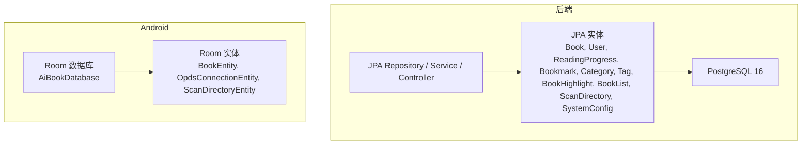
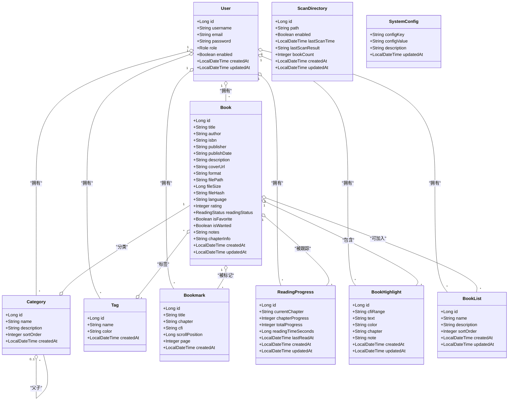
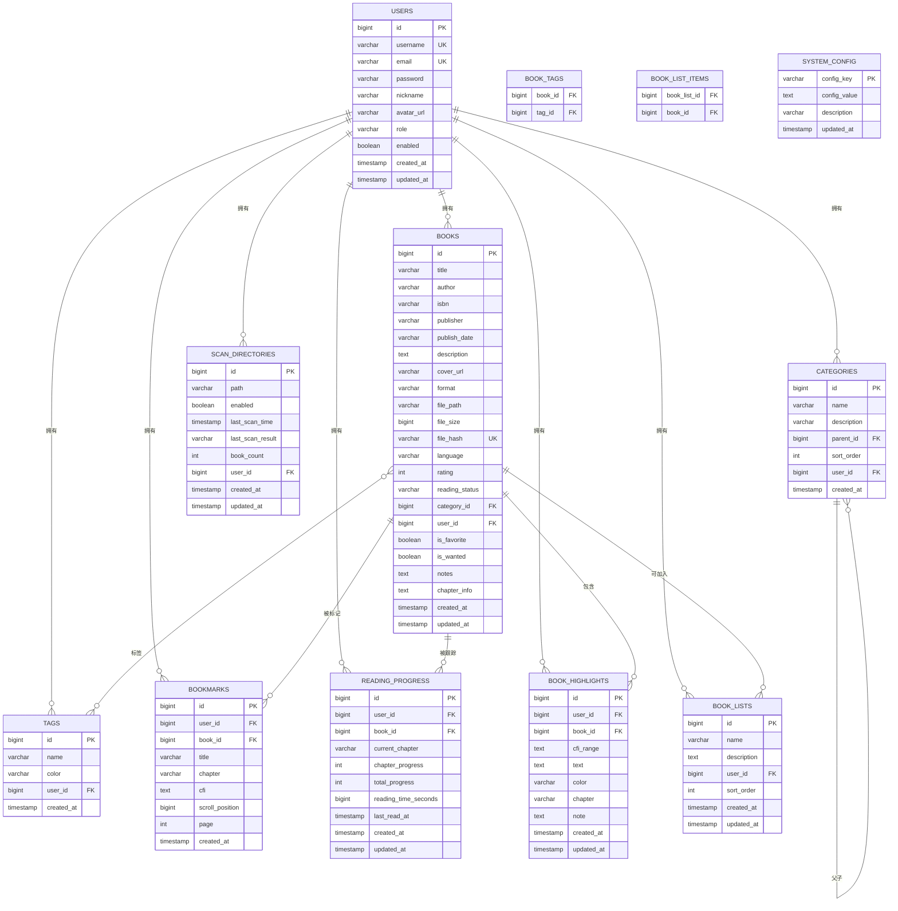
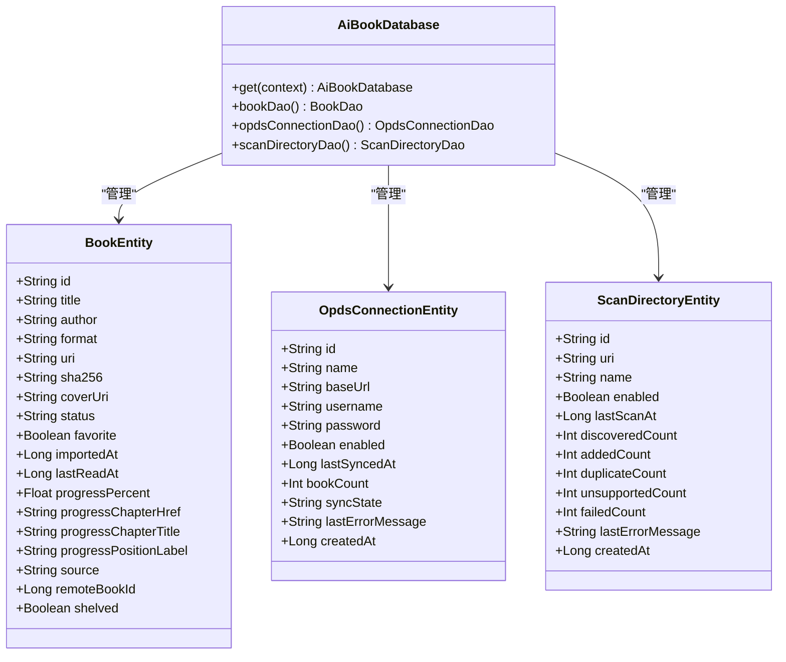
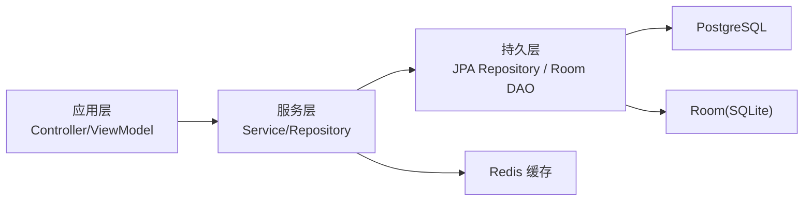

# 数据库设计

<cite>
**本文引用的文件**   
- [Book.java](file://backend/src/main/java/com/aibook/model/entity/Book.java)
- [User.java](file://backend/src/main/java/com/aibook/model/entity/User.java)
- [ReadingProgress.java](file://backend/src/main/java/com/aibook/model/entity/ReadingProgress.java)
- [Bookmark.java](file://backend/src/main/java/com/aibook/model/entity/Bookmark.java)
- [Category.java](file://backend/src/main/java/com/aibook/model/entity/Category.java)
- [Tag.java](file://backend/src/main/java/com/aibook/model/entity/Tag.java)
- [BookHighlight.java](file://backend/src/main/java/com/aibook/model/entity/BookHighlight.java)
- [BookList.java](file://backend/src/main/java/com/aibook/model/entity/BookList.java)
- [ScanDirectory.java](file://backend/src/main/java/com/aibook/model/entity/ScanDirectory.java)
- [SystemConfig.java](file://backend/src/main/java/com/aibook/model/entity/SystemConfig.java)
- [application.yml](file://backend/src/main/resources/application.yml)
- [AiBookDatabase.kt](file://android/core/data/src/main/kotlin/com/aibook/android/core/data/db/AiBookDatabase.kt)
- [BookEntity.kt](file://android/core/data/src/main/kotlin/com/aibook/android/core/data/db/BookEntity.kt)
- [OpdsConnectionEntity.kt](file://android/core/data/src/main/kotlin/com/aibook/android/core/data/db/OpdsConnectionEntity.kt)
- [ScanDirectoryEntity.kt](file://android/core/data/src/main/kotlin/com/aibook/android/core/data/db/ScanDirectoryEntity.kt)
</cite>

## 目录
1. [引言](#引言)
2. [项目结构](#项目结构)
3. [核心组件](#核心组件)
4. [架构总览](#架构总览)
5. [详细组件分析](#详细组件分析)
6. [依赖关系分析](#依赖关系分析)
7. [性能考虑](#性能考虑)
8. [故障排查指南](#故障排查指南)
9. [结论](#结论)
10. [附录](#附录)

## 引言
本文件为 AI Book 系统的数据库设计文档，覆盖后端 PostgreSQL + JPA/Hibernate 的实体与关系设计、ORM 映射与索引优化策略，以及 Android 端 Room 本地数据模型设计与迁移策略。文档提供完整的 ER 关系图、表结构与字段说明，并给出数据访问模式、事务管理与并发控制建议，以及备份恢复方案、性能监控与调优建议。

## 项目结构
- 后端（Spring Boot）：使用 JPA/Hibernate 将领域实体映射到 PostgreSQL 表；通过 HikariCP 管理连接池；JPA DDL 自动更新。
- Android（Room）：定义本地实体与数据库版本，用于离线阅读、进度缓存与 OPDS 连接配置等。

图表来源
- [application.yml:10-26](file://backend/src/main/resources/application.yml#L10-L26)
- [AiBookDatabase.kt:8-12](file://android/core/data/src/main/kotlin/com/aibook/android/core/data/db/AiBookDatabase.kt#L8-L12)

章节来源
- [application.yml:10-26](file://backend/src/main/resources/application.yml#L10-L26)

## 核心组件
本节概述后端核心实体及其职责与关键约束。

- 用户（User）
  - 主键：自增 Long id
  - 唯一性：username、email 唯一且非空
  - 角色：USER/ADMIN 枚举
  - 时间戳：创建/更新时间
- 书籍（Book）
  - 主键：自增 Long id
  - 必填：title、format、filePath
  - 唯一：fileHash（去重用）
  - 关联：category（多对一）、tags（多对多，中间表 book_tags）、user（多对一）
  - 状态：readingStatus（UNREADING/READING/FINISHED）
  - 其他：rating、notes、chapterInfo（JSON）
- 分类（Category）
  - 主键：自增 Long id
  - 层级：parent_id 自引用
  - 归属：user_id
- 标签（Tag）
  - 主键：自增 Long id
  - 归属：user_id
- 书签（Bookmark）
  - 主键：自增 Long id
  - 关联：user_id、book_id
  - 定位：cfi（EPUB CFI）、scrollPosition（TXT/MD）、page
- 阅读进度（ReadingProgress）
  - 主键：自增 Long id
  - 唯一约束：(user_id, book_id)
  - 字段：currentChapter、chapterProgress、totalProgress、readingTimeSeconds、lastReadAt
- 高亮/批注（BookHighlight）
  - 主键：自增 Long id
  - 唯一约束：(user_id, book_id, cfi_range)
  - 字段：text、color、chapter、note
- 书单（BookList）
  - 主键：自增 Long id
  - 关联：user_id，books 多对多（中间表 book_list_items）
- 扫描目录（ScanDirectory）
  - 主键：自增 Long id
  - 字段：path、enabled、lastScanTime、lastScanResult、bookCount、user_id
- 系统配置（SystemConfig）
  - 主键：config_key
  - 字段：config_value、description、updated_at

章节来源
- [User.java:27-84](file://backend/src/main/java/com/aibook/model/entity/User.java#L27-L84)
- [Book.java:24-169](file://backend/src/main/java/com/aibook/model/entity/Book.java#L24-L169)
- [Category.java:21-60](file://backend/src/main/java/com/aibook/model/entity/Category.java#L21-L60)
- [Tag.java:21-47](file://backend/src/main/java/com/aibook/model/entity/Tag.java#L21-L47)
- [Bookmark.java:21-72](file://backend/src/main/java/com/aibook/model/entity/Bookmark.java#L21-L72)
- [ReadingProgress.java:25-78](file://backend/src/main/java/com/aibook/model/entity/ReadingProgress.java#L25-L78)
- [BookHighlight.java:25-80](file://backend/src/main/java/com/aibook/model/entity/BookHighlight.java#L25-L80)
- [BookList.java:24-72](file://backend/src/main/java/com/aibook/model/entity/BookList.java#L24-L72)
- [ScanDirectory.java:23-71](file://backend/src/main/java/com/aibook/model/entity/ScanDirectory.java#L23-L71)
- [SystemConfig.java:21-48](file://backend/src/main/java/com/aibook/model/entity/SystemConfig.java#L21-L48)

## 架构总览
后端采用 Spring Boot + JPA/Hibernate + PostgreSQL 的典型三层架构；Android 端通过 Room 维护本地缓存与离线能力。

图表来源
- [Book.java:24-169](file://backend/src/main/java/com/aibook/model/entity/Book.java#L24-L169)
- [User.java:27-84](file://backend/src/main/java/com/aibook/model/entity/User.java#L27-L84)
- [Category.java:21-60](file://backend/src/main/java/com/aibook/model/entity/Category.java#L21-L60)
- [Tag.java:21-47](file://backend/src/main/java/com/aibook/model/entity/Tag.java#L21-L47)
- [Bookmark.java:21-72](file://backend/src/main/java/com/aibook/model/entity/Bookmark.java#L21-L72)
- [ReadingProgress.java:25-78](file://backend/src/main/java/com/aibook/model/entity/ReadingProgress.java#L25-L78)
- [BookHighlight.java:25-80](file://backend/src/main/java/com/aibook/model/entity/BookHighlight.java#L25-L80)
- [BookList.java:24-72](file://backend/src/main/java/com/aibook/model/entity/BookList.java#L24-L72)
- [ScanDirectory.java:23-71](file://backend/src/main/java/com/aibook/model/entity/ScanDirectory.java#L23-L71)
- [SystemConfig.java:21-48](file://backend/src/main/java/com/aibook/model/entity/SystemConfig.java#L21-L48)

## 详细组件分析

### 后端实体与关系设计（PostgreSQL + JPA/Hibernate）
- 主键与外键
  - 所有实体默认使用自增主键（GenerationType.IDENTITY）。
  - 多对一关系通过 @JoinColumn 指定外键列名（如 user_id、book_id、category_id、parent_id）。
  - 多对多关系通过 @JoinTable 定义中间表（book_tags、book_list_items）。
- 唯一性与约束
  - users.username、users.email 唯一。
  - books.file_hash 唯一（去重）。
  - reading_progress 在 (user_id, book_id) 上唯一。
  - book_highlights 在 (user_id, book_id, cfi_range) 上唯一。
- 枚举与类型
  - reading_status、role 使用字符串枚举存储。
  - 大文本使用 TEXT 列定义（description、notes、chapterInfo、cfi、cfiRange 等）。
- 时间戳
  - 使用 Hibernate 注解自动填充创建/更新时间。

图表来源
- [Book.java:24-169](file://backend/src/main/java/com/aibook/model/entity/Book.java#L24-L169)
- [User.java:27-84](file://backend/src/main/java/com/aibook/model/entity/User.java#L27-L84)
- [Category.java:21-60](file://backend/src/main/java/com/aibook/model/entity/Category.java#L21-L60)
- [Tag.java:21-47](file://backend/src/main/java/com/aibook/model/entity/Tag.java#L21-L47)
- [Bookmark.java:21-72](file://backend/src/main/java/com/aibook/model/entity/Bookmark.java#L21-L72)
- [ReadingProgress.java:25-78](file://backend/src/main/java/com/aibook/model/entity/ReadingProgress.java#L25-L78)
- [BookHighlight.java:25-80](file://backend/src/main/java/com/aibook/model/entity/BookHighlight.java#L25-L80)
- [BookList.java:24-72](file://backend/src/main/java/com/aibook/model/entity/BookList.java#L24-L72)
- [ScanDirectory.java:23-71](file://backend/src/main/java/com/aibook/model/entity/ScanDirectory.java#L23-L71)
- [SystemConfig.java:21-48](file://backend/src/main/java/com/aibook/model/entity/SystemConfig.java#L21-L48)

#### ORM 映射要点与索引优化建议
- 外键索引
  - 建议在以下外键列建立索引以提升查询性能：
    - books.user_id、books.category_id
    - bookmarks.user_id、bookmarks.book_id
    - reading_progress.user_id、reading_progress.book_id
    - book_highlights.user_id、book_highlights.book_id
    - categories.parent_id、categories.user_id
    - tags.user_id
    - book_list_items.book_list_id、book_list_items.book_id
    - scan_directories.user_id
- 复合索引
  - reading_progress(user_id, book_id) 已存在唯一约束，通常自动生成索引。
  - 高频查询可按需添加：
    - books(user_id, reading_status)、books(user_id, is_favorite)
    - bookmarks(user_id, book_id)
    - book_highlights(user_id, book_id)
- 唯一性约束
  - users(username, email)、books(file_hash)、reading_progress(user_id, book_id)、book_highlights(user_id, book_id, cfi_range)。
- 延迟加载
  - 多对一/多对多均使用 LAZY 加载，避免 N+1 问题；复杂查询建议使用 JOIN FETCH 或自定义 SQL。
- 大字段
  - description、notes、chapterInfo、cfi、cfiRange 使用 TEXT，避免频繁全文检索场景下的额外开销；如需搜索，考虑引入外部搜索引擎或生成 GIN 索引（视业务而定）。

章节来源
- [Book.java:111-132](file://backend/src/main/java/com/aibook/model/entity/Book.java#L111-L132)
- [ReadingProgress.java:17-20](file://backend/src/main/java/com/aibook/model/entity/ReadingProgress.java#L17-L20)
- [BookHighlight.java:17-20](file://backend/src/main/java/com/aibook/model/entity/BookHighlight.java#L17-L20)
- [BookList.java:52-59](file://backend/src/main/java/com/aibook/model/entity/BookList.java#L52-L59)
- [application.yml:19-26](file://backend/src/main/resources/application.yml#L19-L26)

### Android Room 本地数据模型
- 数据库入口
  - AiBookDatabase 声明实体集合与版本号，当前版本为 4，未启用 schema 导出，回退策略为破坏性迁移。
- 实体
  - BookEntity：本地书籍缓存，包含基础信息、阅读进度、来源标识（LOCAL/远程同步 ID）、书架标记等。
  - OpdsConnectionEntity：OPDS 源连接配置与同步状态。
  - ScanDirectoryEntity：本地目录扫描任务与统计。
- 迁移策略
  - 当前使用 fallbackToDestructiveMigration，升级时直接重建表；生产环境应实现精确 Migration 以保留用户数据。
- 缓存机制
  - 本地仅保存必要元数据与进度，避免重复网络请求；与远端通过 remoteBookId 进行关联。

图表来源
- [AiBookDatabase.kt:8-17](file://android/core/data/src/main/kotlin/com/aibook/android/core/data/db/AiBookDatabase.kt#L8-L17)
- [BookEntity.kt:6-27](file://android/core/data/src/main/kotlin/com/aibook/android/core/data/db/BookEntity.kt#L6-L27)
- [OpdsConnectionEntity.kt:6-20](file://android/core/data/src/main/kotlin/com/aibook/android/core/data/db/OpdsConnectionEntity.kt#L6-L20)
- [ScanDirectoryEntity.kt:6-21](file://android/core/data/src/main/kotlin/com/aibook/android/core/data/db/ScanDirectoryEntity.kt#L6-L21)

章节来源
- [AiBookDatabase.kt:8-34](file://android/core/data/src/main/kotlin/com/aibook/android/core/data/db/AiBookDatabase.kt#L8-L34)
- [BookEntity.kt:6-27](file://android/core/data/src/main/kotlin/com/aibook/android/core/data/db/BookEntity.kt#L6-L27)
- [OpdsConnectionEntity.kt:6-20](file://android/core/data/src/main/kotlin/com/aibook/android/core/data/db/OpdsConnectionEntity.kt#L6-L20)
- [ScanDirectoryEntity.kt:6-21](file://android/core/data/src/main/kotlin/com/aibook/android/core/data/db/ScanDirectoryEntity.kt#L6-L21)

## 依赖关系分析
- 后端依赖
  - 数据源：PostgreSQL（HikariCP 连接池）
  - ORM：Hibernate（PostgreSQL 方言）
  - 缓存：Redis（可选，用于热点数据）
- Android 依赖
  - Room 数据库（SQLite）
  - DataStore（偏好设置，如服务器地址、JWT 等）

图表来源
- [application.yml:10-35](file://backend/src/main/resources/application.yml#L10-L35)
- [AiBookDatabase.kt:8-17](file://android/core/data/src/main/kotlin/com/aibook/android/core/data/db/AiBookDatabase.kt#L8-L17)

章节来源
- [application.yml:10-35](file://backend/src/main/resources/application.yml#L10-L35)

## 性能考虑
- 连接池
  - HikariCP 最大连接数 20，最小空闲 5；根据并发量调整。
- 查询优化
  - 合理使用 LAZY 加载与 JOIN FETCH，避免 N+1。
  - 针对高频过滤条件建立合适索引（见“索引优化建议”）。
- 大对象处理
  - 大文本尽量按需读取；必要时分片或异步解析。
- 缓存策略
  - 利用 Redis 缓存热点元数据（如书籍列表、分类树），降低数据库压力。
- 批量操作
  - 导入/扫描时使用批量写入，减少事务次数。

章节来源
- [application.yml:15-17](file://backend/src/main/resources/application.yml#L15-L17)
- [application.yml:28-35](file://backend/src/main/resources/application.yml#L28-L35)

## 故障排查指南
- 常见错误
  - 唯一约束冲突：检查 users.username/email、books.file_hash、reading_progress(user_id, book_id)、book_highlights(user_id, book_id, cfi_range)。
  - 外键约束失败：确认关联记录存在且权限正确。
  - Room 版本升级导致崩溃：当前使用破坏性迁移，升级会丢失本地数据；生产环境需实现精确 Migration。
- 日志与诊断
  - 开启 show-sql 与 format_sql 辅助定位慢查询。
  - 关注 HikariPool 连接池告警与 Redis 连通性。

章节来源
- [application.yml:21-26](file://backend/src/main/resources/application.yml#L21-L26)
- [AiBookDatabase.kt:25-29](file://android/core/data/src/main/kotlin/com/aibook/android/core/data/db/AiBookDatabase.kt#L25-L29)

## 结论
AI Book 的数据库设计围绕用户、书籍、阅读行为与组织化标签展开，后端通过 JPA/Hibernate 与 PostgreSQL 紧密集成，Android 端通过 Room 提供离线体验。合理的索引与唯一约束保障了数据一致性与查询性能；未来可在生产环境完善 Room 迁移策略与更细粒度的索引规划，并结合 Redis 提升整体吞吐。

## 附录

### 表结构与字段说明（摘要）
- users
  - id(PK), username(UK), email(UK), password, nickname, avatar_url, role, enabled, created_at, updated_at
- books
  - id(PK), title, author, isbn, publisher, publish_date, description(TEXT), cover_url, format, file_path, file_size, file_hash(UK), language, rating, reading_status, category_id(FK), user_id(FK), is_favorite, is_wanted, notes(TEXT), chapter_info(TEXT), created_at, updated_at
- categories
  - id(PK), name, description, parent_id(FK), sort_order, user_id(FK), created_at
- tags
  - id(PK), name, color, user_id(FK), created_at
- book_tags(book_id, tag_id)
- bookmarks
  - id(PK), user_id(FK), book_id(FK), title, chapter, cfi(TEXT), scroll_position, page, created_at
- reading_progress
  - id(PK), user_id(FK), book_id(FK), current_chapter, chapter_progress, total_progress, reading_time_seconds, last_read_at, created_at, updated_at
  - 唯一约束：(user_id, book_id)
- book_highlights
  - id(PK), user_id(FK), book_id(FK), cfi_range(TEXT), text(TEXT), color, chapter, note(TEXT), created_at, updated_at
  - 唯一约束：(user_id, book_id, cfi_range)
- book_lists
  - id(PK), name, description(TEXT), user_id(FK), sort_order, created_at, updated_at
- book_list_items(book_list_id, book_id)
- scan_directories
  - id(PK), path, enabled, last_scan_time, last_scan_result, book_count, user_id(FK), created_at, updated_at
- system_config
  - config_key(PK), config_value(TEXT), description, updated_at

章节来源
- [Book.java:24-169](file://backend/src/main/java/com/aibook/model/entity/Book.java#L24-L169)
- [User.java:27-84](file://backend/src/main/java/com/aibook/model/entity/User.java#L27-L84)
- [Category.java:21-60](file://backend/src/main/java/com/aibook/model/entity/Category.java#L21-L60)
- [Tag.java:21-47](file://backend/src/main/java/com/aibook/model/entity/Tag.java#L21-L47)
- [Bookmark.java:21-72](file://backend/src/main/java/com/aibook/model/entity/Bookmark.java#L21-L72)
- [ReadingProgress.java:25-78](file://backend/src/main/java/com/aibook/model/entity/ReadingProgress.java#L25-L78)
- [BookHighlight.java:25-80](file://backend/src/main/java/com/aibook/model/entity/BookHighlight.java#L25-L80)
- [BookList.java:24-72](file://backend/src/main/java/com/aibook/model/entity/BookList.java#L24-L72)
- [ScanDirectory.java:23-71](file://backend/src/main/java/com/aibook/model/entity/ScanDirectory.java#L23-L71)
- [SystemConfig.java:21-48](file://backend/src/main/java/com/aibook/model/entity/SystemConfig.java#L21-L48)

### 数据访问模式、事务管理与并发控制
- 数据访问模式
  - 后端：Controller → Service → Repository → JPA/Hibernate → PostgreSQL。
  - Android：UI → ViewModel → Repository → Room DAO → SQLite。
- 事务管理
  - 写操作建议置于事务中，保证一致性；批量导入使用分批提交。
- 并发控制
  - 基于数据库唯一约束防止重复数据（如阅读进度、高亮位置）。
  - 乐观锁可通过 @Version 扩展；当前未显式使用。

章节来源
- [ReadingProgress.java:17-20](file://backend/src/main/java/com/aibook/model/entity/ReadingProgress.java#L17-L20)
- [BookHighlight.java:17-20](file://backend/src/main/java/com/aibook/model/entity/BookHighlight.java#L17-L20)

### 数据备份与恢复方案
- 逻辑备份
  - 使用 pg_dump 定期导出全库或增量导出关键表（books、reading_progress、bookmarks、book_highlights、book_lists、scan_directories、system_config）。
- 物理备份
  - 结合容器编排工具对 PostgreSQL 卷进行快照备份。
- 恢复流程
  - 停止服务 → 清理目标库 → 执行 restore → 校验数据完整性 → 重启服务。
- 注意事项
  - 备份前确保无活跃写入或进入只读模式；恢复后验证外键与唯一约束。

[本节为通用实践建议，不直接分析具体代码文件]

### 性能监控与优化建议
- 监控指标
  - 连接池使用率、慢查询数量、索引命中率、Redis 命中率。
- 优化方向
  - 按查询模式补充索引；分页与排序字段建索引。
  - 对大文本字段按需加载；必要时拆分表或归档历史数据。
  - 读写分离（若规模增长）与缓存预热。

[本节为通用实践建议，不直接分析具体代码文件]