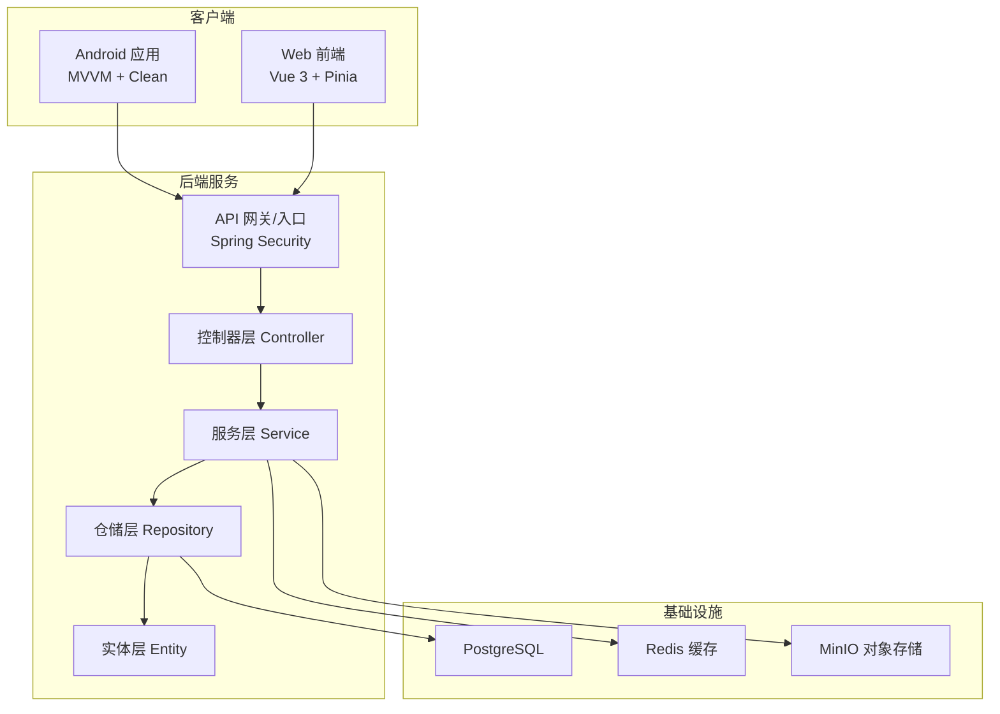
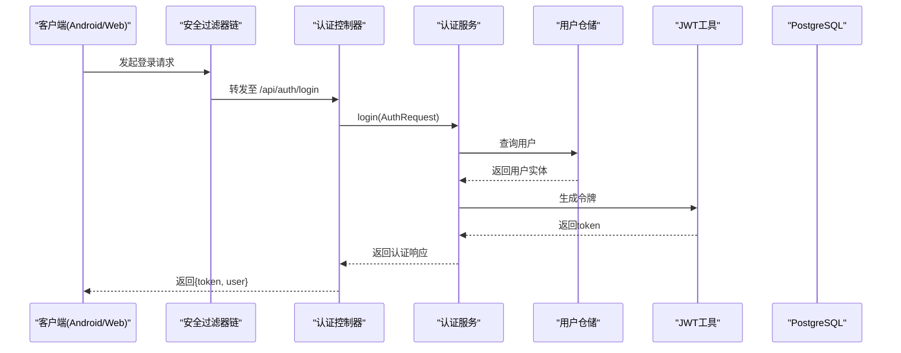
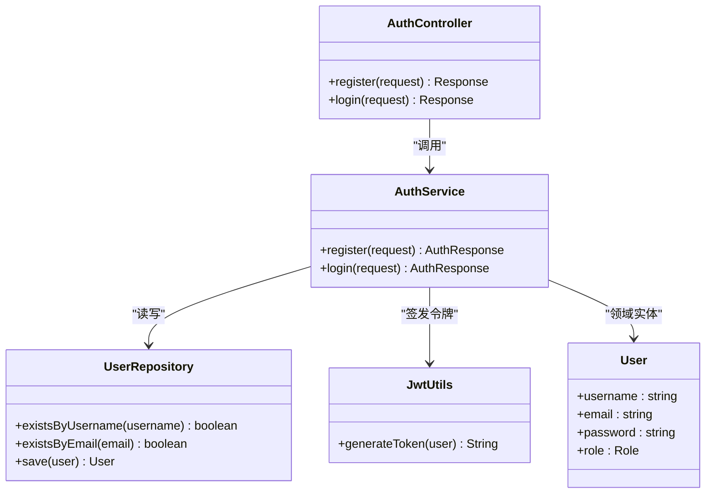
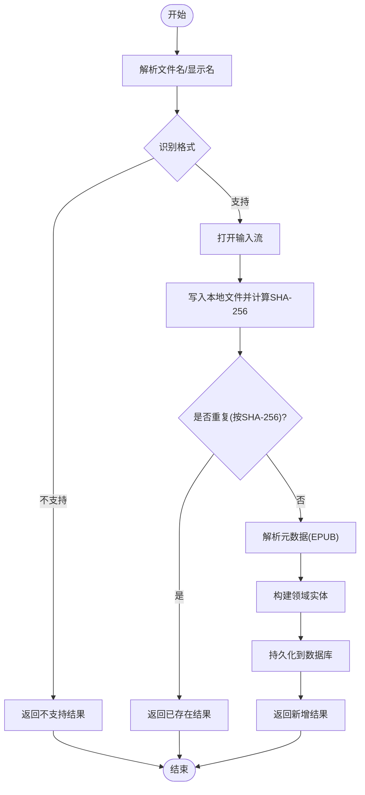
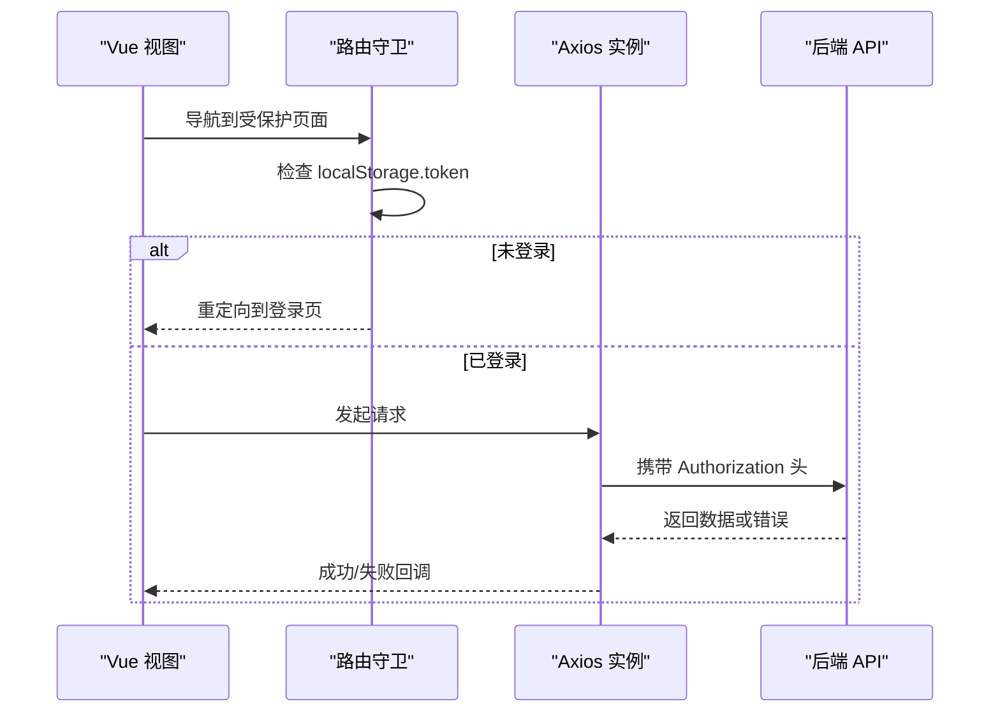
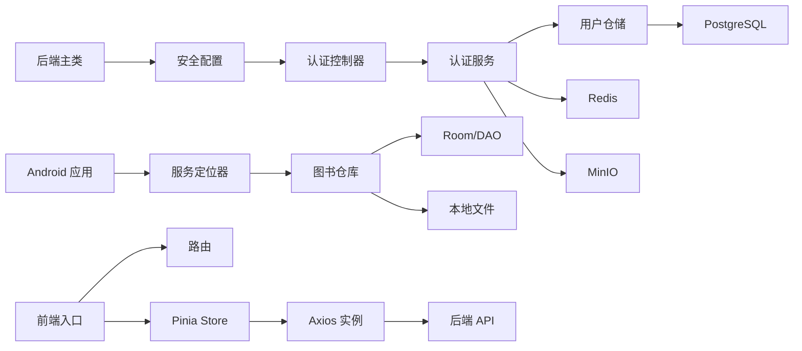

# 架构设计

<cite>
**本文引用的文件**   
- [AibookApplication.java](file://backend/src/main/java/com/aibook/AibookApplication.java)
- [AppConfig.java](file://backend/src/main/java/com/aibook/config/AppConfig.java)
- [SecurityConfig.java](file://backend/src/main/java/com/aibook/security/SecurityConfig.java)
- [AuthController.java](file://backend/src/main/java/com/aibook/controller/AuthController.java)
- [AuthService.java](file://backend/src/main/java/com/aibook/service/AuthService.java)
- [docker-compose.yml](file://docker/docker-compose.yml)
- [AiBookApplication.kt](file://android/app/src/main/kotlin/com/aibook/android/AiBookApplication.kt)
- [ServiceLocator.kt](file://android/app/src/main/kotlin/com/aibook/android/di/ServiceLocator.kt)
- [BookRepository.kt](file://android/core/data/src/main/kotlin/com/aibook/android/core/data/repository/BookRepository.kt)
- [AuthApi.kt](file://android/core/network/src/main/kotlin/com/aibook/android/core/network/api/AuthApi.kt)
- [ShelfViewModel.kt](file://android/app/src/main/kotlin/com/aibook/android/feature/shelf/ShelfViewModel.kt)
- [main.ts](file://frontend/src/main.ts)
- [api.ts](file://frontend/src/utils/api.ts)
- [router/index.ts](file://frontend/src/router/index.ts)
- [stores/book.ts](file://frontend/src/stores/book.ts)
</cite>

## 目录
1. [引言](#引言)
2. [项目结构](#项目结构)
3. [核心组件](#核心组件)
4. [架构总览](#架构总览)
5. [详细组件分析](#详细组件分析)
6. [依赖关系分析](#依赖关系分析)
7. [性能考量](#性能考量)
8. [故障排查指南](#故障排查指南)
9. [结论](#结论)
10. [附录](#附录)

## 引言
本架构设计文档面向 AI Book 系统，覆盖前后端分离、微服务化部署与模块化组织原则；后端采用 MVC 分层 + 领域驱动思想（Controller → Service → Repository → Entity），Android 客户端采用 MVVM + Clean Architecture，前端基于 Vue.js 3 的组件化架构。文档同时阐述关键架构决策与技术选型理由（依赖注入、DTO、策略模式等），并提供系统边界定义、组件交互图与数据处理流程图，以及安全、缓存、日志、监控等横切关注点的实现方案。

## 项目结构
AI Book 由三大部分组成：
- 后端（Spring Boot）：提供 REST API、认证鉴权、数据访问与业务编排，容器化运行于 Docker Compose。
- Android 客户端：本地书架、阅读进度、OPDS 订阅、网络与数据库层清晰分层，使用依赖注入与服务定位器。
- Web 前端（Vue 3 + Pinia + Element Plus）：管理后台与书籍管理界面，通过 Axios 调用后端 API。

图表来源
- [docker-compose.yml:1-125](file://docker/docker-compose.yml#L1-L125)
- [AibookApplication.java:1-17](file://backend/src/main/java/com/aibook/AibookApplication.java#L1-L17)

章节来源
- [docker-compose.yml:1-125](file://docker/docker-compose.yml#L1-L125)
- [AibookApplication.java:1-17](file://backend/src/main/java/com/aibook/AibookApplication.java#L1-L17)

## 核心组件
- 后端启动与能力开关
  - 应用主类启用缓存与定时任务，作为 Spring Boot 入口。
- 安全配置
  - 统一关闭 CSRF、无状态会话、白名单放行静态资源与公开接口，注册 Basic/JWT 过滤器链。
- 认证流程
  - 控制器接收登录/注册请求，服务层完成密码校验、用户持久化与 JWT 签发。
- Android 依赖注入
  - 应用启动时初始化服务定位器，按需构建数据库、仓库、网络与 OPDS 服务等。
- Android 数据层
  - 仓库封装本地导入、去重、元数据解析、阅读进度更新等操作。
- Android 网络层
  - Retrofit 接口定义认证相关 API，配合拦截器完成令牌传递。
- Android UI 层
  - ViewModel 组合 StateFlow 暴露 UI 状态，处理导入、收藏、上架等动作。
- 前端应用
  - 应用入口挂载路由、Pinia、UI 库并初始化主题。
- 前端网络
  - Axios 实例统一设置超时、请求头、全局错误处理与未授权跳转。
- 前端路由
  - 基于路由守卫实现登录态检查与页面保护。
- 前端状态
  - Pinia Store 集中管理书籍列表、分页、搜索与详情等状态与异步操作。

章节来源
- [AibookApplication.java:1-17](file://backend/src/main/java/com/aibook/AibookApplication.java#L1-L17)
- [SecurityConfig.java:1-71](file://backend/src/main/java/com/aibook/security/SecurityConfig.java#L1-L71)
- [AuthController.java:1-41](file://backend/src/main/java/com/aibook/controller/AuthController.java#L1-L41)
- [AuthService.java:1-84](file://backend/src/main/java/com/aibook/service/AuthService.java#L1-L84)
- [AiBookApplication.kt:1-22](file://android/app/src/main/kotlin/com/aibook/android/AiBookApplication.kt#L1-L22)
- [ServiceLocator.kt:1-58](file://android/app/src/main/kotlin/com/aibook/android/di/ServiceLocator.kt#L1-L58)
- [BookRepository.kt:1-186](file://android/core/data/src/main/kotlin/com/aibook/android/core/data/repository/BookRepository.kt#L1-L186)
- [AuthApi.kt:1-16](file://android/core/network/src/main/kotlin/com/aibook/android/core/network/api/AuthApi.kt#L1-L16)
- [ShelfViewModel.kt:1-98](file://android/app/src/main/kotlin/com/aibook/android/feature/shelf/ShelfViewModel.kt#L1-L98)
- [main.ts:1-23](file://frontend/src/main.ts#L1-L23)
- [api.ts:1-50](file://frontend/src/utils/api.ts#L1-L50)
- [router/index.ts:1-86](file://frontend/src/router/index.ts#L1-L86)
- [stores/book.ts:1-154](file://frontend/src/stores/book.ts#L1-L154)

## 架构总览
整体采用前后端分离与可容器化的微服务式部署：
- 后端以 Spring Boot 单体形式提供多域能力（认证、图书、OPDS、WebDAV、扫描等），通过 Docker Compose 编排 PostgreSQL、Redis、MinIO 与后端、前端服务。
- Android 客户端遵循 MVVM + Clean Architecture，数据层（Room/DAO）、网络层（Retrofit/OkHttp）、领域模型与 UI 层解耦。
- Web 前端基于 Vue 3 组件化与 Pinia 状态管理，Axios 统一网络访问与错误处理。

图表来源
- [SecurityConfig.java:1-71](file://backend/src/main/java/com/aibook/security/SecurityConfig.java#L1-L71)
- [AuthController.java:1-41](file://backend/src/main/java/com/aibook/controller/AuthController.java#L1-L41)
- [AuthService.java:1-84](file://backend/src/main/java/com/aibook/service/AuthService.java#L1-L84)
- [docker-compose.yml:1-125](file://docker/docker-compose.yml#L1-L125)

## 详细组件分析

### 后端：MVC 分层 + 领域驱动实践
- 分层职责
  - Controller：接收 HTTP 请求，参数校验，委托 Service。
  - Service：业务编排、事务边界、跨领域协作（如元数据抓取、封面下载）。
  - Repository：数据访问抽象，对接 JPA/MyBatis 等。
  - Entity：领域模型与持久化映射。
- 关键决策
  - 使用 DTO 隔离外部契约与内部模型，避免实体泄露。
  - 引入策略模式用于元数据抓取（豆瓣、Google Books、京东、OpenLibrary 等）。
  - 使用 Redis 做热点缓存（如元数据缓存服务），提升读取性能。
  - 使用 MinIO 存储封面与附件，降低数据库压力。

图表来源
- [AuthController.java:1-41](file://backend/src/main/java/com/aibook/controller/AuthController.java#L1-L41)
- [AuthService.java:1-84](file://backend/src/main/java/com/aibook/service/AuthService.java#L1-L84)

章节来源
- [AuthController.java:1-41](file://backend/src/main/java/com/aibook/controller/AuthController.java#L1-L41)
- [AuthService.java:1-84](file://backend/src/main/java/com/aibook/service/AuthService.java#L1-L84)

### Android：MVVM + Clean Architecture
- 分层职责
  - UI 层：Screen + ViewModel，StateFlow 驱动视图。
  - 领域层：领域模型与用例（如 ImportPolicy）。
  - 数据层：Repository 聚合 DAO、偏好、网络与文件系统。
- 依赖注入
  - 应用启动时初始化 ServiceLocator，按需提供数据库、仓库、网络与 OPDS 服务。
- 导入流程（含去重与元数据解析）

图表来源
- [BookRepository.kt:1-186](file://android/core/data/src/main/kotlin/com/aibook/android/core/data/repository/BookRepository.kt#L1-L186)

章节来源
- [AiBookApplication.kt:1-22](file://android/app/src/main/kotlin/com/aibook/android/AiBookApplication.kt#L1-L22)
- [ServiceLocator.kt:1-58](file://android/app/src/main/kotlin/com/aibook/android/di/ServiceLocator.kt#L1-L58)
- [BookRepository.kt:1-186](file://android/core/data/src/main/kotlin/com/aibook/android/core/data/repository/BookRepository.kt#L1-L186)
- [ShelfViewModel.kt:1-98](file://android/app/src/main/kotlin/com/aibook/android/feature/shelf/ShelfViewModel.kt#L1-L98)

### Web 前端：Vue 3 组件化 + Pinia 状态管理
- 应用入口
  - 创建应用实例，挂载 Pinia、Router、ElementPlus，初始化主题。
- 网络访问
  - Axios 实例统一设置超时、请求头、全局错误处理与未授权跳转。
- 路由与权限
  - 路由守卫根据 token 控制受保护页面访问。
- 状态管理
  - Pinia Store 管理书籍列表、分页、搜索、详情与局部更新。

图表来源
- [main.ts:1-23](file://frontend/src/main.ts#L1-L23)
- [api.ts:1-50](file://frontend/src/utils/api.ts#L1-L50)
- [router/index.ts:1-86](file://frontend/src/router/index.ts#L1-L86)
- [stores/book.ts:1-154](file://frontend/src/stores/book.ts#L1-L154)

章节来源
- [main.ts:1-23](file://frontend/src/main.ts#L1-L23)
- [api.ts:1-50](file://frontend/src/utils/api.ts#L1-L50)
- [router/index.ts:1-86](file://frontend/src/router/index.ts#L1-L86)
- [stores/book.ts:1-154](file://frontend/src/stores/book.ts#L1-L154)

## 依赖关系分析
- 后端
  - 应用主类开启缓存与调度能力；安全配置注册过滤器链；认证控制器依赖服务层；服务层依赖仓储与工具类；仓储依赖数据库。
- Android
  - Application 启动后初始化 ServiceLocator；ServiceLocator 持有数据库、仓库、网络与 OPDS 服务；ViewModel 通过 ServiceLocator 获取仓库；仓库依赖 DAO 与文件系统。
- 前端
  - main.ts 挂载插件；api.ts 提供统一网络访问；router 进行权限控制；store 管理业务状态并调用 api。

图表来源
- [AibookApplication.java:1-17](file://backend/src/main/java/com/aibook/AibookApplication.java#L1-L17)
- [SecurityConfig.java:1-71](file://backend/src/main/java/com/aibook/security/SecurityConfig.java#L1-L71)
- [AuthController.java:1-41](file://backend/src/main/java/com/aibook/controller/AuthController.java#L1-L41)
- [AuthService.java:1-84](file://backend/src/main/java/com/aibook/service/AuthService.java#L1-L84)
- [AiBookApplication.kt:1-22](file://android/app/src/main/kotlin/com/aibook/android/AiBookApplication.kt#L1-L22)
- [ServiceLocator.kt:1-58](file://android/app/src/main/kotlin/com/aibook/android/di/ServiceLocator.kt#L1-L58)
- [BookRepository.kt:1-186](file://android/core/data/src/main/kotlin/com/aibook/android/core/data/repository/BookRepository.kt#L1-L186)
- [main.ts:1-23](file://frontend/src/main.ts#L1-L23)
- [api.ts:1-50](file://frontend/src/utils/api.ts#L1-L50)
- [router/index.ts:1-86](file://frontend/src/router/index.ts#L1-L86)
- [docker-compose.yml:1-125](file://docker/docker-compose.yml#L1-L125)

章节来源
- [AibookApplication.java:1-17](file://backend/src/main/java/com/aibook/AibookApplication.java#L1-L17)
- [SecurityConfig.java:1-71](file://backend/src/main/java/com/aibook/security/SecurityConfig.java#L1-L71)
- [AuthController.java:1-41](file://backend/src/main/java/com/aibook/controller/AuthController.java#L1-L41)
- [AuthService.java:1-84](file://backend/src/main/java/com/aibook/service/AuthService.java#L1-L84)
- [AiBookApplication.kt:1-22](file://android/app/src/main/kotlin/com/aibook/android/AiBookApplication.kt#L1-L22)
- [ServiceLocator.kt:1-58](file://android/app/src/main/kotlin/com/aibook/android/di/ServiceLocator.kt#L1-L58)
- [BookRepository.kt:1-186](file://android/core/data/src/main/kotlin/com/aibook/android/core/data/repository/BookRepository.kt#L1-L186)
- [main.ts:1-23](file://frontend/src/main.ts#L1-L23)
- [api.ts:1-50](file://frontend/src/utils/api.ts#L1-L50)
- [router/index.ts:1-86](file://frontend/src/router/index.ts#L1-L86)
- [docker-compose.yml:1-125](file://docker/docker-compose.yml#L1-L125)

## 性能考量
- 后端
  - 使用 Redis 缓存热点数据（如元数据、封面信息），减少数据库与对象存储压力。
  - 使用 MinIO 承载大文件（封面、附件），避免数据库膨胀。
  - 合理分页与排序，避免全表扫描。
- Android
  - 使用 Flow/StateFlow 进行响应式数据绑定，减少不必要的 UI 刷新。
  - 导入过程分块写入与 SHA-256 计算，避免内存峰值过高。
  - 去重策略基于文件指纹，避免重复存储。
- 前端
  - 路由懒加载与组件按需引入，减小首屏体积。
  - Axios 统一超时与错误处理，避免长时间阻塞。
  - 列表分页与增量更新，优化渲染性能。

[本节为通用指导，不直接分析具体文件]

## 故障排查指南
- 认证失败
  - 检查前端是否携带 Authorization 头；确认后端安全配置放行路径与过滤器顺序。
  - 若出现 401，前端会清除 token 并重定向登录页。
- 网络异常
  - 检查后端服务健康状态（Docker Compose healthcheck）；确认端口与网络连通性。
  - 查看全局错误处理消息提示，定位具体错误码与消息。
- 导入失败
  - 检查文件格式识别逻辑与本地文件写入权限；确认 SHA-256 计算与去重逻辑。
- 依赖注入问题
  - 确认 ServiceLocator 单例初始化与应用生命周期一致；避免在构造期循环依赖。

章节来源
- [SecurityConfig.java:1-71](file://backend/src/main/java/com/aibook/security/SecurityConfig.java#L1-L71)
- [api.ts:1-50](file://frontend/src/utils/api.ts#L1-L50)
- [docker-compose.yml:1-125](file://docker/docker-compose.yml#L1-L125)
- [BookRepository.kt:1-186](file://android/core/data/src/main/kotlin/com/aibook/android/core/data/repository/BookRepository.kt#L1-L186)
- [ServiceLocator.kt:1-58](file://android/app/src/main/kotlin/com/aibook/android/di/ServiceLocator.kt#L1-L58)

## 结论
AI Book 系统通过前后端分离与容器化部署实现了清晰的系统边界与可扩展的架构。后端以 MVC 分层与领域驱动思想组织代码，结合 DTO、策略模式与缓存/对象存储提升性能与可维护性；Android 客户端遵循 MVVM + Clean Architecture，确保 UI 与数据解耦；前端基于 Vue 3 组件化与 Pinia 状态管理，提供一致的体验与良好的扩展性。整体方案兼顾了可读性、可测试性与可运维性。

[本节为总结性内容，不直接分析具体文件]

## 附录
- 系统边界定义
  - 客户端边界：Android 与 Web 前端仅通过 HTTP API 与后端交互，不共享代码。
  - 后端边界：对外暴露 REST API，内部通过 Service 协调仓储与外部服务（Redis、MinIO）。
  - 数据边界：PostgreSQL 存储结构化数据，MinIO 存储非结构化文件，Redis 缓存热点数据。
- 横切关注点
  - 安全：Spring Security 过滤器链、JWT 无状态认证、Basic 认证兼容。
  - 缓存：Redis 缓存热点数据，注解式缓存启用。
  - 日志：建议在各层添加结构化日志，便于追踪与排障。
  - 监控：建议集成指标采集与健康检查，结合 Docker Compose healthcheck 进行服务可用性探测。

[本节为概念性说明，不直接分析具体文件]