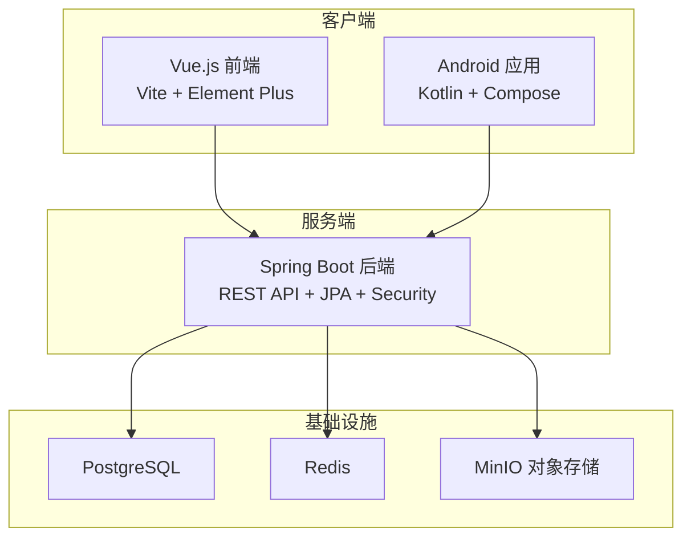
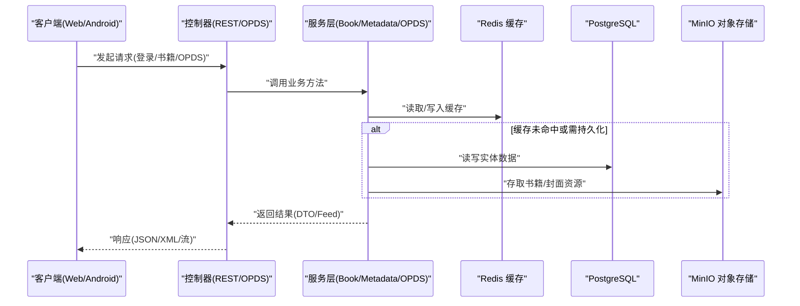
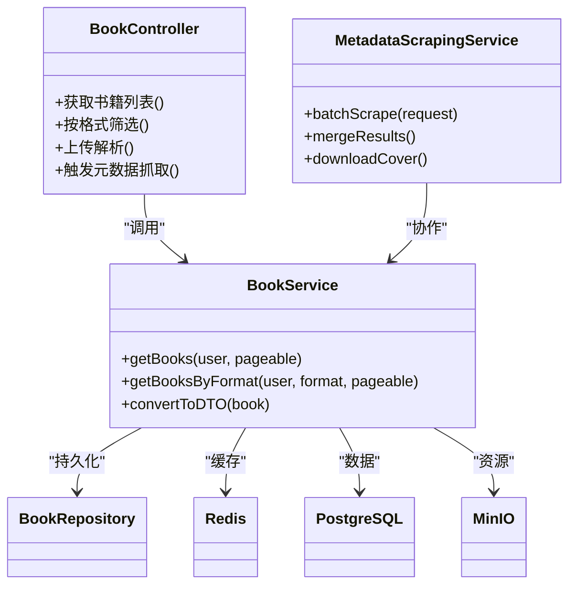
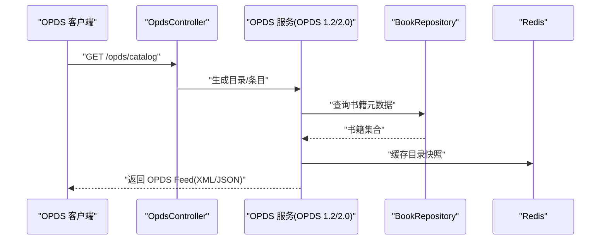
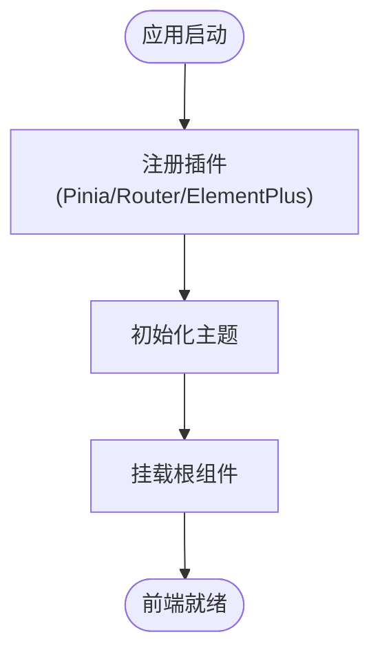
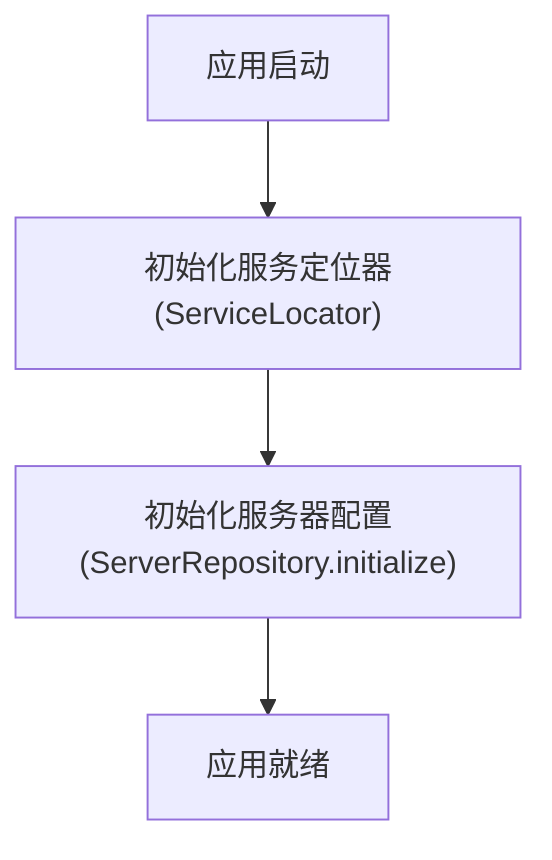
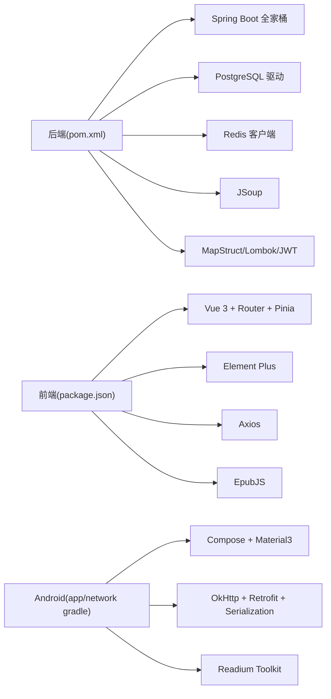

# 项目概述

<cite>
**本文引用的文件列表**
- [backend/pom.xml](file://backend/pom.xml)
- [backend/src/main/java/com/aibook/AibookApplication.java](file://backend/src/main/java/com/aibook/AibookApplication.java)
- [backend/src/main/resources/application.yml](file://backend/src/main/resources/application.yml)
- [backend/src/main/java/com/aibook/controller/BookController.java](file://backend/src/main/java/com/aibook/controller/BookController.java)
- [backend/src/main/java/com/aibook/controller/OpdsController.java](file://backend/src/main/java/com/aibook/controller/OpdsController.java)
- [backend/src/main/java/com/aibook/service/BookService.java](file://backend/src/main/java/com/aibook/service/BookService.java)
- [backend/src/main/java/com/aibook/service/scraper/MetadataScrapingService.java](file://backend/src/main/java/com/aibook/service/scraper/MetadataScrapingService.java)
- [frontend/package.json](file://frontend/package.json)
- [frontend/src/main.ts](file://frontend/src/main.ts)
- [android/app/build.gradle.kts](file://android/app/build.gradle.kts)
- [android/core/network/build.gradle.kts](file://android/core/network/build.gradle.kts)
- [android/app/src/main/kotlin/com/aibook/android/AiBookApplication.kt](file://android/app/src/main/kotlin/com/aibook/android/AiBookApplication.kt)
- [docker/docker-compose.yml](file://docker/docker-compose.yml)
</cite>

## 目录
1. [简介](#简介)
2. [项目结构](#项目结构)
3. [核心组件](#核心组件)
4. [架构总览](#架构总览)
5. [详细组件分析](#详细组件分析)
6. [依赖关系分析](#依赖关系分析)
7. [性能考量](#性能考量)
8. [故障排查指南](#故障排查指南)
9. [结论](#结论)
10. [附录：快速开始](#附录快速开始)

## 简介
AI Book 电子书管理系统是一个前后端分离的跨平台阅读与书库管理平台。系统提供以下核心能力：
- 电子书管理：本地扫描、多格式支持、元数据提取与编辑、封面管理、分类标签、书架组织
- 智能元数据抓取：对接豆瓣、Open Library、Google Books 等书源，批量补全书名、作者、简介、ISBN、封面
- OPDS 协议支持：实现 OPDS 1.2 与 OPDS 2.0，便于第三方阅读器接入
- 多端同步：Web 前端（Vue.js）、Android 原生应用（Kotlin/Compose）与后端统一通过 REST API 交互；阅读进度、书签、高亮可跨设备同步
- 存储与缓存：PostgreSQL 持久化业务数据，Redis 作为缓存层，MinIO 对象存储存放书籍与封面等资源

技术栈选择理由：
- Java/Spring Boot：成熟的企业级生态，JPA + PostgreSQL 稳定可靠；Spring Security + JWT 提供安全认证；Cache + Redis 提升热点数据访问性能；Scheduling 支持定时任务（如目录扫描）
- Kotlin/Compose：现代 Android 开发首选，声明式 UI 与协程结合，配合 Retrofit/OkHttp 构建高效网络层
- Vue.js 3 + Vite + Pinia：轻量高效的 Web 前端框架，组合式 API 与状态管理清晰，适合中后台与内容管理场景
- PostgreSQL：强一致的关系型数据库，适合结构化业务数据与复杂查询
- Redis：高性能键值缓存，用于会话、配置、热点元数据等
- MinIO：兼容 S3 的对象存储，适合海量电子书与封面资源的高可用存储

## 项目结构
仓库采用多模块、前后端分离的组织方式：
- backend：Spring Boot 后端服务，包含控制器、服务、仓储、模型、配置与安全等
- frontend：Vue.js 3 前端工程，使用 Vite 构建，Element Plus 组件库，Pinia 状态管理
- android：Android 原生应用，基于 Kotlin + Compose，模块化 core:model、core:network、core:data、core:reader
- docker：一键编排 PostgreSQL、Redis、MinIO、后端与前端容器

图表来源
- [backend/src/main/java/com/aibook/AibookApplication.java:1-17](file://backend/src/main/java/com/aibook/AibookApplication.java#L1-L17)
- [frontend/src/main.ts:1-23](file://frontend/src/main.ts#L1-L23)
- [android/app/src/main/kotlin/com/aibook/android/AiBookApplication.kt:1-22](file://android/app/src/main/kotlin/com/aibook/android/AiBookApplication.kt#L1-L22)
- [docker/docker-compose.yml:1-125](file://docker/docker-compose.yml#L1-L125)

章节来源
- [backend/pom.xml:1-157](file://backend/pom.xml#L1-L157)
- [frontend/package.json:1-27](file://frontend/package.json#L1-L27)
- [android/app/build.gradle.kts:1-76](file://android/app/build.gradle.kts#L1-L76)
- [docker/docker-compose.yml:1-125](file://docker/docker-compose.yml#L1-L125)

## 核心组件
- 后端启动与特性开关
  - Spring Boot 主类启用缓存与定时任务，为目录扫描、元数据抓取等异步任务提供基础能力
- 配置中心
  - application.yml 集中管理数据库、Redis、JWT、MinIO、上传大小、扫描策略等关键参数
- 控制器与服务
  - BookController 暴露书籍相关接口（列表、分页、格式筛选、上传解析、元数据抓取任务等）
  - OpdsController 提供 OPDS 1.2/2.0 目录服务，供第三方阅读器消费
  - BookService 封装书籍领域逻辑，聚合读取、分页、DTO 转换等
  - MetadataScrapingService 协调多个书源抓取器，完成批量元数据补全
- 前端初始化
  - main.ts 注册路由、状态管理与 UI 组件库，并初始化主题
- Android 应用初始化
  - AiBookApplication 在进程启动时初始化服务定位器与服务器配置，确保网络与本地数据就绪

章节来源
- [backend/src/main/java/com/aibook/AibookApplication.java:1-17](file://backend/src/main/java/com/aibook/AibookApplication.java#L1-L17)
- [backend/src/main/resources/application.yml:1-68](file://backend/src/main/resources/application.yml#L1-L68)
- [backend/src/main/java/com/aibook/controller/BookController.java:1-36](file://backend/src/main/java/com/aibook/controller/BookController.java#L1-L36)
- [backend/src/main/java/com/aibook/controller/OpdsController.java:1-44](file://backend/src/main/java/com/aibook/controller/OpdsController.java#L1-L44)
- [backend/src/main/java/com/aibook/service/BookService.java:1-45](file://backend/src/main/java/com/aibook/service/BookService.java#L1-L45)
- [backend/src/main/java/com/aibook/service/scraper/MetadataScrapingService.java](file://backend/src/main/java/com/aibook/service/scraper/MetadataScrapingService.java)
- [frontend/src/main.ts:1-23](file://frontend/src/main.ts#L1-L23)
- [android/app/src/main/kotlin/com/aibook/android/AiBookApplication.kt:1-22](file://android/app/src/main/kotlin/com/aibook/android/AiBookApplication.kt#L1-L22)

## 架构总览
系统采用前后端分离与微内核风格的服务分层：
- 客户端层：Web 与 Android 分别通过 HTTP 调用后端 REST API；OPDS 客户端可直接订阅后端 OPDS 目录
- 服务层：控制器负责请求路由与校验，服务层承载业务编排，仓储层对接数据库与缓存
- 数据层：PostgreSQL 存储实体与关系，Redis 缓存热点数据，MinIO 存储二进制资源（书籍、封面）
- 运维层：Docker Compose 编排所有依赖服务，提供一键启动能力

图表来源
- [backend/src/main/java/com/aibook/controller/BookController.java:1-36](file://backend/src/main/java/com/aibook/controller/BookController.java#L1-L36)
- [backend/src/main/java/com/aibook/controller/OpdsController.java:1-44](file://backend/src/main/java/com/aibook/controller/OpdsController.java#L1-L44)
- [backend/src/main/java/com/aibook/service/BookService.java:1-45](file://backend/src/main/java/com/aibook/service/BookService.java#L1-L45)
- [backend/src/main/resources/application.yml:1-68](file://backend/src/main/resources/application.yml#L1-L68)

## 详细组件分析

### 后端核心：书籍与元数据抓取
- 书籍管理
  - BookController 提供书籍列表、分页、按格式筛选、上传解析、元数据抓取任务等接口
  - BookService 封装用户维度书籍查询、分页与 DTO 映射，保证领域逻辑清晰
- 元数据抓取
  - MetadataScrapingService 协调多个书源抓取器（豆瓣、Open Library、Google Books），支持批量任务与失败重试
  - 抓取流程包括：去重判断、并发抓取、结果合并、封面下载与本地缓存

图表来源
- [backend/src/main/java/com/aibook/controller/BookController.java:1-36](file://backend/src/main/java/com/aibook/controller/BookController.java#L1-L36)
- [backend/src/main/java/com/aibook/service/BookService.java:1-45](file://backend/src/main/java/com/aibook/service/BookService.java#L1-L45)
- [backend/src/main/java/com/aibook/service/scraper/MetadataScrapingService.java](file://backend/src/main/java/com/aibook/service/scraper/MetadataScrapingService.java)
- [backend/src/main/resources/application.yml:1-68](file://backend/src/main/resources/application.yml#L1-L68)

章节来源
- [backend/src/main/java/com/aibook/controller/BookController.java:1-36](file://backend/src/main/java/com/aibook/controller/BookController.java#L1-L36)
- [backend/src/main/java/com/aibook/service/BookService.java:1-45](file://backend/src/main/java/com/aibook/service/BookService.java#L1-L45)
- [backend/src/main/java/com/aibook/service/scraper/MetadataScrapingService.java](file://backend/src/main/java/com/aibook/service/scraper/MetadataScrapingService.java)

### OPDS 协议支持
- OpdsController 暴露 /opds 路径，同时支持 OPDS 1.2 与 OPDS 2.0 的目录与条目描述
- 客户端可通过标准 OPDS 订阅后端书库，实现与第三方阅读器的无缝集成

图表来源
- [backend/src/main/java/com/aibook/controller/OpdsController.java:1-44](file://backend/src/main/java/com/aibook/controller/OpdsController.java#L1-L44)
- [backend/src/main/resources/application.yml:1-68](file://backend/src/main/resources/application.yml#L1-L68)

章节来源
- [backend/src/main/java/com/aibook/controller/OpdsController.java:1-44](file://backend/src/main/java/com/aibook/controller/OpdsController.java#L1-L44)

### 前端：Vue.js 3 应用
- 入口 main.ts 注册 Pinia、Router、Element Plus，并初始化主题
- 使用 Vite 进行开发与构建，依赖 axios 进行 HTTP 通信，epubjs 用于 EPUB 渲染

图表来源
- [frontend/src/main.ts:1-23](file://frontend/src/main.ts#L1-L23)
- [frontend/package.json:1-27](file://frontend/package.json#L1-L27)

章节来源
- [frontend/src/main.ts:1-23](file://frontend/src/main.ts#L1-L23)
- [frontend/package.json:1-27](file://frontend/package.json#L1-L27)

### Android：Kotlin/Compose 应用
- 应用启动时初始化服务定位器，预加载服务器配置，确保后续网络与本地数据可用
- 网络层基于 OkHttp + Retrofit + kotlinx.serialization，OPDS 客户端通过独立模块实现

图表来源
- [android/app/src/main/kotlin/com/aibook/android/AiBookApplication.kt:1-22](file://android/app/src/main/kotlin/com/aibook/android/AiBookApplication.kt#L1-L22)
- [android/core/network/build.gradle.kts:1-19](file://android/core/network/build.gradle.kts#L1-L19)

章节来源
- [android/app/src/main/kotlin/com/aibook/android/AiBookApplication.kt:1-22](file://android/app/src/main/kotlin/com/aibook/android/AiBookApplication.kt#L1-L22)
- [android/core/network/build.gradle.kts:1-19](file://android/core/network/build.gradle.kts#L1-L19)

## 依赖关系分析
- 后端依赖
  - Spring Boot Starter（Web、Security、Data JPA、Validation、Cache）
  - PostgreSQL 驱动、Redis 客户端、Jackson Hibernate 模块、JSoup、MapStruct、Lombok、JWT
- 前端依赖
  - Vue 3、Vue Router、Pinia、Element Plus、Axios、EpubJS、Vite、TypeScript
- Android 依赖
  - Compose BOM、Material3、Navigation Compose、Coil、Readium Toolkit、OkHttp/Retrofit、kotlinx-serialization

图表来源
- [backend/pom.xml:1-157](file://backend/pom.xml#L1-L157)
- [frontend/package.json:1-27](file://frontend/package.json#L1-L27)
- [android/app/build.gradle.kts:1-76](file://android/app/build.gradle.kts#L1-L76)
- [android/core/network/build.gradle.kts:1-19](file://android/core/network/build.gradle.kts#L1-L19)

章节来源
- [backend/pom.xml:1-157](file://backend/pom.xml#L1-L157)
- [frontend/package.json:1-27](file://frontend/package.json#L1-L27)
- [android/app/build.gradle.kts:1-76](file://android/app/build.gradle.kts#L1-L76)
- [android/core/network/build.gradle.kts:1-19](file://android/core/network/build.gradle.kts#L1-L19)

## 性能考量
- 数据库连接池：HikariCP 最大连接数与最小空闲连接可调，避免连接耗尽
- 缓存策略：Redis 作为缓存层，建议对热点目录、元数据、用户配置进行缓存
- 大文件上传：multipart 最大请求与文件大小限制已配置，注意磁盘空间与 MinIO 容量规划
- 并发抓取：元数据抓取应控制并发度与限流，避免外部书源封禁
- 日志级别：生产环境建议降低日志级别，减少 I/O 开销

[本节为通用指导，不直接分析具体文件]

## 故障排查指南
- 启动失败
  - 检查环境变量与配置文件中的数据库、Redis、MinIO 地址与凭据是否匹配
  - 确认 Docker Compose 依赖服务健康检查通过
- 登录鉴权异常
  - 核对 JWT 密钥与过期时间配置，确保前后端一致
- 上传失败
  - 检查上传路径与 MinIO 桶权限，确认磁盘空间充足
- OPDS 无法访问
  - 验证 /opds 路由与跨域配置，确认客户端 Accept 头与协议版本匹配

章节来源
- [backend/src/main/resources/application.yml:1-68](file://backend/src/main/resources/application.yml#L1-L68)
- [docker/docker-compose.yml:1-125](file://docker/docker-compose.yml#L1-L125)

## 结论
AI Book 以清晰的三层架构与标准化协议（OPDS）打通了多端阅读体验。后端以 Spring Boot 为核心，结合 PostgreSQL、Redis、MinIO 形成稳健的数据与存储底座；前端与 Android 客户端通过 REST/OPDS 与后端解耦，具备良好的扩展性与可维护性。借助 Docker Compose，开发者可以快速搭建完整运行环境，快速迭代功能。

[本节为总结性内容，不直接分析具体文件]

## 附录：快速开始
- 前置条件
  - 安装 Docker 与 Docker Compose
  - 可选：本地安装 JDK 21（后端开发）、Node.js 18+（前端开发）、Android Studio（Android 开发）
- 一键启动
  - 在项目根目录执行 docker compose up -d，将拉起 PostgreSQL、Redis、MinIO、后端与前端服务
  - 访问 http://localhost:80 打开前端，http://localhost:8080 访问后端 API
- 本地开发
  - 后端：修改 application.yml 中的数据库/Redis/MinIO 配置后，运行 Spring Boot 主类
  - 前端：进入 frontend 目录，执行 npm install 与 npm run dev
  - Android：在 Android Studio 中打开 android 模块，配置模拟器或真机运行
- 常用端口
  - 前端：80
  - 后端：8080
  - PostgreSQL：5432
  - Redis：6379
  - MinIO API：9000，控制台：9001

章节来源
- [docker/docker-compose.yml:1-125](file://docker/docker-compose.yml#L1-L125)
- [backend/src/main/resources/application.yml:1-68](file://backend/src/main/resources/application.yml#L1-L68)
- [frontend/package.json:1-27](file://frontend/package.json#L1-L27)
- [backend/src/main/java/com/aibook/AibookApplication.java:1-17](file://backend/src/main/java/com/aibook/AibookApplication.java#L1-L17)